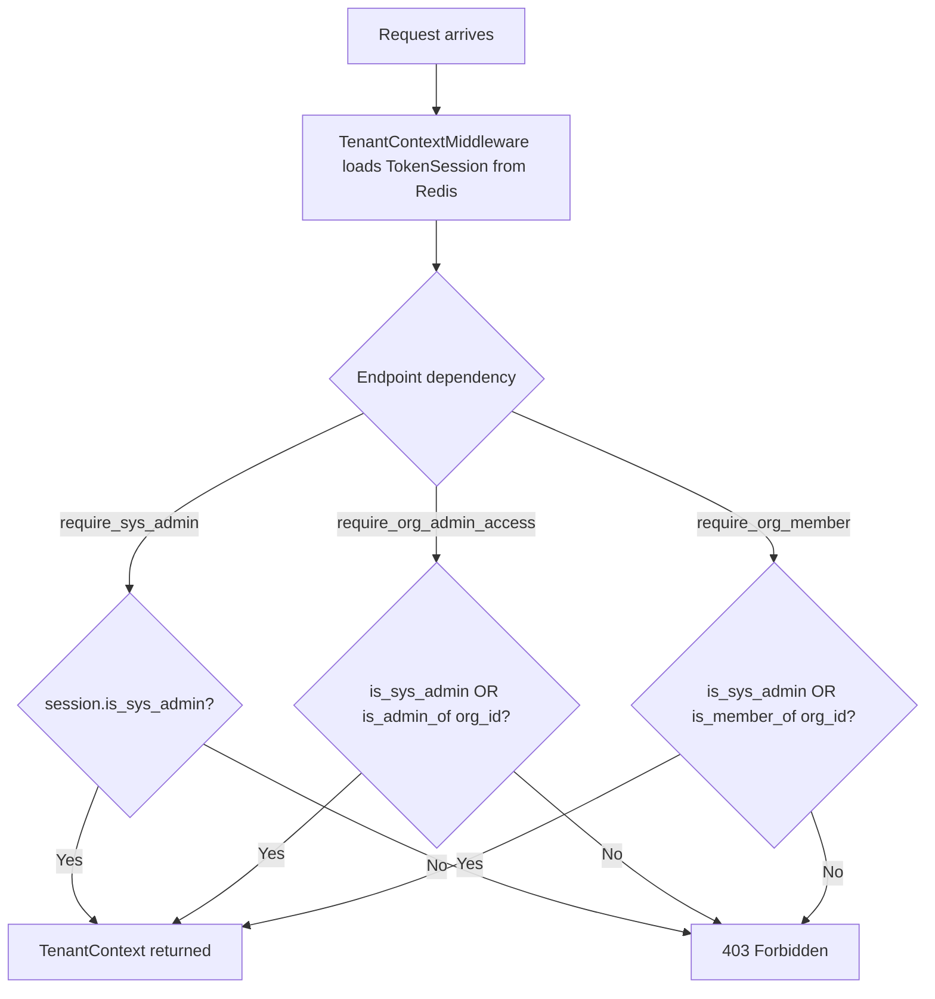

# Tenant and Admin Management

Cadence has two administrative roles that operate at different scopes:

| Role        | Location                                            | Check                         |
|-------------|-----------------------------------------------------|-------------------------------|
| `sys_admin` | `users.is_sys_admin` (PostgreSQL column)            | `session.is_sys_admin`        |
| `org_admin` | `user_org_memberships.is_admin` (PostgreSQL column) | `session.is_admin_of(org_id)` |

`sys_admin` is a platform-wide flag on the User row. `org_admin` is a per-membership flag; a user can be `org_admin` in
one org and a regular member in another.

## Role Check Flow



## Organization Management

**Controller:** `src/cadence/controller/organization_controller.py`
**Service:** `src/cadence/service/organization_service.py` (mixin on `TenantService`)

| Endpoint                         | Auth                    | Description                                      |
|----------------------------------|-------------------------|--------------------------------------------------|
| `GET /api/orgs`                  | `require_authenticated` | List orgs visible to caller (sys_admin sees all) |
| `POST /api/admin/orgs`           | `sys_admin`             | Create org                                       |
| `GET /api/admin/orgs`            | `sys_admin`             | List all orgs                                    |
| `PATCH /api/admin/orgs/{org_id}` | `sys_admin`             | Update org fields                                |

`create_org` (`organization_service.py`) auto-generates a UUID `org_id` if not supplied.

`list_accessible_orgs` (`organization_controller.py`) returns all orgs for `sys_admin` with `role="sys_admin"`, or
only the orgs the caller belongs to with their actual `org_admin`/`member` role otherwise.

## User Management

**Controller:** `src/cadence/controller/user_controller.py`
**Service:** `src/cadence/service/user_service.py` (mixin on `TenantService`)

| Endpoint                             | Auth        | Description                            |
|--------------------------------------|-------------|----------------------------------------|
| `POST /api/admin/users`              | `sys_admin` | Create user (sets `is_sys_admin` flag) |
| `GET /api/admin/users`               | `sys_admin` | List all users                         |
| `GET /api/admin/orgs/{org_id}/users` | `sys_admin` | List users of an org                   |
| `DELETE /api/admin/users/{user_id}`  | `sys_admin` | Soft-delete user                       |

Users are created with a hashed password (argon2). The `is_sys_admin` flag can only be set at creation time by a
`sys_admin`.

## Org Membership Management

**Controller:** `src/cadence/controller/membership_controller.py`

| Endpoint                                              | Auth        | Description              |
|-------------------------------------------------------|-------------|--------------------------|
| `POST /api/orgs/{org_id}/members`                     | `org_admin` | Add existing user to org |
| `POST /api/orgs/{org_id}/users`                       | `org_admin` | Alias of above           |
| `GET /api/orgs/{org_id}/users`                        | `org_admin` | List all members         |
| `PATCH /api/orgs/{org_id}/users/{user_id}/membership` | `org_admin` | Toggle `is_admin` flag   |
| `DELETE /api/orgs/{org_id}/users/{user_id}`           | `org_admin` | Remove member from org   |

`UpdateMembershipRequest` contains only `is_admin: bool`. Promoting a user to `org_admin` takes effect on their next
login (new session will carry the updated `org_admin` list from `membership_repo`).

Removing a user from an org (`remove_user_from_org`) hard-deletes the `user_org_memberships` row. The user account
itself is not affected.

## TenantService Architecture

`TenantService` (`src/cadence/service/tenant_service.py`) inherits from both `OrganizationServiceMixin` and
`UserServiceMixin`:

```python
class TenantService(OrganizationServiceMixin, UserServiceMixin):
    def __init__(self,
                 org_repo, org_settings_repo, org_llm_config_repo,
                 user_repo, membership_repo, instance_repo
                 ): ...
```

The mixins are abstract (ABC) and access repositories through getter methods. `TenantService.__init__` wires all
repositories, and the getter methods (`get_org_repo()`, `get_membership_repo()`, etc.) satisfy the abstract interface.

## LLM Configuration (BYOK)

**Controller:** `src/cadence/controller/llm_config_controller.py`

Orgs store their own LLM provider API keys in the `organization_llm_configs` table. This is the Bring Your Own Key (
BYOK) mechanism. Keys are encrypted at the application level and the API **never** returns the raw key —
`_build_llm_response` (`llm_config_controller.py`) explicitly omits `api_key` from the response.

`sys_admin` is intentionally excluded from these endpoints to maintain BYOK isolation. Only `org_admin` may manage LLM
configs for their org.

| Endpoint                                                   | Auth            | Description                     |
|------------------------------------------------------------|-----------------|---------------------------------|
| `POST /api/orgs/{org_id}/llm-configs`                      | `org_admin`     | Add LLM config (BYOK)           |
| `GET /api/orgs/{org_id}/llm-configs`                       | `org_admin`     | List (API key masked)           |
| `PATCH /api/orgs/{org_id}/llm-configs/{config_name}`       | `org_admin`     | Update (provider immutable)     |
| `DELETE /api/orgs/{org_id}/llm-configs/{config_name}`      | `org_admin`     | Soft-delete                     |
| `GET /api/providers/{provider}/models`                     | `authenticated` | Known model IDs for a provider  |
| `GET /api/frameworks/{framework_type}/supported-providers` | `authenticated` | Providers valid for a framework |

`AddLLMConfigRequest` fields: `name`, `provider`, `api_key`, `base_url` (optional), `additional_config` (optional
JSONB). `provider` is immutable after creation.

`delete_llm_config` (`organization_service.py`) checks `instance_repo.count_using_llm_config` before proceeding.
If any active orchestrator instance still references the config by ID, the delete is rejected with `ValueError` (
returned as `409 Conflict`).

## Org Settings

Org-level settings override global defaults for all orchestrator instances in that org.
See [Configuration Cascade](configuration.md) for the full 3-tier model.

| Endpoint                           | Auth        | Description                  |
|------------------------------------|-------------|------------------------------|
| `POST /api/orgs/{org_id}/settings` | `org_admin` | Create or update org setting |
| `GET /api/orgs/{org_id}/settings`  | `org_admin` | List all org settings        |

## Admin Monitoring Endpoints

(`src/cadence/controller/admin_controller.py`, all require `sys_admin`)

| Endpoint                          | Description                                          |
|-----------------------------------|------------------------------------------------------|
| `GET /api/admin/settings`         | List all global settings                             |
| `PATCH /api/admin/settings/{key}` | Update global setting (publishes RabbitMQ broadcast) |
| `GET /api/admin/health`           | Health check all pool instances                      |
| `GET /api/admin/pool/stats`       | Pool statistics (counts, memory estimate)            |
