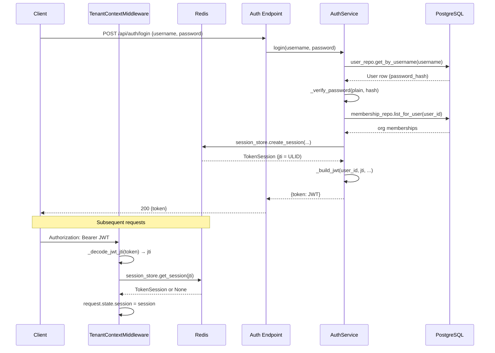

# Authentication and Sessions

Cadence uses short-lived JWTs whose only claims are `sub` (user id) and `jti` (a ULID). All authorization state — org
memberships, roles, admin flags — lives in Redis, not in the token. Revoking a token is a single Redis `DEL`.

## Request Flow



## Login Endpoint

**`POST /api/auth/login`** — `src/cadence/controller/auth_controller.py`

No authentication required. Accepts `{"username": "...", "password": "..."}` and returns `{"token": "<jwt>"}`.

Errors return `401 Unauthorized` (invalid credentials) or `500`.

```python
@router.post(
    "/api/auth/login",
    response_model=LoginResponse,
    status_code=status.HTTP_200_OK,
)
async def login(login_request: LoginRequest, request: Request):
    auth_service = request.app.state.auth_service
    try:
        result = await auth_service.login(
            username=login_request.username,
            password=login_request.password,
        )
        return LoginResponse(token=result["token"])
    except ValueError:
        raise HTTPException(
            status_code=status.HTTP_401_UNAUTHORIZED,
            detail="Invalid username or password",
        )
    except Exception as e:
        logger.error(f"Login failed: {e}", exc_info=True)
        raise HTTPException(
            status_code=status.HTTP_500_INTERNAL_SERVER_ERROR,
            detail="Login failed",
        )
```

## Password Verification

`_verify_password` dispatches on the stored hash prefix:

| Hash prefix                | Algorithm                              | Used for                          |
|----------------------------|----------------------------------------|-----------------------------------|
| `pbkdf2:sha256:260000:...` | PBKDF2-HMAC-SHA256, 260 000 iterations | Bootstrap-created admin users     |
| `$argon2...`               | Argon2 via passlib                     | All passwords set through the API |

New passwords are always hashed with argon2 (`_hash_password` in `auth_service.py`).

```python
def _verify_pbkdf2_password(plain: str, stored_hash: str) -> bool:
    """Verify a PBKDF2-HMAC-SHA256 password hash (bootstrap-generated format).

    Expected format: pbkdf2:sha256:260000:<hex-salt>:<hex-digest>
    """
    import hashlib

    parts = stored_hash.split(":")
    if len(parts) != 5 or parts[0] != "pbkdf2":
        return False

    _, algo, iterations_str, salt_hex, digest_hex = parts
    try:
        salt = bytes.fromhex(salt_hex)
        iterations = int(iterations_str)
        expected = bytes.fromhex(digest_hex)
    except (ValueError, TypeError):
        return False

    actual = hashlib.pbkdf2_hmac(algo, plain.encode(), salt, iterations)
    return actual == expected


def _verify_password(plain: str, stored_hash: str) -> bool:
    """Verify a password against any supported hash format."""
    if stored_hash.startswith("pbkdf2:"):
        return _verify_pbkdf2_password(plain, stored_hash)
    return _verify_argon2_password(plain, stored_hash)
```

## ULID JWT ID

The JWT carries only three meaningful claims:

| Claim | Value                                                                              |
|-------|------------------------------------------------------------------------------------|
| `sub` | User UUID string                                                                   |
| `jti` | ULID string (Redis session key suffix)                                             |
| `exp` | `now + token_ttl_seconds` (default 180 min, `CADENCE_ACCESS_TOKEN_EXPIRE_MINUTES`) |

The ULID is generated by `SessionStoreRepository.generate_jti()` (`session_store_repository.py`) using the
`ulid-py` library.

## TokenSession (`src/cadence/repository/session_store_repository.py`)

```python
@dataclass
class TokenSession:
    """In-memory representation of a Redis session entry.

    Attributes:
        jti: JWT ID — the ULID used as Redis key and JWT jti claim
        user_id: Authenticated user identifier
        is_sys_admin: Platform-wide admin flag
        org_admin: Organization IDs where user has admin rights
        org_user: Organization IDs where user is a regular member
        created_at: Session creation time (ISO format)
        expires_at: Session expiry time (ISO format)
    """

    jti: str
    user_id: str
    is_sys_admin: bool
    org_admin: List[str] = field(default_factory=list)
    org_user: List[str] = field(default_factory=list)
    created_at: str = ""
    expires_at: str = ""

    def is_member_of(self, org_id: str) -> bool:
        """Check whether the session has any access to the given org."""
        return org_id in self.org_admin or org_id in self.org_user

    def is_admin_of(self, org_id: str) -> bool:
        """Check whether the session has admin access to the given org."""
        return org_id in self.org_admin
```

Helper methods:

- `is_member_of(org_id)` — `org_id in org_admin or org_id in org_user`
- `is_admin_of(org_id)` — `org_id in org_admin`

### Redis Key Layout

```
session:{jti}           → JSON payload, TTL = token_ttl_seconds
user_sessions:{user_id} → Redis Set of active jti values
```

`delete_all_user_sessions(user_id)` (`session_store_repository.py`) atomically revokes all sessions for a user —
used when removing a user from an org or disabling an account.

## TenantContextMiddleware (`src/cadence/middleware/tenant_context_middleware.py`)

Runs on every request. Does not raise on missing or invalid JWT — it simply leaves `request.state.session = None`.

```python
async def dispatch(self, request: Request, call_next):
    request.state.session = None
    request.state.token_jti = None

    bearer = self._extract_bearer(request)
    if bearer:
        jti = self._decode_jwt_jti(bearer)
        if jti:
            session_store = getattr(request.app.state, "session_store", None)
            if session_store:
                session = await session_store.get_session(jti)
                if session:
                    request.state.session = session
                    request.state.token_jti = jti

    return await call_next(request)
```

The `session_store` is resolved from `app.state` at request time (lazy resolution) to avoid a circular dependency at
startup.

## Authorization Dependencies (`src/cadence/middleware/authorization_middleware.py`)

These FastAPI dependency functions are injected into route handlers via `Depends(...)`. They all read
`request.state.session` set by the middleware.

| Function                   | Raises            | Used for                                     |
|----------------------------|-------------------|----------------------------------------------|
| `require_authenticated`    | 401 if no session | Any logged-in endpoint                       |
| `require_sys_admin`        | 401/403           | Platform-wide admin endpoints                |
| `require_org_member`       | 401/403           | Org-scoped read endpoints                    |
| `require_org_admin_access` | 401/403           | Org-scoped write endpoints                   |
| `require_any_admin`        | 401/403           | Platform endpoints without an org path param |

All functions return a `TenantContext` dataclass:

```python
@dataclass
class TenantContext:
    user_id: str
    org_id: str
    is_sys_admin: bool
    is_org_admin: bool
```

`require_org_member` and `require_org_admin_access` read `org_id` from the URL path parameter automatically via
`Path(...)`.

**sys_admin bypass.** `require_org_member` skips the membership check when `session.is_sys_admin` is `True`, granting
platform admins read access to any org. Note that `require_org_admin_access` on LLM-config endpoints explicitly excludes
sys_admin to enforce BYOK isolation — `api/orgs/{org_id}/llm-configs` accepts only the org's own `org_admin`.

## Logout

`DELETE /api/auth/logout` extracts `request.state.token_jti` (set by middleware) and calls `auth_service.logout(jti)`
which does `session_store.delete_session(jti)`. The JWT itself is not invalidated cryptographically; the Redis key
deletion is what terminates the session.

## Additional Auth Endpoints

| Endpoint                | Auth                    | Description                       |
|-------------------------|-------------------------|-----------------------------------|
| `GET /api/me`           | `require_authenticated` | Returns `{user_id, is_sys_admin}` |
| `GET /api/me/orgs`      | `require_authenticated` | Lists org memberships with role   |
| `PATCH /api/me/profile` | `require_authenticated` | Change own password               |
