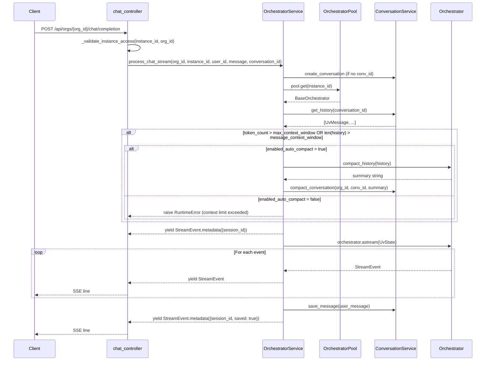

# Chat and Streaming (SSE)

The chat endpoint is the primary user-facing API. It accepts a message, routes it through a loaded orchestrator, and
streams the response back as Server-Sent Events (SSE). A synchronous (non-streaming) path is also available.

## Endpoint

```
POST /api/orgs/{org_id}/chat/completion
```

Defined in `src/cadence/controller/chat_controller.py`. Requires `require_org_member` (`org_id` from path).

### Request Body

```json
{
  "instance_id": "550e8400-e29b-41d4-a716-446655440000",
  "message": "What is the weather in San Francisco?",
  "conversation_id": "optional-existing-id",
  "stream": true
}
```

`stream` defaults to `true`. When `false`, a single JSON response is returned instead of an SSE stream.

## Streaming Flow



## Code Walkthrough

### 1. Access Validation

`_validate_instance_access` calls `orchestrator_service.get_instance_org_id(instance_id)` and compares it to
`context.org_id`. Returns 404 if the instance does not exist, 403 if it belongs to a different org.

### 2. Context Preparation (`_prepare_context`)

The orchestrator is fetched **before** loading history so that its settings can be inspected for context limit
enforcement:

```python
if not conversation_id:
    conversation_id = await conversation_service.create_conversation(
        org_id, user_id, instance_id
    )
orchestrator = await pool.get(instance_id)  # fetch first
history = await conversation_service.get_history(
    org_id, conversation_id, limit=DEFAULT_CONVERSATION_HISTORY_LIMIT
)
user_message = UvHumanMessage(content=message)
all_messages = history + [user_message]

# Context limit check — runs before building UvState
token_exceeded = count_tokens_estimate(all_messages) > max_context_window
msg_count_exceeded = len(history) > message_context_window
if token_exceeded or msg_count_exceeded:
    if enabled_auto_compact:
        summary = await orchestrator.compact_history(history)
        await conversation_service.compact_conversation(org_id, conv_id, ..., summary)
        all_messages = [
            UvHumanMessage(content="[Previous conversation summary]"),
            UvAIMessage(content=summary),
            user_message,
        ]
    else:
        raise RuntimeError("Context limit reached: ...")

state = UvState(messages=all_messages, thread_id=conversation_id)
```

**Context limits** are read from `orchestrator.mode_config.settings`:

| Setting                  | Type             | Trigger                                                         |
|--------------------------|------------------|-----------------------------------------------------------------|
| `max_context_window`     | `int` (tokens)   | estimated token count of `history + user_message` exceeds value |
| `message_context_window` | `int` (messages) | `len(history)` exceeds value                                    |

When either limit is exceeded:

- **`enabled_auto_compact = True`**: calls `orchestrator.compact_history(history)` (LLM summarizes), marks old messages
  as `is_compacted=True` in MongoDB, saves 2 synthetic messages (human placeholder + AI summary), then continues with
  the compacted `all_messages`.
- **`enabled_auto_compact = False`**: raises `RuntimeError` — the request is rejected with a descriptive error
  indicating
  which limit was breached.

`UvState` and `UvHumanMessage` are types from the `cadence-sdk` library.

### 3. Pool Lookup (`OrchestratorPool.get`)

If `instance_id` is in `self.instances` the orchestrator is returned immediately (hot-tier hit). Otherwise a
per-instance `asyncio.Lock` is acquired and the instance is loaded from the database via `_load_from_db`.

### 4. Streaming (`process_chat_stream`)

```python
yield StreamEvent.metadata({"session_id": conv_id})
async for event in orchestrator.astream(state):
    yield event
await conversation_service.save_message(org_id, conv_id, user_message)
yield StreamEvent.metadata({"session_id": conv_id, "saved": True})
```

Each yielded `StreamEvent` is converted to an SSE string by the `event_generator` in `chat_controller.py`:

```python
async for stream_event in orchestrator_service.process_chat_stream(...):
    yield stream_event.to_sse()
    yield "\n\n"
```

`StreamEvent.to_sse()` (`infrastructure/streaming/stream_event.py`) produces:

```
event: <event_type>
data: <json payload>

```

The `StreamingResponse` is returned with headers `Cache-Control: no-cache` and `X-Accel-Buffering: no`.

## StreamEvent Types (`src/cadence/infrastructure/streaming/stream_event.py`)

`StreamEventType` defines three base constants:

| Constant   | String value | Factory method                                   |
|------------|--------------|--------------------------------------------------|
| `AGENT`    | `"agent"`    | `StreamEvent.agent_start(data)`                  |
| `MESSAGE`  | `"message"`  | `StreamEvent.message(content, role="assistant")` |
| `METADATA` | `"metadata"` | `StreamEvent.metadata(dict)`                     |

Framework-specific streaming wrappers (e.g. `LangGraphStreamingWrapper`, `GoogleADKStreamingWrapper`) map their native
events to these three types before yielding.

### SSE Example

```
event: metadata
data: {"session_id": "conv-abc123"}

event: agent
data: {"agent": "supervisor"}

event: message
data: {"content": "The weather in San Francisco is 72F.", "role": "assistant"}

event: metadata
data: {"session_id": "conv-abc123", "saved": true}
```

## LangGraph Internal State (`src/cadence/engine/impl/langgraph/state.py`)

When using the LangGraph backend, `UvState` is converted to `MessageState` before traversing the graph:

```python
class MessageState(TypedDict, total=False):
    messages: Annotated[list[AnyMessage], operator.add]  # add_messages reducer
    thread_id: Optional[str]
    agent_hops: Optional[int]
    current_agent: Optional[str]
    error_state: Optional[Dict[str, Any]]
    validation_result: Optional[Dict[str, Any]]
    used_plugins: List[str]
    routing_decision: Optional[str]  # "tools" | "conversational" | "clarify"
    tool_results: Optional[List[Dict[str, Any]]]
```

`routing_decision` and `tool_results` are ephemeral (set and consumed within a single turn). `agent_hops` and
`current_agent` are returned to callers in the non-streaming `ChatResponse`.

## Synchronous Path

When `stream=false`, `orchestrator_service.process_chat(...)` is awaited instead. It calls `orchestrator.ask(state)` (
non-streaming), accumulates the last AI message, saves both messages, and returns:

```json
{
  "session_id": "conv-abc123",
  "response": "The weather...",
  "agent_hops": 3,
  "current_agent": "weather_plugin"
}
```

## Conversation Persistence

Messages are stored in **MongoDB** via `MessageRepository`. Conversation metadata (id, org, user, instance, timestamps)
is stored in **PostgreSQL** via `ConversationRepository`. The `ConversationService` (
`src/cadence/service/conversation_service.py`) coordinates both stores.

History is loaded at the start of every turn (`get_history`) so that the orchestrator has full context.
`DEFAULT_CONVERSATION_HISTORY_LIMIT` (defined in `src/cadence/constants/`) caps the number of messages loaded per turn.

### Autocompaction

Each message document in MongoDB has an `is_compacted` field (default `false`). `get_messages` filters out compacted
messages (`{is_compacted: {$ne: true}}`), so callers always see the active history.

When `compact_conversation` is called:

1. All existing messages for the conversation are marked `is_compacted=True` via `mark_messages_compacted`.
2. Two new (non-compacted) messages are inserted: a `UvHumanMessage("[Previous conversation summary]")` and a
   `UvAIMessage(<summary>)`.
3. Subsequent `get_history` calls return only the 2 synthetic summary messages plus any new messages added after
   compaction.
