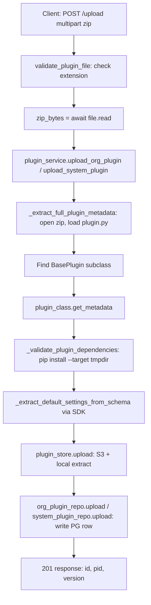

# Plugin System

Plugins are Python packages that extend orchestrators with domain-specific tools and agents. They are packaged as zip
archives, validated on upload, stored in S3 (or local filesystem), and loaded into orchestrators at pool-creation time.

## Plugin Scopes

| Scope  | Upload endpoint                          | Required role | Storage path                                  | PostgreSQL table |
|--------|------------------------------------------|---------------|-----------------------------------------------|------------------|
| System | `POST /api/admin/plugins/upload`         | `sys_admin`   | `system/{pid}/{version}/plugin.zip`           | `system_plugins` |
| Org    | `POST /api/orgs/{org_id}/plugins/upload` | `org_admin`   | `tenants/{org_id}/{pid}/{version}/plugin.zip` | `org_plugins`    |

System plugins are visible to all orgs. Org plugins are visible only to the org that uploaded them. When listing
available plugins (`GET /api/orgs/{org_id}/plugins`), `PluginService.list_available` merges both sets and adds a
`source` field (`"system"` or `"org"`).

## Upload Flow



### Metadata Extraction

The zip is opened with `zipfile.ZipFile`, the `plugin.py` entry is located, and the module is loaded via
`importlib.util.spec_from_file_location`. The first class that subclasses `cadence_sdk.base.BasePlugin` is instantiated
for metadata:

```python
meta = plugin_class.get_metadata()
# Fields: pid, version, name, description, capabilities, agent_type, stateless, tag
```

`pid` uses reverse-domain notation (e.g. `io.cadence.system.product_search`).

### Dependency Validation

If the plugin declares dependencies, they are installed into a `tempfile.TemporaryDirectory` using a subprocess pip
call. The main process is never affected. Failure raises `ValueError` and returns `400 Bad Request`.

## Storage Layout

**S3 bucket** (`CADENCE_S3_BUCKET_NAME`, default `cadence-plugins`):

```
system/{pid}/{version}/plugin.zip
tenants/{org_id}/{pid}/{version}/plugin.zip
```

**Local filesystem** (cache):

```
{CADENCE_SYSTEM_PLUGINS_DIR}/{pid}/{version}/   ← extracted system plugin
{CADENCE_TENANT_PLUGINS_ROOT}/{org_id}/{pid}/{version}/  ← extracted tenant plugin
```

`PluginStoreRepository.ensure_local` checks the local cache first. On
a miss it downloads the zip from S3 and extracts it. When `CADENCE_PLUGIN_S3_ENABLED=false`, only the local filesystem
is used and a `FileNotFoundError` is raised for missing plugins.

## Plugin Catalog (PostgreSQL)

Both `system_plugins` and `org_plugins` tables store the same metadata shape:

| Column             | Type        | Notes                                               |
|--------------------|-------------|-----------------------------------------------------|
| `id`               | UUID        | Primary key                                         |
| `pid`              | text        | Reverse-domain identifier                           |
| `version`          | text        | Semantic version string                             |
| `name`             | text        | Display name                                        |
| `description`      | text        | Optional                                            |
| `tag`              | text        | Free-form filter tag                                |
| `is_latest`        | bool        | True for most recent version of this pid            |
| `s3_path`          | text        | Canonical S3 key                                    |
| `default_settings` | JSONB       | `{key: default_value}` from SDK schema              |
| `capabilities`     | JSONB array | Declared capability strings                         |
| `agent_type`       | text        | `"specialized"` or `"general"`                      |
| `stateless`        | bool        | Whether the plugin agent holds no per-request state |
| `is_active`        | bool        | False after soft-delete                             |

## SDKPluginManager (`src/cadence/infrastructure/plugins/plugin_manager.py`)

`SDKPluginManager` is created by the factory for each orchestrator instance. It composes `PluginLoaderMixin` (discovery)
and `PluginBundleBuilderMixin` (bundle creation).

### `load_plugins(plugin_specs, instance_config)`

```
For each "pid@version" or "pid" in plugin_specs:
  1. Resolve contract from SDK PluginRegistry
  2. Skip if (pid, version) already in self._bundles
  3. _validate_plugin(contract): structure check + custom dep check
  4. _create_bundle_with_cache(contract, settings_resolver)
  5. Store in self._bundles[(pid, version)]
```

### SDKPluginBundle

The complete set of resolved resources for one plugin:

```python
@dataclass
class SDKPluginBundle:
    contract: PluginContract      # SDK registry entry
    metadata: PluginMetadata      # get_metadata() result
    agent: BaseAgent              # instantiated plugin agent
    bound_model: BaseChatModel | None  # LLM bound with tools (None for supervisor mode)
    uv_tools: list[UvTool]        # framework-agnostic tool wrappers
    orchestrator_tools: list[Any] # framework-native tools (via adapter.uvtool_to_orchestrator)
    adapter: OrchestratorAdapter
    tool_node: Any | None         # LangGraph ToolNode (langgraph only)
    agent_node: Any | None
```

### Bundle Caching

For stateless plugins (`contract.is_stateless = True`), `_create_bundle_with_cache` checks the `SharedBundleCache`. If
settings are unchanged, the existing bundle is reused across orchestrator instances rather than rebuilding. Stateful
plugins always get a fresh bundle.

## Plugin Settings Resolution

`PluginSettingsResolver` (`infrastructure/plugins/plugin_settings_resolver.py`) reads
`instance_config["plugin_settings"]` which is a dict keyed by `"pid@version"`:

```json
{
  "io.cadence.system.weather@1.0.0": {
    "id": "io.cadence.system.weather",
    "version": "1.0.0",
    "name": "Weather Plugin",
    "active": true,
    "settings": [
      {"key": "api_key", "value": "sk-..."},
      {"key": "units", "value": "metric"}
    ]
  }
}
```

These per-instance overrides are merged with `default_settings` from the catalog row at orchestrator creation time.

## System Plugin Endpoints (`src/cadence/controller/system_plugin_controller.py`)

All require `sys_admin`.

| Endpoint                                | Description                            |
|-----------------------------------------|----------------------------------------|
| `GET /api/admin/plugins`                | List system plugins (optional `?tag=`) |
| `POST /api/admin/plugins/upload`        | Upload system plugin zip               |
| `GET /api/admin/plugins/{plugin_id}`    | Get one system plugin                  |
| `DELETE /api/admin/plugins/{plugin_id}` | Soft-delete (sets `is_active=False`)   |

## Org Plugin Endpoints (`src/cadence/controller/plugin_controller.py`)

| Endpoint                                                      | Auth         | Description                    |
|---------------------------------------------------------------|--------------|--------------------------------|
| `GET /api/orgs/{org_id}/plugins`                              | `org_member` | List system + org plugins      |
| `POST /api/orgs/{org_id}/plugins/upload`                      | `org_admin`  | Upload org plugin zip          |
| `DELETE /api/orgs/{org_id}/plugins/{plugin_id}`               | `org_admin`  | Soft-delete                    |
| `GET /api/orgs/{org_id}/plugins/{plugin_pid}/settings-schema` | `org_member` | Dynamic settings schema for UI |
