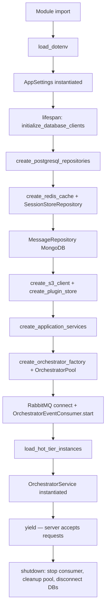

# Application Startup

`src/cadence/main.py` is both the module that creates the `FastAPI` app object and the module that controls its entire
lifecycle through the `lifespan` async context manager.

## Startup Sequence



## Step-by-step Walkthrough

### 1. Environment Loading

Before any Cadence import that touches environment variables, the module calls `load_dotenv` against a `.env` file
located three directories above `main.py`. The `# ruff: noqa: E402` comment documents the deliberate import-order
violation.

```python
env_path = Path(__file__).parent.parent.parent / ".env"
load_dotenv(dotenv_path=env_path)
```

### 2. AppSettings

A module-level `AppSettings()` is instantiated immediately after imports. This reads all `CADENCE_*` environment
variables once. The singleton is reused throughout the file and stored on `app.state` inside `lifespan`.

See [Configuration Cascade](configuration.md) for the full field reference.

### 3. Database Connections

```
initialize_database_clients(app_settings)
  PostgreSQLClient(postgres_url).connect()
  MongoDBClient(mongo_url).connect()
  RedisClient(redis_url, redis_default_db).connect()
```

All three clients are stored on `app.state` so they can be reached by health-check routes without going through service
layers.

### 4. Repository Construction

Returns a dict of twelve repository objects, all sharing the single `PostgreSQLClient`:

| Key                    | Class                             |
|------------------------|-----------------------------------|
| `global_settings_repo` | `GlobalSettingsRepository`        |
| `org_repo`             | `OrganizationRepository`          |
| `org_settings_repo`    | `OrganizationSettingsRepository`  |
| `org_llm_config_repo`  | `OrganizationLLMConfigRepository` |
| `provider_model_repo`  | `ProviderModelConfigRepository`   |
| `org_plugin_repo`      | `OrganizationPluginRepository`    |
| `system_plugin_repo`   | `SystemPluginRepository`          |
| `org_catalog_repo`     | `OrgPluginRepository`             |
| `instance_repo`        | `OrchestratorInstanceRepository`  |
| `user_repo`            | `UserRepository`                  |
| `membership_repo`      | `UserOrgMembershipRepository`     |
| `conversation_repo`    | `ConversationRepository`          |

`SessionStoreRepository` and `MessageRepository` (MongoDB) are created separately immediately after.

### 5. S3 and Plugin Store

`create_s3_client` returns `None` when `CADENCE_PLUGIN_S3_ENABLED=false` or when credentials are missing.
`create_plugin_store` always constructs a `PluginStoreRepository` — when the S3 client is `None`, only the local
filesystem is used.

### 6. Service Construction

Five services are built and stored on `app.state`:

| Key                    | Class                 | Dependencies                                                |
|------------------------|-----------------------|-------------------------------------------------------------|
| `tenant_service`       | `TenantService`       | org, settings, llm-config, user, membership, instance repos |
| `settings_service`     | `SettingsService`     | global-settings, org-settings, instance repos               |
| `conversation_service` | `ConversationService` | message repo (Mongo), conversation repo (PG)                |
| `plugin_service`       | `PluginService`       | system-plugin, org-plugin repos, plugin store               |
| `auth_service`         | `AuthService`         | user, membership, org repos, session store, JWT settings    |

### 7. Orchestrator Factory and Pool

```python
orchestrator_factory = create_orchestrator_factory(
    app_settings, repositories["org_llm_config_repo"], plugin_store
)
orchestrator_pool = OrchestratorPool(
    factory=orchestrator_factory,
    db_repositories={"orchestrator_instance_repo": repositories["instance_repo"]},
)
```

`OrchestratorFactory` initialises its registry from `_BACKEND_CONFIGS` covering all `(framework, mode)` combinations.
See [Orchestrator Lifecycle](orchestrator-lifecycle.md).

### 8. RabbitMQ and Event Consumer

```python
rabbitmq_client = RabbitMQClient(app_settings.rabbitmq_url)
await rabbitmq_client.connect()
event_publisher = OrchestratorEventPublisher(rabbitmq_client)
event_consumer = OrchestratorEventConsumer(
    client=rabbitmq_client,
    pool=orchestrator_pool,
    instance_repo=repositories["instance_repo"],
    plugin_store=plugin_store,
)
await event_consumer.start()
```

RabbitMQ failure is non-fatal: `app.state.event_publisher` and `app.state.event_consumer` are set to `None` and
lifecycle events are disabled. The application continues serving requests.

### 9. Hot-Tier Instance Loading

```python
hot_instances = await instance_repo.list_by_tier("hot", status="active")
for instance in hot_instances:
    await plugin_store.ensure_local(pid, version, org_id)   # S3 → local cache
    await orchestrator_pool.create_instance(instance_id, ...)
```

Plugins are fetched from S3 to local disk before the orchestrator is instantiated. Each plugin reference follows the
`pid@version` convention. Failures for individual instances are logged but do not abort startup.

### 10. OrchestratorService

`OrchestratorService` wraps the pool and conversation service and is the only object that chat endpoints interact with.
It is constructed last because it depends on both the pool and `conversation_service`.

### 11. Middleware and Routers

Middleware is registered at module level (before the first request), not inside `lifespan`:

```python
configure_cors_middleware(app, cors_origins)
configure_rate_limiting_middleware(app)
configure_tenant_context_middleware(app, app_settings)
configure_error_handlers_middleware(app, app_settings)
register_api_routers(app)
```

`TenantContextMiddleware` resolves its `session_store` lazily from `app.state` at request time, avoiding the circular
dependency that would arise if it were wired at module-load time.

## Shutdown

1. `event_consumer.stop()` — cancel AMQP consumer and close channel.
2. `rabbitmq_client.disconnect()`.
3. `orchestrator_pool.cleanup_all()` — calls `cleanup()` on every loaded orchestrator.
4. `disconnect_database_clients()` — closes PostgreSQL, MongoDB, Redis connections.
