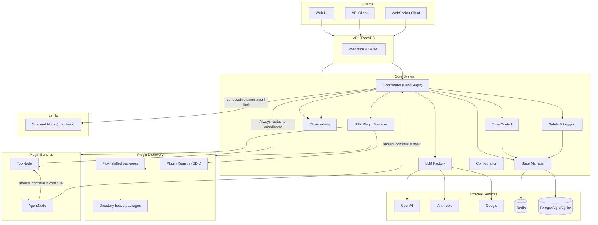
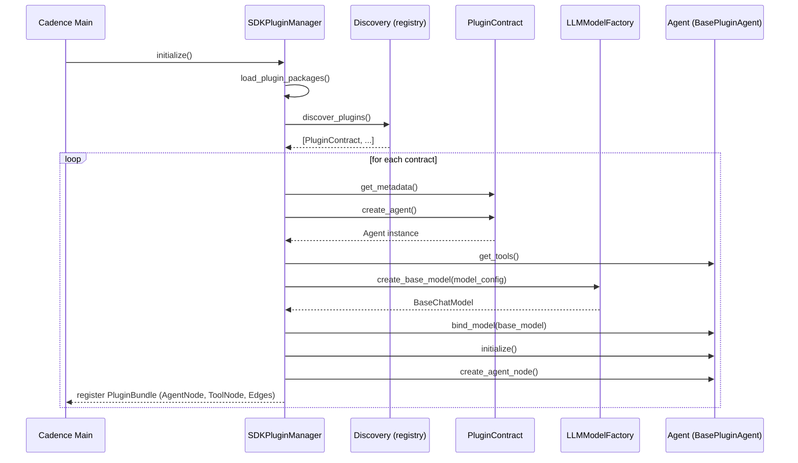
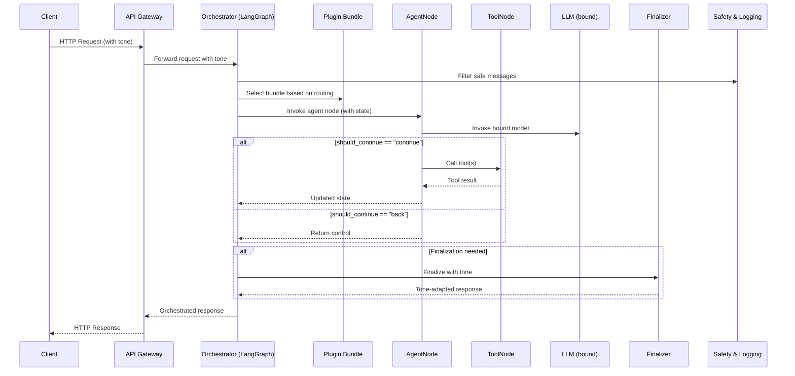
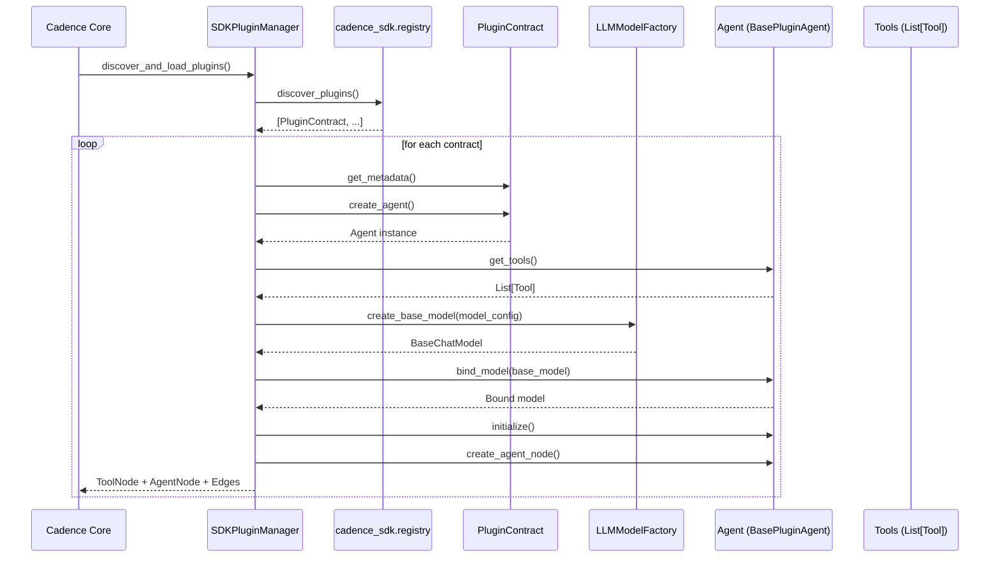
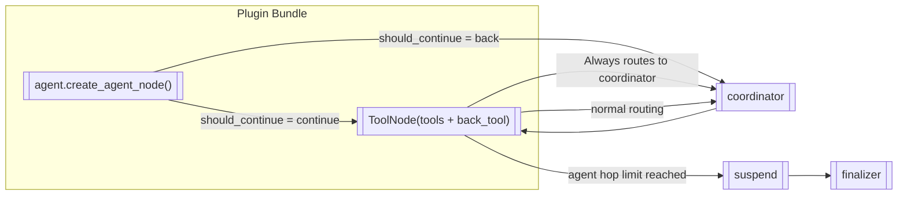
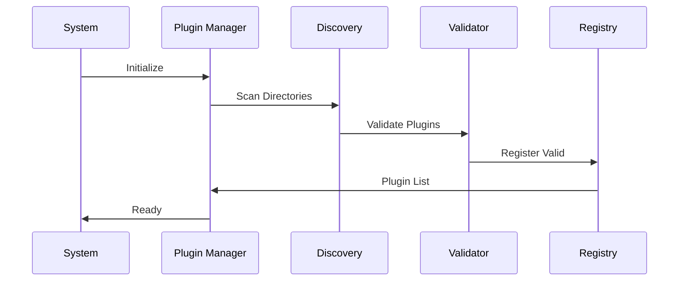

# Architecture Overview

Cadence is built with a modular, plugin-driven architecture that emphasizes simplicity, extensibility, and production
readiness. This document explains the core architectural decisions and how the system components interact.

## High-Level Architecture



## Core Components

### 1. **API (FastAPI)**

The entry point for all external communication:

- **REST API**: HTTP endpoints for synchronous operations
- **Endpoints**: `/conversation/chat`, `/plugins/plugins`, `/system/status`, `/health`
- Authentication and rate limiting are not included by default
- **CORS**: Cross-origin resource sharing configuration
- **Validation**: Request/response validation with Pydantic

### 2. **Multi-Agent Orchestrator**

The brain of the system that coordinates agent interactions with advanced orchestration capabilities:

- **Workflow Management**: LangGraph-based workflow orchestration with conditional routing
- **Agent Routing**: Intelligent routing with consecutive agent limit protection and hop counting
- **State Management**: Conversation state tracking with plugin context and routing history
- **Safety Features**: Tool execution logging, message filtering, and circular routing prevention
- **Dynamic Configuration**: Separate model configurations for coordinator, suspend, and synthesizer roles
- **Error Handling**: Graceful failure recovery with suspend node handling and timeout management
- **Performance Optimization**: Model caching and resource management through service container
- **Suspend Node**: User-friendly hop limit handling with tone-aware messaging and plugin suggestions
- **Synthesizer Node**: Intelligent conversation synthesis with structured response handling
- **Tone Control**: Dynamic response style adaptation (natural, explanatory, formal, concise, learning)
- **Routing Logic**: Advanced decision logic with tool call detection and routing validation
- **Consecutive Agent Limits**: Prevents infinite loops with configurable consecutive routing limits
- **Structured Responses**: Model-based and prompt-based structured response generation
- **Response Context**: Plugin-aware response building with suggestions and metadata
- **Timeout Handling**: Coordinator timeout protection with fallback responses
- **Message Compaction**: Intelligent message compression for synthesizer efficiency

### 3. **Plugin Manager**

Handles the complete plugin lifecycle with management capabilities:

- **Multi-source Discovery**: Pip packages, directory scanning, and uploaded plugins
- **Validation**: Structure, dependency, and health validation
- **Lifecycle Management**: Loading, unloading, hot-reloading, and bundle creation
- **Resource Management**: LLM model binding, tool integration, and memory management
- **Health Monitoring**: Plugin status monitoring and failure isolation
- **Upload Management**: Dynamic plugin upload, extraction, and integration
- **Dependency Resolution**: Automatic installation of plugin dependencies
- **SDK Integration**: Seamless integration with the Cadence SDK for plugin development

### 4. **LLM Factory**

Manages connections to various language models with caching and provider management:

- **Multi-Provider Support**: OpenAI, Anthropic, Google AI, Azure OpenAI
- **Model Caching**: Cache manager with key-based model instance reuse
- **Provider Registry**: Centralized provider registration and management
- **Configuration Management**: Provider-specific settings and credential resolution
- **Fallback Handling**: Automatic provider fallback and error recovery
- **Cost Optimization**: Token usage tracking and model optimization
- **Cache Statistics**: Performance monitoring and cache hit rate tracking

### 5. **Service Container**

Provides dependency injection and service lifecycle management:

- **Layered Architecture**: Infrastructure, application, and domain service layers
- **Dependency Injection**: Centralized service creation and dependency resolution
- **Database Factory**: Multi-backend repository creation (PostgreSQL, Redis, Memory)
- **Service Lifecycle**: Initialization, health monitoring, and cleanup management
- **Repository Abstraction**: Backend-agnostic data access patterns
- **Health Monitoring**: System health checks and diagnostics
- **Resource Management**: Connection pooling and resource optimization

### 6. **Database Factory**

Implements factory pattern for multi-backend data storage:

- **Backend Abstraction**: Unified interface for different storage backends
- **Repository Creation**: Dynamic repository instantiation based on configuration
- **Connection Management**: Database connection lifecycle and pooling
- **Health Monitoring**: Backend-specific health checks and status reporting
- **Migration Support**: Database schema management and versioning
- **Fallback Strategy**: Automatic fallback to in-memory storage on failure

## Data Flow

### Plugin Discovery Sources

Cadence aggregates plugins from multiple sources at startup:

- **Pip-installed packages** (environment packages)

    - Discovered via the SDK registry when packages that depend on `cadence_sdk` are present
    - Import of the package triggers `register_plugin(...)`
    - No extra configuration needed beyond having the package installed

- **Directory-based packages** (filesystem)

    - Controlled via environment variable `CADENCE_PLUGINS_DIR`
    - Supports single directory or JSON list of directories

- **Uploaded plugins** (dynamic upload)
    - Plugins uploaded via UI or API to the store directory
    - Managed through the plugin upload system
    - Automatic extraction, validation, and integration

```bash
# Single directory
CADENCE_PLUGINS_DIR=./plugins/src/cadence_example_plugins

# Or JSON list of directories
CADENCE_PLUGINS_DIR=["/abs/path/one", "/abs/path/two"]
```

Requirements for directory discovery:

- Each entry is a valid Python package (has `__init__.py`)
- The package imports call `register_plugin(MyPlugin)` so the SDK registry can collect it

### Application Startup Flow (performed once at app start)



### Request Processing Flow (uses preloaded bundles)



### Agent-as-Plugin Integration with LangGraph (startup)

This section explains precisely how a plugin becomes executable nodes in the LangGraph workflow.



At run-time the orchestrator uses the pre-wired nodes and edges like this:



Key responsibilities:

- Agent.get_tools(): returns LangChain Tools used by the agent
- Agent.bind_model(): binds tools to the chat model (model.bind_tools(tools))
- Agent.create_agent_node(): returns the callable used as the LangGraph node
- Agent.should_continue(state): returns "continue" to call tools or "back" to return to the coordinator

#### Agent Decision Making

The system implements agent decision-making through a standardized decision method:

**Decision Logic Design:**

- If the agent's response has tool calls → routes to tools for execution
- If the agent's response has NO tool calls → returns control to coordinator
- This ensures consistent routing behavior across all agents

- **Consistent Flow**: All agent responses follow the same routing path
- **Explicit Intent**: Fake tool calls make routing decisions explicit
- **No Direct Routing**: Agents never route directly to coordinator
- **Tool Node Integration**: All responses go through the tools node for proper state management

The plugin bundles define their own routing logic through a standardized interface.

**Edge Configuration Design:**

- **Conditional Edges**: Agent routing decisions based on standardized decision method
- **Direct Edges**: Tools always route to coordinator (prevents circular routing)
- **No More Loops**: Eliminated the `tools → agent` edge that caused infinite loops
- **Standardized Interface**: All plugins follow the same edge configuration pattern

#### Enhanced Suspend Node for Hop Limit Handling

The suspend node provides intelligent handling of hop limits with context awareness:

- **Hop Detection**: Hop limit detection with state tracking
- **Smart Hop Counting**: Only agent calls increment the hop counter, not finalization calls
- **Context Preservation**: Maintains conversation context while explaining the limit situation
- **Tone Adaptation**: Respects user's requested tone preference in the suspension message
- **Safe Message Filtering**: Prevents validation errors by filtering incomplete tool call sequences

When hop limits are reached, the workflow automatically routes through:
`Coordinator → SuspendNode → END`

The suspend node provides a user-friendly experience by:

1. **Acknowledging the limit** without technical jargon
2. **Explaining accomplishments** based on gathered information
3. **Providing best possible answer** with available data
4. **Suggesting continuation** if the answer is incomplete
5. **Maintaining conversation tone** as requested by the user

#### Coordinator Response Enforcement

The coordinator enforces proper routing by ensuring all responses go through the finalizer node:

- **No Direct Answers**: The coordinator never answers questions directly
- **Consistent Flow**: All responses route through the finalizer for proper synthesis
- **Content Cleanup**: Removes any direct response content from the coordinator
- **Proper Routing**: Maintains the intended conversation flow through the finalizer

#### Core Wiring Design

The plugin bundle creation and graph integration follows a standardized design pattern:

**Bundle Creation Design:**

- **Plugin Discovery**: Plugin manager discovers available plugins through registry
- **Agent Creation**: Each plugin creates its agent instance with metadata
- **Model Binding**: LLM models are bound to agents with appropriate configuration
- **Tool Integration**: Agent tools are collected and integrated into the bundle
- **Graph Registration**: Agent and tool nodes are registered with the conversation graph

This design ensures that tools, bound models, and agent nodes are properly integrated into the orchestration system.

#### Graph Edge Integration

The orchestrator uses plugin bundle edge definitions to create the routing network:

**Edge Integration Design:**

- **Conditional Routing**: Agent decisions control the flow based on standardized decision method
- **No Circular Routing**: Tools always route to coordinator, never back to agent
- **Consistent Flow**: All responses follow the same routing path
- **Debugging**: Logs show exactly what edges are being created
- **Dynamic Edge Creation**: Plugin bundles define their own routing logic

### Plugin Loading Flow



## Design Principles

### 1. **Separation of Concerns**

Each component has a single, well-defined responsibility:

- **API Gateway**: Handles HTTP concerns only
- **Orchestrator**: Manages workflow logic only
- **Plugin Manager**: Handles plugin lifecycle only
- **LLM Factory**: Manages model connections only

### 2. **Plugin-First Architecture**

Everything is a plugin, enabling:

- **Extensibility**: Add new capabilities without code changes
- **Modularity**: Independent development and deployment
- **Maintainability**: Isolated testing and debugging
- **Scalability**: Horizontal scaling of specific capabilities

### 3. **Configuration-Driven**

System behavior is controlled through:

- **Environment Variables**: Runtime configuration
- **Plugin Metadata**: Capability declarations
- **Dynamic Settings**: Runtime parameter adjustment
- **Validation**: Configuration integrity checks

### 4. **Production Ready**

Built-in features for production deployment:

- **Health Checks**: Comprehensive system monitoring
- **Logging**: Structured logging with configurable levels
- **Metrics**: Performance and usage metrics
- **Error Handling**: Graceful degradation and recovery

## Technical Stack

### Backend Framework

- **FastAPI**: Modern, fast web framework for APIs
- **Pydantic**: Data validation and settings management
- **Uvicorn**: ASGI server for production deployment

### AI/ML Stack

- **LangChain**: LLM application framework
- **LangGraph**: Workflow orchestration
- **OpenAI/Anthropic/Google**: LLM provider APIs

### Data Management

- **Redis**: Caching and session storage
- **SQLite/PostgreSQL**: Persistent data storage
- **Pydantic**: Data models and validation

### Development Tools

- **Poetry**: Dependency management
- **Pytest**: Testing framework
- **Black/Isort**: Code formatting
- **MyPy**: Type checking

## Scalability Considerations

### Horizontal Scaling

- **Stateless Design**: API components can be replicated
- **Plugin Isolation**: Plugins run independently
- **Load Balancing**: Multiple instances can share load
- **Database Sharding**: Data can be distributed

### Performance Optimization

- **Connection Pooling**: Efficient resource management
- **Caching Layers**: Multiple levels of caching
- **Async Operations**: Non-blocking I/O operations
- **Resource Limits**: Configurable resource constraints

### Monitoring and Observability

- **Health Endpoints**: System status monitoring
- **Metrics Collection**: Performance data gathering
- **Log Aggregation**: Centralized log management
- **Tracing**: Request flow tracking

## Security Architecture

### Authentication & Authorization

- **JWT Tokens**: Stateless authentication
- **Role-Based Access**: Granular permission control
- **API Key Management**: Secure credential storage
- **Rate Limiting**: Abuse prevention

### Data Protection

- **Input Validation**: Comprehensive input sanitization
- **Output Encoding**: Safe data presentation
- **Encryption**: Data in transit and at rest
- **Audit Logging**: Security event tracking

## Performance Characteristics

### Response Times

- **Simple Queries**: < 100ms
- **LLM Processing**: 1-5 seconds (provider dependent)
- **Plugin Operations**: < 500ms
- **Complex Workflows**: 5-30 seconds

### Throughput

- **Concurrent Users**: 100+ simultaneous users
- **Requests/Second**: 1000+ RPS (depending on complexity)
- **Plugin Instances**: Configurable per plugin
- **Memory Usage**: 100MB-2GB (depending on plugins)

## Future Architecture

### Planned Enhancements

- **Microservices**: Service decomposition for scale
- **Event Streaming**: Real-time event processing
- **GraphQL**: Flexible query interface
- **Kubernetes**: Container orchestration
- **Service Mesh**: Inter-service communication

### Extension Points

- **Custom Orchestrators**: Alternative workflow engines
- **Plugin Marketplaces**: Third-party plugin distribution
- **Multi-Tenancy**: Isolated user environments
- **Federation**: Distributed Cadence instances

## Related Documentation

- **[Plugin System](plugin-system.md)** - Plugin architecture details
- **[Deployment](../deployment/production.md)** - Production setup
