# LangGraph Architecture in Cadence

## Overview

The Cadence system uses LangGraph to orchestrate multi-agent conversations through a sophisticated workflow that
dynamically routes between different plugin agents. This document provides a comprehensive guide to understanding how
the graph is constructed, how nodes are added, and how edges connect to create a flexible conversation flow.

## Table of Contents

- [Architecture Layers](#architecture-layers)
- [Graph Construction Process](#graph-construction-process)
- [Decision Logic and Routing](#decision-logic-and-routing)
- [Response Tone Control](#response-tone-control)
- [Tool Execution Logging](#tool-execution-logging)
- [Complete Conversation Flow](#complete-conversation-flow)
- [Practical Examples](#practical-examples)
- [Best Practices](#best-practices)

## Architecture Layers

The LangGraph implementation in Cadence follows a layered architecture approach:

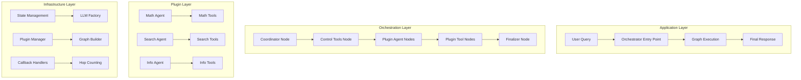

## Graph Construction Process

The graph construction follows a systematic 6-phase approach that ensures proper setup and integration of all
components.

### Phase 1: Graph Initialization

The process begins with creating a new `StateGraph` instance:

```python
def _build_conversation_graph(self) -> StateGraph:
    graph = StateGraph(AgentState)  # Initialize with state schema
    # ... build process continues
```

**What happens:**

- Creates a new `StateGraph` instance
- Associates it with the `AgentState` schema for type safety
- Prepares the graph for node and edge additions

### Phase 2: Core Node Registration

The orchestrator starts by adding four essential nodes that form the backbone of the conversation flow:

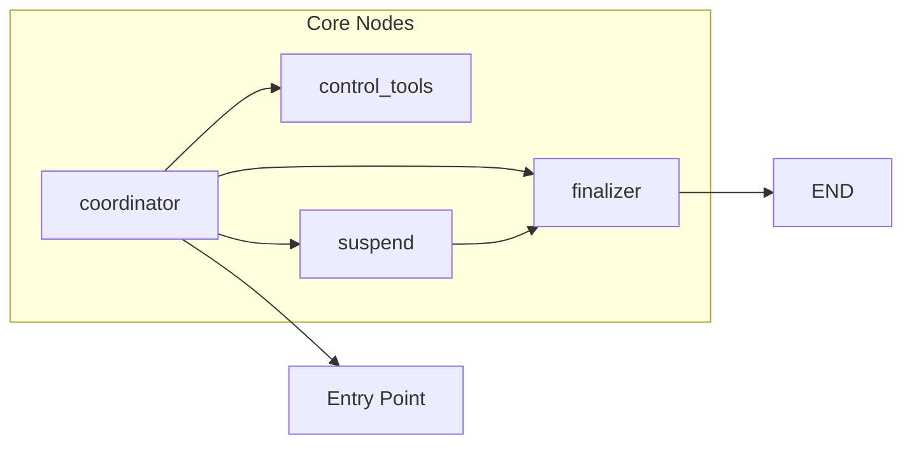

**Implementation:**

```python
def _add_core_orchestration_nodes(self, graph: StateGraph) -> None:
    graph.add_node(GraphNodeNames.COORDINATOR, self._coordinator_node)
    graph.add_node(GraphNodeNames.CONTROL_TOOLS, ToolNode(tools=self.plugin_manager.get_coordinator_tools()))
    graph.add_node(GraphNodeNames.SUSPEND, self._suspend_node)
    graph.add_node(GraphNodeNames.FINALIZER, self._finalizer_node)
```

### Phase 3: Plugin Node Integration

Dynamic plugin nodes are discovered and integrated based on registered plugins in the system:

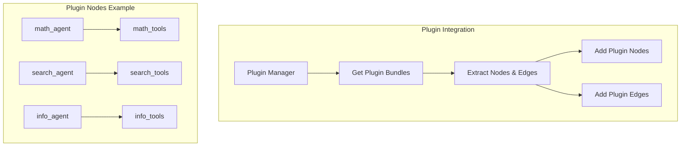

**Implementation:**

```python
def _add_dynamic_plugin_nodes(self, graph: StateGraph) -> None:
    """Dynamically adds plugin nodes and their connections to the graph."""
    for plugin_bundle in self.plugin_manager.plugin_bundles.values():
        plugin_name = plugin_bundle.metadata.name

        graph.add_node(f"{plugin_name}_agent", plugin_bundle.agent_node)
        graph.add_node(f"{plugin_name}_tools", plugin_bundle.tool_node)
```

### Phase 4: Routing Edge Establishment

The routing network creates the decision tree that guides conversation flow:

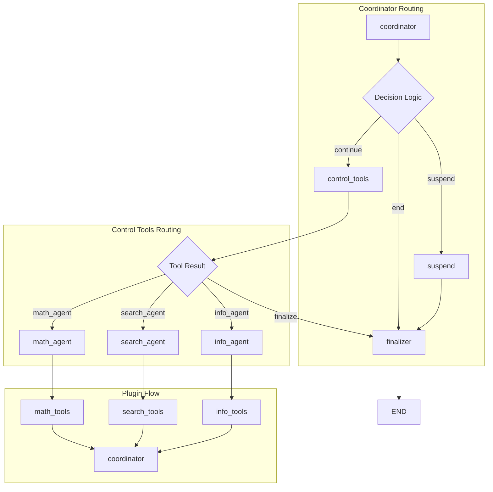

**Implementation:**

```python
def _add_conditional_routing_edges(self, graph: StateGraph) -> None:
    """Adds conditional routing edges between graph nodes."""
    self._add_coordinator_routing_edges(graph)
    self._add_control_tools_routing_edges(graph)
    self._add_plugin_routing_edges(graph)

def _add_coordinator_routing_edges(self, graph: StateGraph) -> None:
    """Adds conditional edges from coordinator to other nodes."""
    graph.add_conditional_edges(
        GraphNodeNames.COORDINATOR,
        self._coordinator_routing_logic,
        {
            RoutingDecision.CONTINUE: GraphNodeNames.CONTROL_TOOLS,
            RoutingDecision.END: GraphNodeNames.FINALIZER,
            RoutingDecision.SUSPEND: GraphNodeNames.SUSPEND,
        },
    )

def _add_control_tools_routing_edges(self, graph: StateGraph) -> None:
    """Adds conditional edges from control tools to plugin agents and finalizer."""
    route_mapping = {}

    for plugin_bundle in self.plugin_manager.plugin_bundles.values():
        route_mapping[plugin_bundle.metadata.name] = f"{plugin_bundle.metadata.name}_agent"

    route_mapping[RoutingDecision.END] = GraphNodeNames.FINALIZER

    graph.add_conditional_edges(GraphNodeNames.CONTROL_TOOLS, self._determine_plugin_route, route_mapping)

def _add_plugin_routing_edges(self, graph: StateGraph) -> None:
    """Adds edges from plugin agents back to coordinator."""
    for plugin_bundle in self.plugin_manager.plugin_bundles.values():
        plugin_name = plugin_bundle.metadata.name

        graph.add_edge(f"{plugin_name}_agent", f"{plugin_name}_tools")
        graph.add_edge(f"{plugin_name}_tools", GraphNodeNames.COORDINATOR)
```

### Phase 5: Entry Point Configuration

The graph needs a starting point:

```python
def _build_conversation_graph(self) -> StateGraph:
    # ... previous phases ...
    
    graph.set_entry_point(GraphNodeNames.COORDINATOR)  # Set starting node
    
    # ... continue with compilation
```

**What this means:**

- Every conversation starts at the `coordinator` node
- The coordinator analyzes the user query and makes routing decisions
- This creates a consistent entry point for all conversations

### Phase 6: Graph Compilation

The final step compiles the graph for execution:

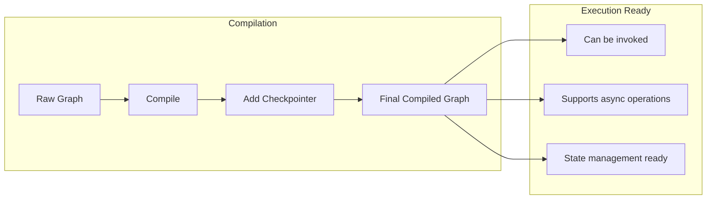

**Implementation:**

```python
def _build_conversation_graph(self) -> StateGraph:
    # ... previous phases ...
    
    # Compile the graph with optional checkpointer
    compilation_options = {"checkpointer": self.checkpointer} if self.checkpointer else {}
    compiled_graph = graph.compile(**compilation_options)
    
    # Log the graph structure for debugging
    self.logger.debug(f"Graph built with \n{compiled_graph.get_graph().draw_mermaid()}")
    
    return compiled_graph
```

## Decision Logic and Conditional Routing

### Improved Routing Design

The routing system has been designed to eliminate redundancy and improve clarity:

- **Coordinator** makes all primary finalization decisions
- **Control Tools** handle plugin routing and error case finalization
- **Clear Separation** of routing responsibilities
- **Error Handling** routes unknown results to finalizer
- **Consistent Naming** all routing tools use `goto_` prefix (e.g., `goto_math_agent`, `goto_finalize`)

This design follows the single responsibility principle while maintaining robust error handling and making the system
more predictable and maintainable.

### Coordinator Routing Logic

The coordinator makes intelligent decisions based on conversation state:

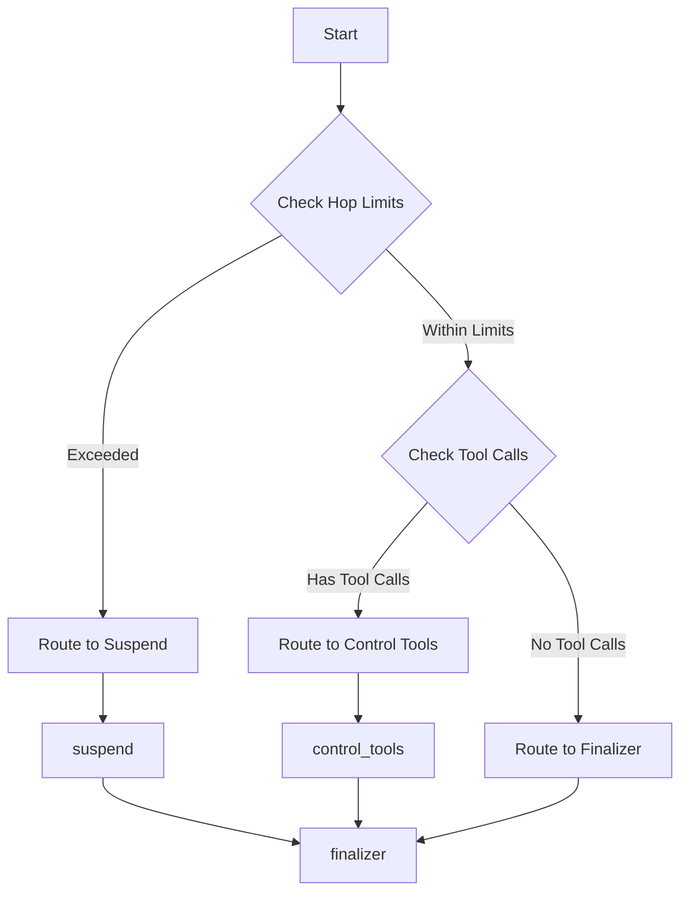

**Implementation:**

```python
def _coordinator_routing_logic(self, state: AgentState) -> str:
    if self._is_hop_limit_reached(state):
        self.logger.debug("Routing to SUSPEND due to hop limit reached")
        return RoutingDecision.SUSPEND
    elif self._has_tool_calls(state):
        self.logger.debug("Routing to CONTINUE due to tool calls present")
        return RoutingDecision.CONTINUE
    else:
        self.logger.debug("Routing to END - no tool calls and hop limit not reached")
        return RoutingDecision.END
```

### Hop Limit Management

The system prevents infinite loops through hop counting:

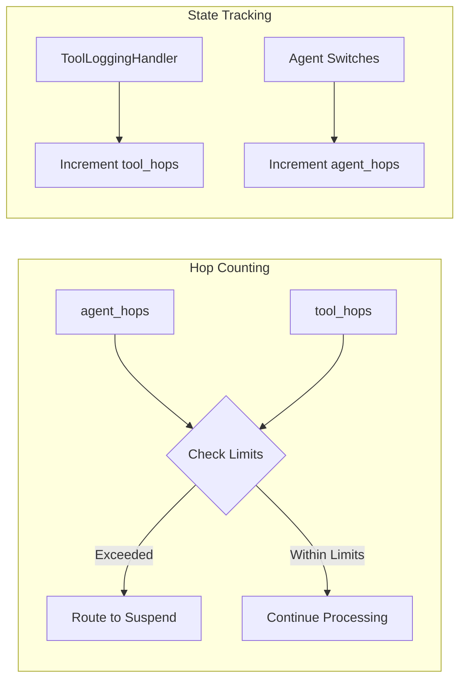

## Response Tone Control

The Cadence system now supports dynamic response tone control, allowing users to specify how they want responses to be
formatted and delivered.

### ResponseTone Enum

The system defines five distinct response styles through the `ResponseTone` enum:

```python
class ResponseTone(Enum):
    """Available response styles for the finalizer with detailed descriptions."""
    NATURAL = "natural"
    EXPLANATORY = "explanatory"
    FORMAL = "formal"
    CONCISE = "concise"
    LEARNING = "learning"
```

### Supported Tones

1. **Natural** (default): Friendly, conversational responses as if talking to a friend
2. **Explanatory**: Detailed, educational explanations with examples and analogies
3. **Formal**: Professional, structured language with clear organization
4. **Concise**: Brief, to-the-point answers focusing on essential information
5. **Learning**: Teaching approach with step-by-step guidance and educational structure

### Tone Integration in Finalizer

The finalizer dynamically adapts its response style based on the requested tone:

```python
def _finalizer_node(self, state: AgentState) -> AgentState:
    """Synthesizes the complete conversation into a coherent final response."""
    messages = state.get("messages", [])
    requested_tone = state.get("tone", "natural") or "natural"
    tone_instruction = self._get_tone_instruction(requested_tone)

    finalization_prompt_content = ConversationPrompts.FINALIZER_INSTRUCTIONS.format(
        tone_instruction=tone_instruction
    )
    finalization_prompt = SystemMessage(content=finalization_prompt_content)

    safe_messages = self._filter_safe_messages(messages)
    final_response = self.finalizer_model.invoke([finalization_prompt] + safe_messages)

    return self._create_state_update(final_response, state.get("agent_hops", 0), state)
```

### Conversation Prompts

The system uses structured prompts for different conversation roles:

```python
class ConversationPrompts:
    """System prompts for different conversation roles."""

    COORDINATOR_INSTRUCTIONS = """Your goal is to analyze queries and decide which agent to route to from the **AVAILABLE AGENTS**.
**AVAILABLE AGENTS**
{plugin_descriptions}
- finalize: Call when you think the answer for the user query/question is ready or no suitable agents.
**DECISION OUTPUT**
- Choose ONE of: {tool_options} | goto_finalize"""

    HOP_LIMIT_REACHED = """You have reached maximum agent call ({current}/{maximum}) allowed by the system.
**What this means:**
- The system cannot process any more agent switches
- You must provide a final answer based on the information gathered so far
- Further processing is not possible

**What you should do:**
1. Acknowledge that you've hit the system limit. Explain it friendly to users, do not use term system limit or agent stuff
2. Explain what you were able to accomplish base on results.
3. Provide the best possible answer with the available information
4. If the answer is incomplete, explain why and suggest the user continue the chat

**IMPORTANT**, never makeup the answer if provided information by agents not enough
Please provide a helpful response that addresses the user's query while explaining the hop limit situation."""

    FINALIZER_INSTRUCTIONS = """You are the Finalizer, responsible for creating the final response for a multi-agent conversation.

CRITICAL REQUIREMENTS:
1. **RESPECT AGENT RESPONSES** - Use ONLY the information provided by agents and tools, do NOT make up or add information
2. **ADDRESS CURRENT USER QUERY** - Focus on answering the recent user question, use previous conversation as context
3. **SYNTHESIZE RELEVANT WORK** - Connect and organize the work done by different agents into a coherent answer
4. **BE HELPFUL** - Provide useful, actionable information that directly answers the user's question
5. **RESPONSE STYLE**: {tone_instruction}

IMPORTANT: Your role is to synthesize and present the information that agents have gathered, not to generate new information or make assumptions beyond what's provided in the conversation."""
```

## Tone Control Flow

The tone control system flows through the entire conversation pipeline:

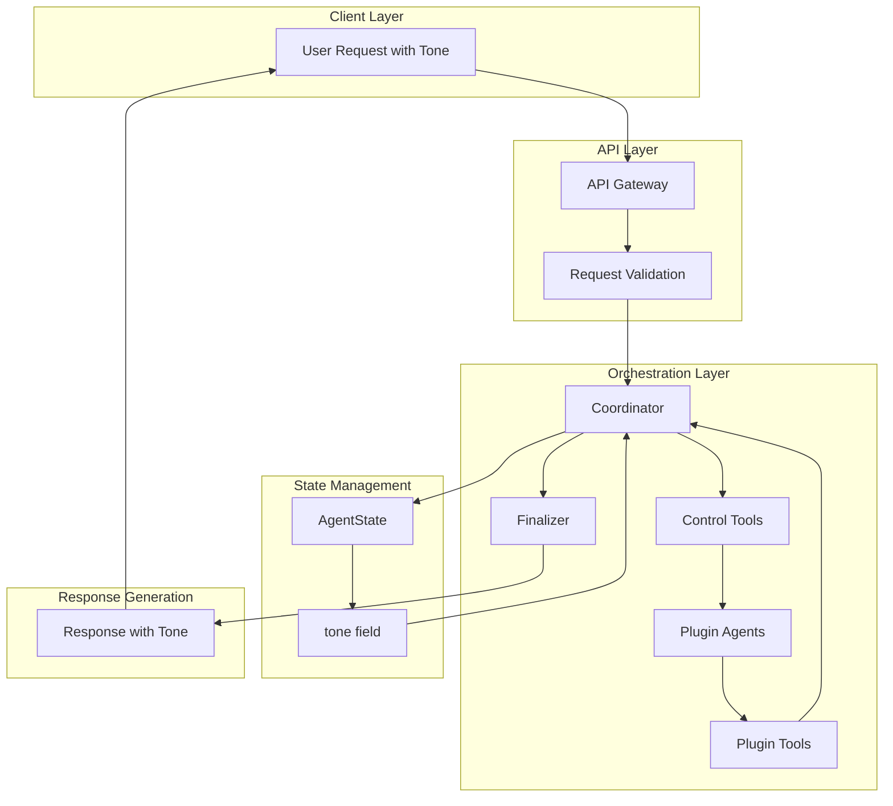

## Tool Execution Logging

The system includes a `ToolExecutionLogger` callback handler for tracking tool execution and managing hop counting:

```python
class ToolExecutionLogger(BaseCallbackHandler):
    """Logs tool execution and manages hop counting for conversation safety."""

    def on_tool_start(self, serialized=None, input_str=None, **kwargs):
        """Logs tool execution start and updates hop counters for non-routing tools."""
        try:
            tool_name = serialized.get("name") if isinstance(serialized, dict) else None
            self.logger.debug(f"Tool start: name={tool_name or 'unknown'} input={input_str}")

            if tool_name.startswith("goto_"):
                self.logger.debug(f"Tool name={tool_name or 'unknown'} is skipped from counting")
            elif self.state_updater:
                self.logger.debug(f"Updating tool_hops: +1 (tool: {tool_name})")
                self.state_updater("tool_hops", 1)
            else:
                self.logger.warning("No state_updater available for tool_hops tracking")
        except Exception as e:
            self.logger.error(f"Error in on_tool_start: {e}")
```

## Complete Conversation Flow

### High-Level Flow

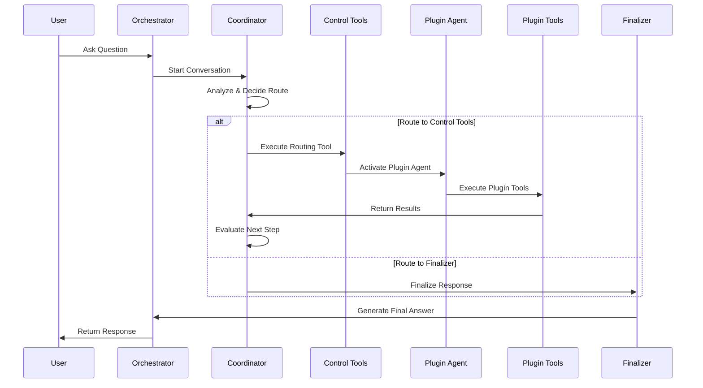

### Detailed Node Interactions

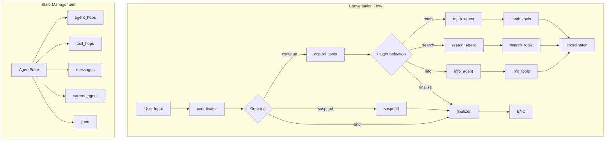

## Graph Compilation and Execution

### Compilation Process

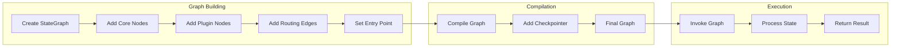

**Implementation:**

```python
def _build_conversation_graph(self) -> StateGraph:
    graph = StateGraph(AgentState)
    
    self._add_core_orchestration_nodes(graph)
    self._add_dynamic_plugin_nodes(graph)
    
    graph.set_entry_point(GraphNodeNames.COORDINATOR)
    self._add_conditional_routing_edges(graph)
    
    compilation_options = {"checkpointer": self.checkpointer} if self.checkpointer else {}
    compiled_graph = graph.compile(**compilation_options)
    
    return compiled_graph
```

## Practical Examples

### Example 1: Simple Math Query

**User Query:** "What is 15 * 23?"

**Execution Flow:**

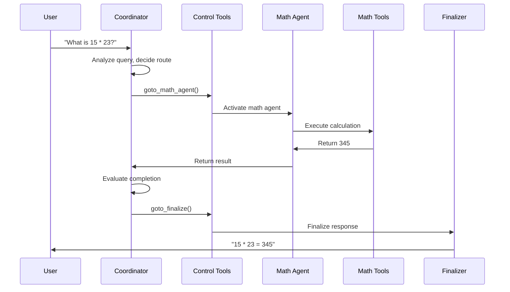

**Graph Routing Decisions:**

1. **Coordinator Decision**: `continue` (has tool calls)
2. **Control Tools Result**: `math_agent`
3. **Plugin Route**: `math_agent` → `math_tools` → `coordinator`
4. **Final Decision**: `goto_finalize` → returns `"finalize"` → routes to finalizer

### Example 2: Multi-Agent Workflow

**User Query:** "Search for Python async programming info and calculate years since Python 3.7 release"

**Execution Flow:**

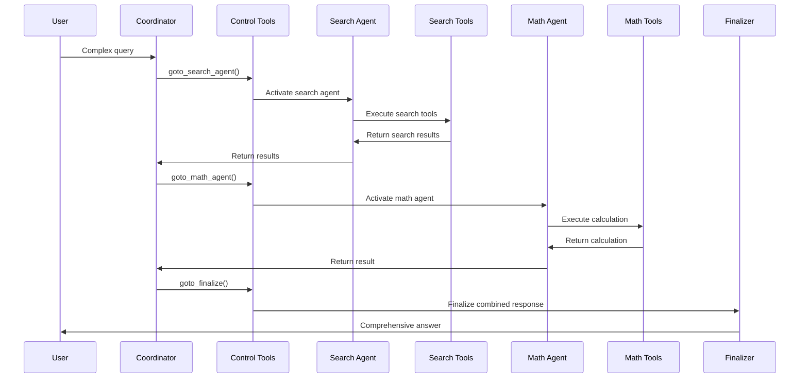

**State Changes:**

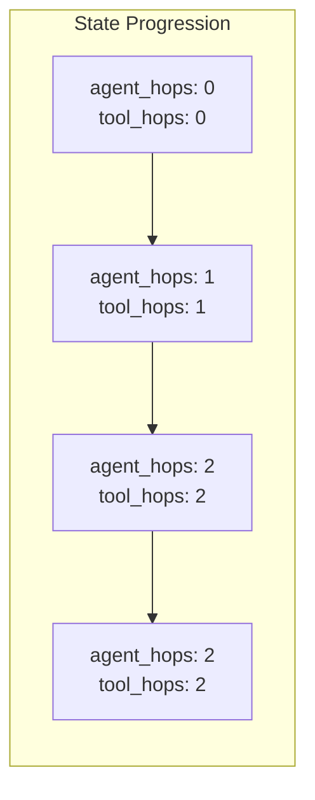

### Example 3: Hop Limit Reached

**User Query:** "I need a very detailed analysis that requires multiple agents..."

**Execution Flow (Hit Hop Limit):**

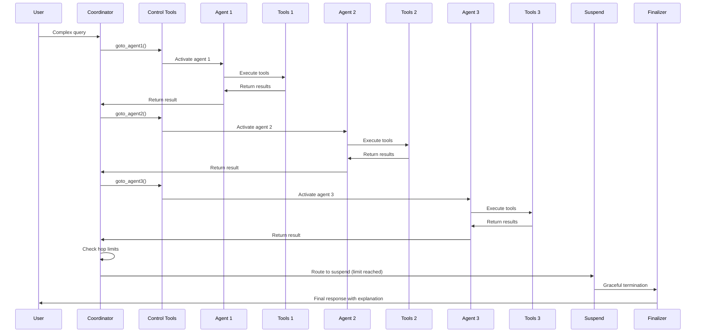

## Plugin Integration Architecture

### Plugin Bundle Structure

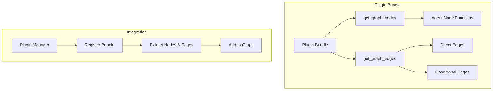

### Dynamic Plugin Loading

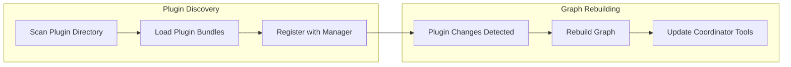

## Error Handling and Safety

### Error Handling Flow

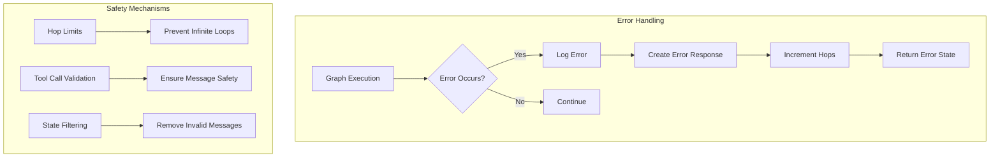

## Configuration and Customization

### Graph Configuration

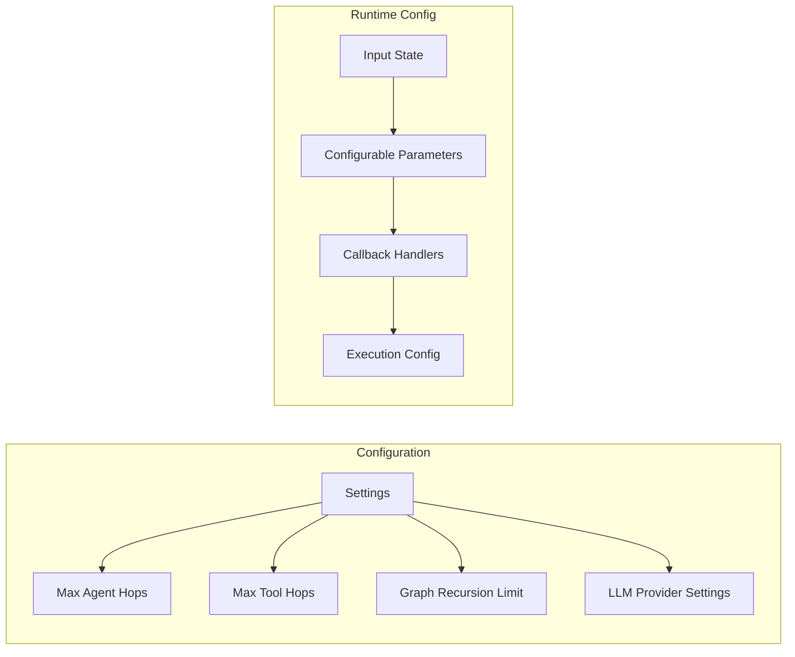

## Best Practices

### 1. **Node Design**

- Keep nodes focused on single responsibilities
- Use descriptive names for better debugging
- Implement proper error handling in each node

### 2. **Edge Management**

- Use conditional edges for decision-based routing
- Implement proper fallback paths
- Avoid circular dependencies

### 3. **State Management**

- Design state schema carefully
- Validate state updates
- Implement proper cleanup mechanisms

### 4. **Plugin Integration**

- Maintain clear separation between core and plugin logic
- Use consistent interfaces for plugin communication
- Support dynamic plugin loading and unloading

### 5. **Error Handling**

- Implement graceful degradation
- Log errors with sufficient context
- Provide user-friendly error messages

### 6. **Performance Optimization**

- Always implement hop limits to prevent infinite loops
- Filter messages to ensure tool call sequences are complete
- Use callback handlers for execution tracking and debugging

## Consistent Naming Convention

All routing tools in the system follow a consistent naming pattern:

- **Plugin Agents**: `goto_{plugin_name}_agent` (e.g., `goto_math_agent`, `goto_search_agent`)
- **Finalization**: `goto_finalize` (for completing conversations)
- **Tool Execution**: All routing tools use the `goto_` prefix for clarity

### How Routing Works

```python
# Tool definitions in SDK Manager:
def goto_math_agent() -> str:
    return "math_agent"  # Routes to math_agent node

def goto_finalize() -> str:
    return "finalize"    # Routes to finalizer node
```

### Routing Logic

The control tools routing logic handles three scenarios:

1. **Plugin Routing**: `"math_agent"` → routes to `math_agent` node
2. **Finalization**: `"finalize"` → routes to `finalizer` node
3. **Error Handling**: Unknown results → routes to `finalizer` node

This consistency makes the system easier to understand and maintain, as developers can immediately identify routing
tools by their naming pattern.

### **Plugin Route Determination**

The system uses the `_determine_plugin_route` method to handle routing decisions:

```python
def _determine_plugin_route(self, state: AgentState) -> str:
    """Routes to the appropriate plugin agent based on tool results."""
    messages = state.get("messages", [])
    if not messages:
        return RoutingDecision.END

    last_message = messages[-1]

    # Check if this is a valid tool message
    if not self._is_valid_tool_message(last_message):
        self.logger.warning("No valid tool message found in routing")
        return RoutingDecision.END

    # Get the tool result from the message content
    tool_result = last_message.content
    self.logger.debug(
        f"Tool routing: tool_result='{tool_result}', available_plugins={[bundle.metadata.name for bundle in self.plugin_manager.plugin_bundles.values()]}"
    )

    if tool_result in [
        plugin_bundle.metadata.name for plugin_bundle in self.plugin_manager.plugin_bundles.values()
    ]:
        return tool_result
    elif tool_result == "finalize":
        return RoutingDecision.END
    else:
        self.logger.warning(f"Unknown tool result: '{tool_result}', routing to END")
        return RoutingDecision.END
```

## Enhanced Finalizer with Tone-Aware Response Generation

The finalizer has been enhanced to support dynamic response tone control while ensuring it respects and synthesizes
actual agent responses rather than making up information.

### **Key Features**

1. **Dynamic Tone Support**: Supports multiple response styles (natural, explanatory, formal, concise, learning)
2. **Response Respect**: Uses ONLY information provided by agents without making up or adding assumptions
3. **Current Query Focus**: Focuses on the most recent user query, using previous conversation as context
4. **Structured Prompts**: Uses comprehensive prompt templates with tone-specific instructions
5. **Robust Default Handling**: Ensures tone is always set with fallback to "natural"
6. **Helpful Responses**: Provides useful, actionable information that directly answers the user's question

### **Implementation**

The finalizer dynamically adapts its response style based on the requested tone:

```python
def _finalizer_node(self, state: AgentState) -> AgentState:
    """Synthesizes the complete conversation into a coherent final response."""
    messages = state.get("messages", [])
    requested_tone = state.get("tone", "natural") or "natural"
    tone_instruction = self._get_tone_instruction(requested_tone)

    finalization_prompt_content = ConversationPrompts.FINALIZER_INSTRUCTIONS.format(
        tone_instruction=tone_instruction
    )
    finalization_prompt = SystemMessage(content=finalization_prompt_content)

    safe_messages = self._filter_safe_messages(messages)
    final_response = self.finalizer_model.invoke([finalization_prompt] + safe_messages)

    return self._create_state_update(final_response, state.get("agent_hops", 0), state)
```

### **Tone Instruction Generation**

The system provides detailed tone descriptions through the `ResponseTone` enum:

```python
def _get_tone_instruction(self, tone: str) -> str:
    """Returns the appropriate tone instruction based on the requested response style."""
    return ResponseTone.get_description(tone)
```

### **Default Handling**

The system ensures tone is always set with robust default handling at multiple levels:

- **API Level**: `tone: Optional[str] = Field(default="natural")`
- **Client Level**: `"tone": tone or "natural"`
- **Service Level**: `"tone": (tone or "natural").strip() or "natural"`
- **Finalizer Level**: `requested_tone = state.get("tone", "natural") or "natural"`

This ensures the finalizer always has a valid tone instruction, even if the API request is missing or contains empty
values.

### **Example: How Finalizer Adapts to Different Tones**

**User Query**: "What's the weather like in Tokyo and calculate the time difference from New York?"

**Agent Responses**:

1. **Weather Agent**: "The current weather in Tokyo is 22°C with light rain. Humidity is 75%."
2. **Math Agent**: "Tokyo is 14 hours ahead of New York. If it's 9 AM in New York, it's 11 PM in Tokyo."

#### **Natural Tone** (default)

```
Here's what I found for you about Tokyo:

The weather right now is 22°C with light rain and 75% humidity. Pretty typical spring weather there!

For the time difference, Tokyo is 14 hours ahead of New York. So if it's 9 AM in New York, it's 11 PM in Tokyo. That's a pretty big difference - definitely something to keep in mind if you're planning calls or meetings.

Hope that helps with your planning!
```

#### **Formal Tone**

```
Based on the information gathered, here are the details for Tokyo:

**Weather Conditions:**
The current temperature in Tokyo is 22°C with light rain and 75% humidity.

**Time Difference:**
Tokyo operates 14 hours ahead of New York. For reference: when it is 9:00 AM in New York, it is 11:00 PM in Tokyo.

This information should assist with your planning requirements.
```

#### **Concise Tone**

```
Tokyo weather: 22°C, light rain, 75% humidity
Time difference: Tokyo is 14 hours ahead of New York
```

**Key Points**:

- ✅ Uses ONLY information from agents
- ✅ Focuses on the current user query (weather + time difference)
- ✅ Adapts response style based on requested tone
- ✅ Provides useful, actionable information
- ✅ Maintains accuracy by not adding assumptions
- ✅ Supports multiple communication styles (natural, formal, concise, etc.)

## Benefits of the Improved Routing Design

The improved routing design provides several key advantages:

1. **Clear Responsibility Separation**: Each component has a focused role
    - Coordinator: Makes all primary routing decisions
    - Control Tools: Handles plugin execution and error cases
    - Finalizer: Handles response synthesis

2. **Robust Error Handling**: Graceful handling of unexpected routing results
    - Unknown results route to finalizer instead of crashing
    - Error cases are handled consistently

3. **Easier Debugging**: Clear routing logic means easier troubleshooting
    - Coordinator decisions are centralized
    - Plugin routing is isolated
    - Error paths are well-defined

4. **More Maintainable**: Changes to routing logic are localized
    - Primary finalization logic is in coordinator
    - Error handling is in control tools
    - Clear separation of concerns

5. **Predictable Flow**: Users and developers can understand the conversation flow
    - Clear decision points
    - Logical progression through the system
    - Graceful error recovery

## Conclusion

The LangGraph architecture in Cadence provides a robust, flexible foundation for multi-agent conversations. By separating
concerns into distinct layers and using conditional routing, the system can handle complex workflows while maintaining
safety and performance. The dynamic plugin integration allows for extensibility without compromising the core
orchestration logic.

The improved routing design eliminates redundancy and follows the single responsibility principle, making the system
more predictable, maintainable, and easier to debug.
