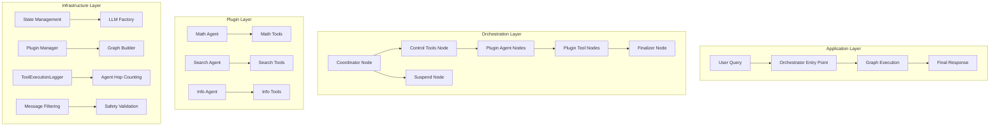
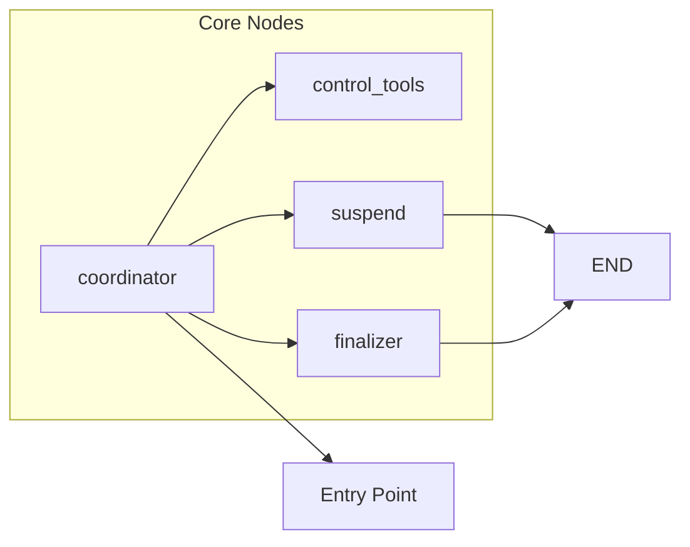
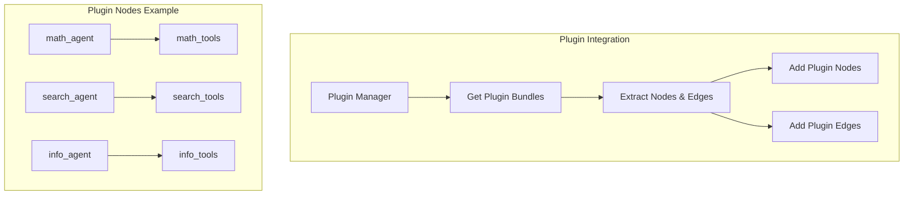
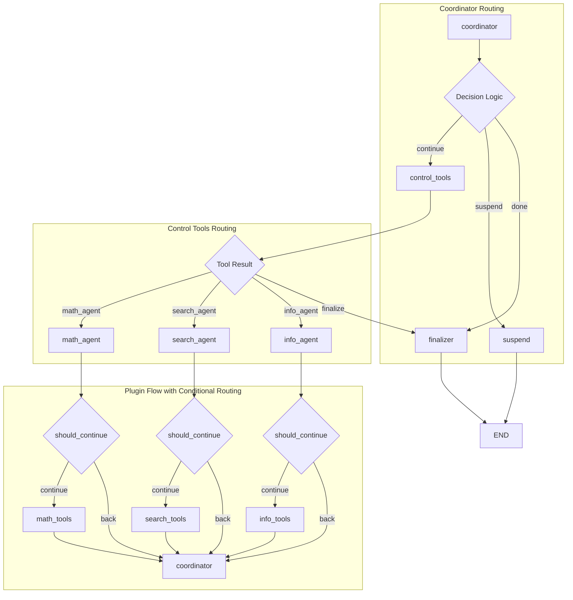
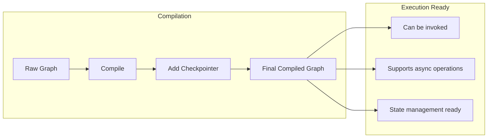
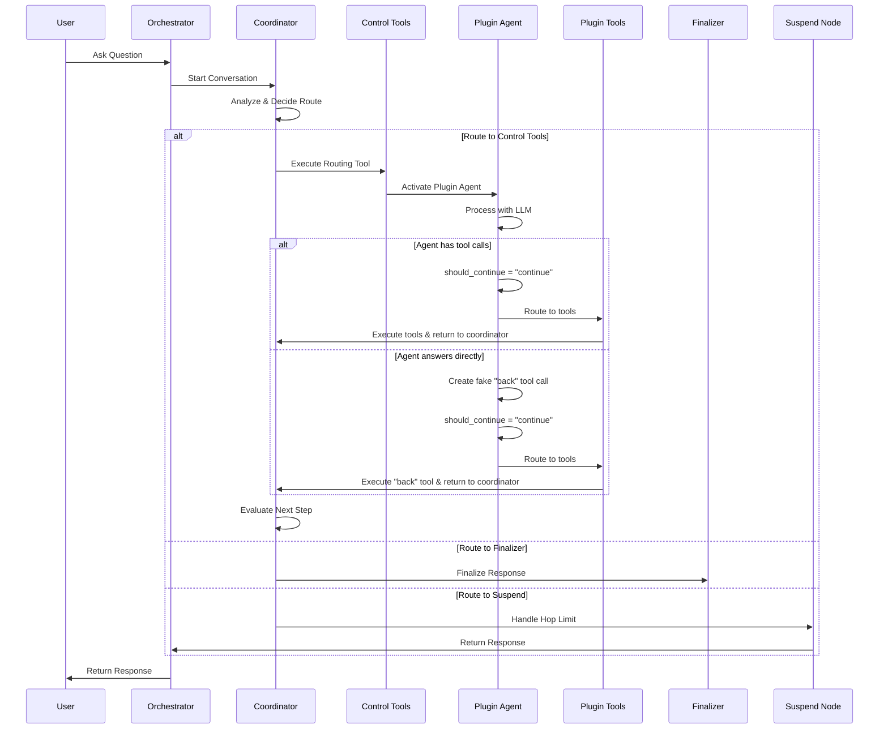
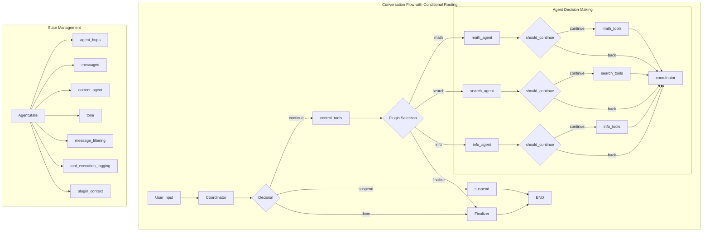
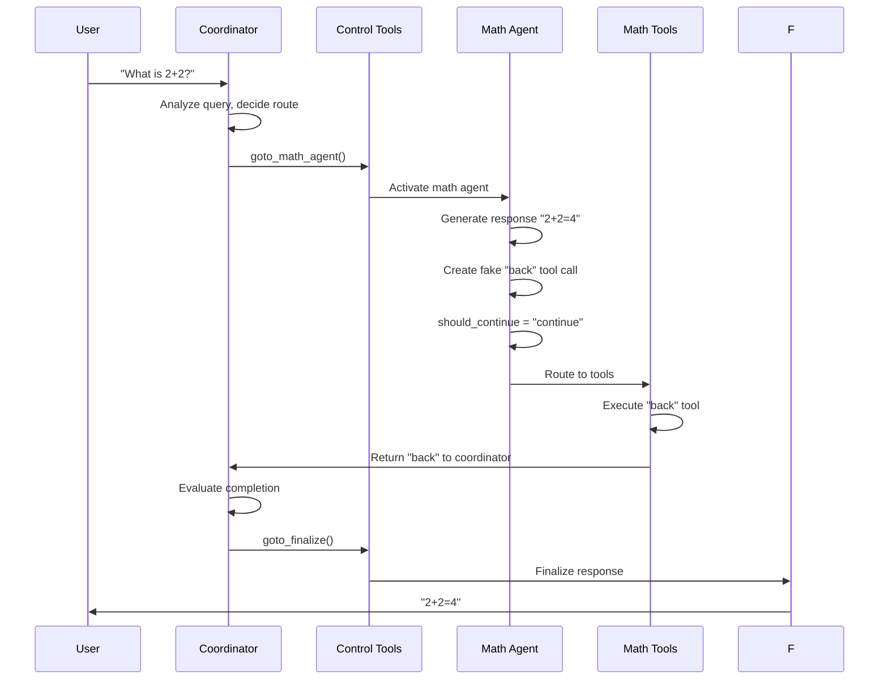
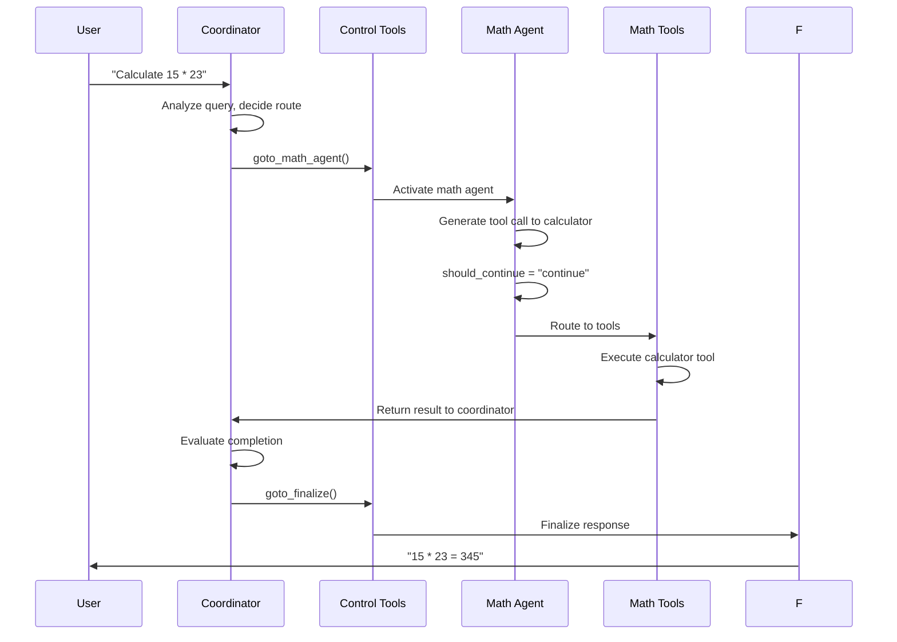

# LangGraph Architecture in Cadence

## Overview

The Cadence system uses LangGraph to orchestrate multi-agent conversations through a sophisticated workflow that
dynamically routes between different plugin agents. This document provides a comprehensive guide to understanding the
architectural design, how the graph is conceptually constructed, and how the conversation flow is designed to be
flexible and extensible.

## Table of Contents

- [Architecture Layers](#architecture-layers)
- [Graph Construction Design](#graph-construction-design)
- [Decision Logic and Routing](#decision-logic-and-routing)
- [Response Tone Control](#response-tone-control)
- [Tool Execution Logging](#tool-execution-logging)
- [Complete Conversation Flow](#complete-conversation-flow)
- [Practical Examples](#practical-examples)
- [Best Practices](#best-practices)

## Architecture Layers

The LangGraph implementation in Cadence follows a layered architecture approach:



## Graph Construction Design

The graph construction follows a systematic 6-phase design approach that ensures proper setup and integration of all
components.

### Phase 1: Graph Initialization

The process begins with creating a new state graph instance that will manage the conversation flow.

**Design Principles:**

- Creates a new state graph instance with conversation state schema
- Associates it with the agent state schema for type safety
- Prepares the graph for dynamic node and edge additions

### Phase 2: Core Node Registration

The orchestrator starts by adding four essential nodes that form the backbone of the conversation flow:



**Core Node Design:**

- **Coordinator Node**: Main decision-making hub that analyzes user queries and routes to appropriate agents
- **Control Tools Node**: Manages routing tools that direct conversation flow to specific plugin agents
- **Suspend Node**: Handles graceful termination when hop limits are exceeded
- **Finalizer Node**: Synthesizes conversation results into coherent final responses

### Phase 3: Plugin Node Integration

Dynamic plugin nodes are discovered and integrated based on registered plugins in the system:



**Plugin Integration Design:**

- **Dynamic Discovery**: Plugin manager discovers available plugin bundles
- **Node Extraction**: Each plugin bundle provides agent and tool nodes
- **Graph Integration**: Nodes are dynamically added to the conversation graph
- **Edge Configuration**: Plugin bundles define their own routing logic

### Phase 4: Routing Edge Establishment

The routing network creates the decision tree that guides conversation flow:



**Routing Design Principles:**

- **Conditional Edges**: Agent routing decisions based on `should_continue` method
- **Direct Edges**: Tools always route to coordinator (prevents circular routing)
- **No Circular Routing**: Eliminated the `tools → agent` edge that caused infinite loops
- **Dynamic Edge Creation**: Plugin bundles define their own routing logic

### Phase 5: Entry Point Configuration

The graph needs a starting point for all conversations.

**Design Principles:**

- Every conversation starts at the coordinator node
- The coordinator analyzes the user query and makes routing decisions
- This creates a consistent entry point for all conversations

### Phase 6: Graph Compilation

The final step compiles the graph for execution.



**Compilation Design:**

- **Graph Compilation**: Converts the raw graph into an executable workflow
- **Checkpointer Integration**: Optional state persistence for conversation continuity
- **Debug Information**: Graph structure logging for development and debugging

**Decision Logic Design:**

### Agent Decision Making

The system implements agent decision-making through a standardized decision method:

**Decision Logic Design:**

- If the agent's response has tool calls → routes to tools for execution
- If the agent's response has NO tool calls → returns control to coordinator
- This ensures consistent routing behavior across all agents

### Routing Implementation

The implementation is simple and elegant:

**Implementation in BaseAgent:**

```python
@staticmethod
def should_continue(state: Dict[str, Any]) -> str:
    """Simple routing decision based on tool calls presence"""
    last_msg = state.get("messages", [])[-1] if state.get("messages") else None
    if not last_msg:
        return "back"

    tool_calls = getattr(last_msg, "tool_calls", None)
    return "continue" if tool_calls else "back"
```

**Design Principles:**

- **Pure Decision Logic**: Check if agent response has tool_calls
- **Consistent Flow**: All agent responses follow the same routing path through should_continue
- **Simple and Reliable**: Clean routing logic without complexity
- **Standardized Interface**: All plugins use the same decision method

### Plugin Bundle Edge Configuration

The plugin bundles define their own routing logic through a standardized interface.

**Edge Configuration (from SDKPluginBundle.get_graph_edges()):**

```python
def get_graph_edges(self) -> Dict[str, Any]:
    normalized_agent_name = str.lower(self.metadata.name).replace(" ", "_")
    return {
        "conditional_edges": {
            f"{normalized_agent_name}_agent": {
                "condition": self.agent.should_continue,  # Static method reference
                "mapping": {
                    "continue": f"{normalized_agent_name}_tools",  # Route to tools
                    "back": "coordinator",  # Return to coordinator
                },
            }
        },
        "direct_edges": [(f"{normalized_agent_name}_tools", "coordinator")],  # Tools always return
    }
```

**Edge Configuration Design:**

- **Conditional Edges**: Based on `should_continue` static method result
- **Direct Edges**: Tools always route back to coordinator (prevents circular routing)
- **No Agent-to-Agent Routing**: All routing goes through the coordinator
- **Standardized Naming**: Plugin names normalized to `{plugin_name}_agent` and `{plugin_name}_tools`

### Back Tool Integration

Each plugin bundle automatically includes a "back" tool created in the SDKPluginBundle constructor:

**Implementation:**

```python
# From SDKPluginBundle.__init__()
@tool
def back() -> str:
    """Return control back to the coordinator."""
    return "back"


all_tools = tools + [back]  # Add to agent's tools
self.tool_node = ToolNode(all_tools)  # Create ToolNode with all tools
```

**Design Principles:**

- **Automatic Addition**: Every plugin bundle gets a back tool automatically
- **Simple Implementation**: Just returns "back" string for routing
- **ToolNode Integration**: Included in the ToolNode along with agent's tools
- **Consistent Behavior**: All plugins have the same back tool functionality

## Suspend Node Implementation

The suspend node provides intelligent handling of hop limits with context awareness.

**Key Design Features:**

- **Hop Detection**: Hop limit detection with state tracking
- **Smart Hop Counting**: Only agent calls increment the hop counter, not finalization calls
- **Context Preservation**: Maintains conversation context while explaining the limit situation
- **Tone Adaptation**: Respects user's requested tone preference in the suspension message
- **Safe Message Filtering**: Prevents validation errors by filtering incomplete tool call sequences

**Hop Limit Prompt Design:**

The suspend node uses a prompt that provides better user experience:

- **User-Friendly Language**: Explains limits without technical jargon
- **Accomplishment Acknowledgment**: Explains what was accomplished based on gathered information
- **Best Possible Answer**: Provides the best answer with available data
- **Continuation Suggestions**: Suggests how to continue if the answer is incomplete
- **Tone Adaptation**: Maintains the user's requested conversation tone

**Hop Counting Logic:**

The hop counting system ensures that only agent calls increment the hop counter:

- **Finalization Exclusion**: `goto_finalize` calls don't increment hop counter
- **Agent Call Tracking**: Only agent routing calls increment the counter
- **Accurate Limits**: Prevents premature hop limit triggering

## Coordinator Guardrails and Routing Limits

### Consecutive Same-Agent Route Guard

The coordinator implements a guard to prevent repeatedly routing to the same agent too many times in a row.

- Purpose: avoid unproductive loops where the coordinator keeps handing control to the same agent without progress
- Trigger: when the same agent is selected consecutively beyond a configurable limit
- Behavior: routes to the `suspend` node instead of continuing
- Configuration: `coordinator_consecutive_agent_route_limit` (env: `CADENCE_COORDINATOR_CONSECUTIVE_AGENT_ROUTE_LIMIT`)

State tracking is maintained in `plugin_context`:

- `plugin_context.same_agent_consecutive_routes`: running count of consecutive routes to the same agent
- `plugin_context.last_routed_agent`: last selected agent name
- Reset conditions: any `goto_finalize` decision or a change in selected agent

### Coordinator Workflow Implementation

The coordinator follows a strict workflow implemented in `_coordinator_node()`:

**Coordinator Logic:**

```python
def _coordinator_node(self, state: AgentState) -> AgentState:
    # 1. Build dynamic prompt with available plugins
    plugin_descriptions = self._build_plugin_descriptions()
    tool_options = self._build_tool_options()
    coordinator_prompt = COORDINATOR_INSTRUCTIONS.format(...)

    # 2. Get coordinator's routing decision
    request_messages = [SystemMessage(content=coordinator_prompt)] + messages
    coordinator_response = self.coordinator_model.invoke(request_messages)

    # 3. Process routing decision and update counters
    if self._has_tool_calls({"messages": [coordinator_response]}):
        # Agent routing - increment hop counter and update consecutive routing
        current_agent_hops = self.calculate_agent_hops(current_agent_hops, tool_calls)
        plugin_context = self._update_consecutive_routes_counter(plugin_context, tool_calls)
    else:
        # No routing decision - force finalization
        coordinator_response.content = ""
        coordinator_response.tool_calls = [ToolCall(name="goto_finalize", args={})]
        plugin_context = self._reset_route_counters(plugin_context)

    return self._create_state_update(coordinator_response, current_agent_hops, updated_state)
```

**Coordinator Safety Checks (in \_coordinator_routing_logic()):**

1. **Hop Limit Check**: `if self._is_hop_limit_reached(state): return SUSPEND`
2. **Consecutive Agent Check**: `if self._is_consecutive_agent_route_limit_reached(state): return SUSPEND`
3. **Tool Calls Check**: `if self._has_tool_calls(state): return CONTINUE`
4. **Default**: `return DONE` (route to finalizer)

**Coordinator Prompt Contract (Strict Rules):**

- Choose exactly one route from available tools or finalize
- Do not invent agents/tools, and do not perform tool work directly
- Use the full conversation history; avoid redundant work if results already exist
- Prefer continuity when the last agent is still the best fit

## Complete Conversation Flow

### High-Level Flow with Enhanced Conditional Routing



### Detailed Node Interactions with Routing



## Practical Examples

### Example 1: Agent Answers Directly

**User Query:** "What is 2+2?"

**Execution Flow:**



**Key Design Features:**

1. **Agent Decision**: Uses standardized decision method for routing decisions
2. **Consistent Flow**: Always goes through tools node before coordinator
3. **No Circular Routing**: Tools route directly to coordinator, not back to agent
4. **Suspend Node**: Hop limit handling with user-friendly messages

### Example 2: Agent Uses Tools

**User Query:** "Calculate 15 \* 23"

**Execution Flow:**



## Benefits of the Routing System

### 1. **Eliminated Circular Routing**

- **Before**: `agent → tools → agent → tools → ...` (infinite loop)
- **After**: `agent → tools → coordinator` (clean, predictable flow)

### 2. **State Management**

- All agent responses go through the same routing path
- State updates happen consistently through the tools node
- Debugging and monitoring capabilities
- Plugin context tracking for routing history

### 3. **Clear Intent Communication**

- Agent routing decisions are explicit through should_continue logic
- Easy to understand and debug conversation flow
- Predictable system behavior
- Logging for routing decisions

### 4. **Error Handling**

- Clear separation between agent decisions and tool execution
- Error isolation and recovery
- Consistent error handling patterns
- Graceful degradation when agents fail

### 5. **Plugin Integration**

- Plugin bundles define their own routing logic
- Consistent interface for all plugins
- Separation of concerns
- Easy plugin development and testing

### 6. **Suspend Node**

- Hop limit detection and counting
- User-friendly limit explanations
- Tone-aware suspension messages
- Safe message filtering to prevent errors
- Context preservation

## Best Practices

### 1. **Enhanced Agent Implementation**

- Always implement the standardized decision method properly
- Clear system prompts that guide tool usage
- Proper error handling and logging

### 2. **Enhanced Tool Design**

- Tools should return meaningful results
- Handle errors gracefully
- Provide clear documentation
- Include proper validation

### 3. **Enhanced Plugin Structure**

- Follow the established plugin structure
- Register plugins properly in the initialization
- Include proper metadata and capabilities
- Implement proper edge configuration

### 4. **Enhanced Testing**

- Test both tool usage and direct answer scenarios
- Verify routing behavior with different agent responses
- Test error conditions and edge cases
- Validate state management consistency

### 5. **Monitoring**

- Monitor routing decisions and edge creation
- Track plugin context and routing history
- Monitor tool execution performance
- Validate state consistency

## Conclusion

The conditional routing system in Cadence provides a robust, predictable foundation for multi-agent
conversations.
By implementing intelligent agent decision-making, proper edge routing, and suspend node
handling, we've eliminated circular routing issues while maintaining the
flexibility and power of the multi-agent architecture.

The system ensures that:

- All agent responses follow a consistent routing path
- Circular routing is prevented through proper edge configuration
- State management is predictable and debuggable
- The conversation flow is clear and maintainable
- Plugin integration is seamless and consistent
- Error handling is robust and graceful

This implementation makes Cadence reliable, easy to debug, and maintainable while preserving all
the features of the multi-agent orchestration system.
