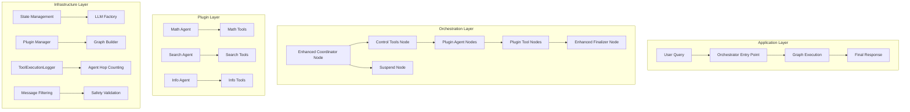
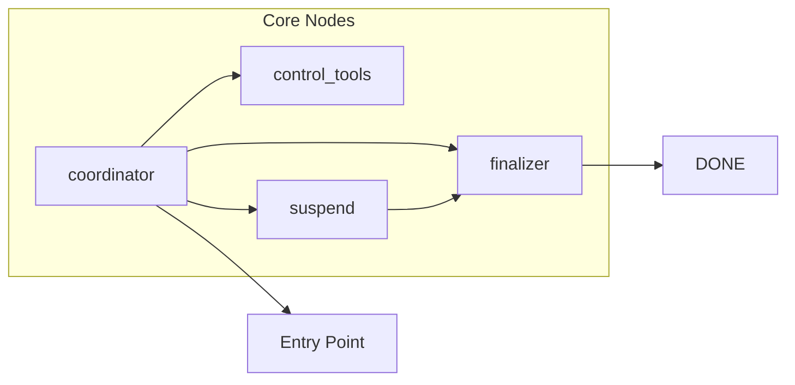
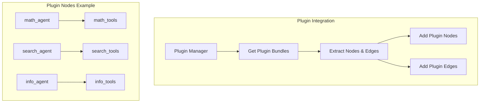
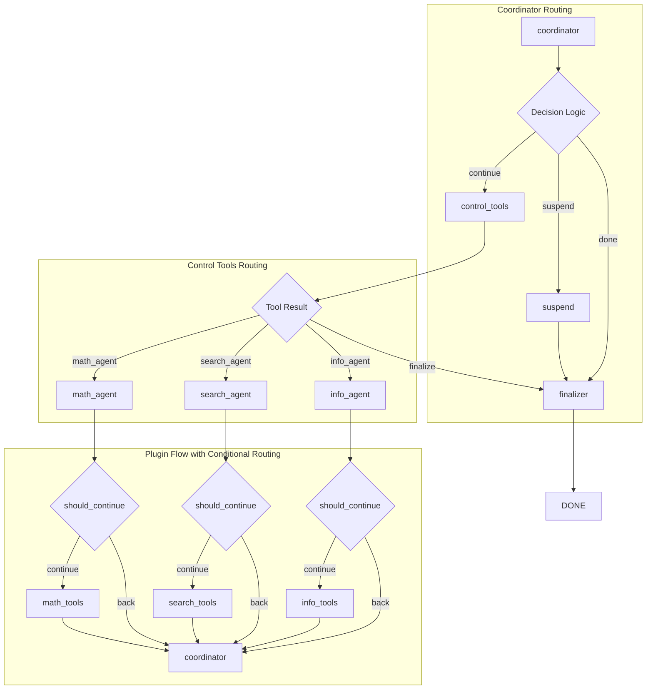
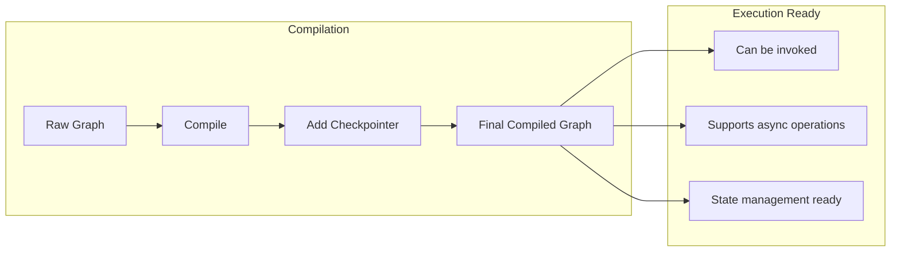
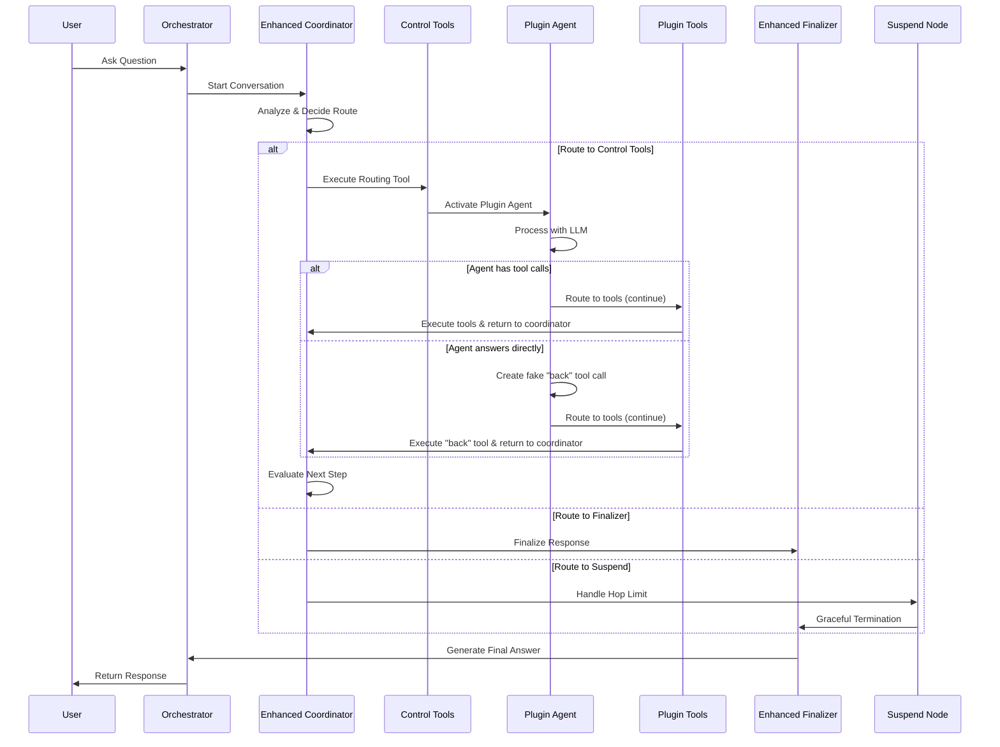
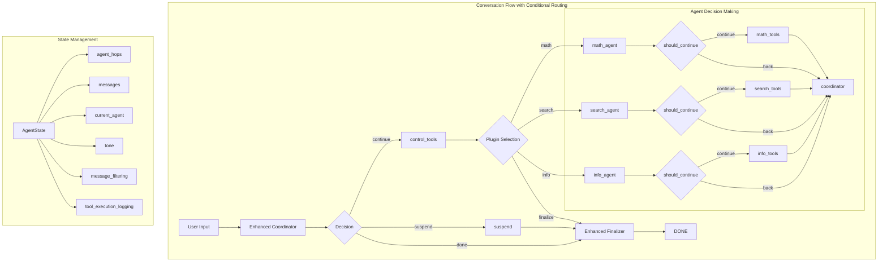
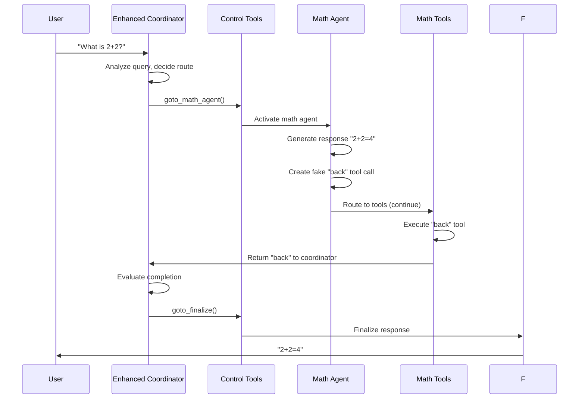
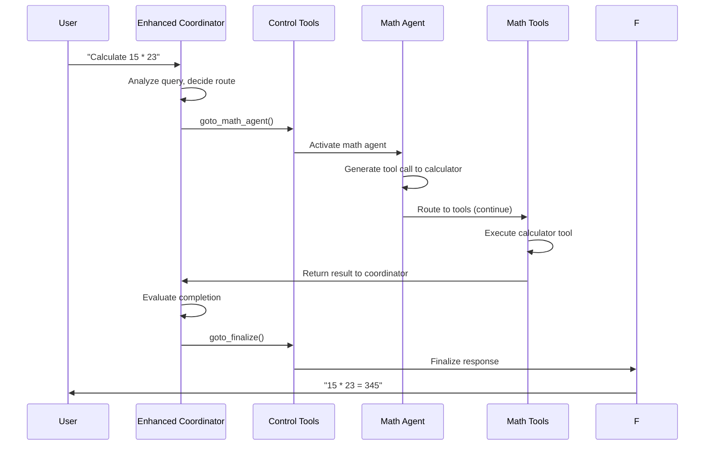

# LangGraph Architecture in Cadence

## Overview

The Cadence system uses LangGraph to orchestrate multi-agent conversations through a sophisticated workflow that
dynamically routes between different plugin agents. This document provides a comprehensive guide to understanding how
the graph is constructed, how nodes are added, and how edges connect to create a flexible conversation flow.

## Table of Contents

- [Architecture Layers](#architecture-layers)
- [Graph Construction Process](#graph-construction-process)
- [Decision Logic and Routing](#decision-logic-and-routing)
- [Response Tone Control](#response-tone-control)
- [Tool Execution Logging](#tool-execution-logging)
- [Complete Conversation Flow](#complete-conversation-flow)
- [Practical Examples](#practical-examples)
- [Best Practices](#best-practices)

## Architecture Layers

The LangGraph implementation in Cadence follows a layered architecture approach:



## Graph Construction Process

The graph construction follows a systematic 6-phase approach that ensures proper setup and integration of all
components.

### Phase 1: Graph Initialization

The process begins with creating a new `StateGraph` instance:

```python
def _build_conversation_graph(self) -> StateGraph:
    graph = StateGraph(AgentState)  # Initialize with state schema
    # ... build process continues
```

**What happens:**

- Creates a new `StateGraph` instance
- Associates it with the `AgentState` schema for type safety
- Prepares the graph for node and edge additions

### Phase 2: Core Node Registration

The orchestrator starts by adding four essential nodes that form the backbone of the conversation flow:



**Implementation:**

```python
def _add_core_orchestration_nodes(self, graph: StateGraph) -> None:
    graph.add_node(GraphNodeNames.COORDINATOR, self._coordinator_node)
    graph.add_node(GraphNodeNames.CONTROL_TOOLS, ToolNode(tools=self.plugin_manager.get_coordinator_tools()))
    graph.add_node(GraphNodeNames.SUSPEND, self._suspend_node)
    graph.add_node(GraphNodeNames.FINALIZER, self._finalizer_node)
```

### Phase 3: Plugin Node Integration

Dynamic plugin nodes are discovered and integrated based on registered plugins in the system:



**Implementation:**

```python
def _add_dynamic_plugin_nodes(self, graph: StateGraph) -> None:
    """Dynamically adds plugin nodes and their connections to the graph."""
    for plugin_bundle in self.plugin_manager.plugin_bundles.values():
        plugin_name = plugin_bundle.metadata.name

        graph.add_node(f"{plugin_name}_agent", plugin_bundle.agent_node)
        graph.add_node(f"{plugin_name}_tools", plugin_bundle.tool_node)
```

### Phase 4: Routing Edge Establishment

The routing network creates the decision tree that guides conversation flow. **This is where the new conditional routing
system is implemented:**



**Implementation:**

```python
def _add_conditional_routing_edges(self, graph: StateGraph) -> None:
    """Adds conditional routing edges between graph nodes."""
    self._add_coordinator_routing_edges(graph)
    self._add_control_tools_routing_edges(graph)
    self._add_plugin_routing_edges(graph)


def _add_plugin_routing_edges(self, graph: StateGraph) -> None:
    """Adds edges from plugin agents back to coordinator using bundle edge definitions."""
    for plugin_bundle in self.plugin_manager.plugin_bundles.values():
        edges = plugin_bundle.get_graph_edges()
        
        self.logger.debug(f"Adding edges for plugin {plugin_bundle.metadata.name}: {edges}")
        
        # Add conditional edges for agent routing decisions
        for node_name, edge_config in edges["conditional_edges"].items():
            self.logger.debug(f"Adding conditional edge: {node_name} -> {edge_config['mapping']}")
            graph.add_conditional_edges(
                node_name,
                edge_config["condition"],
                edge_config["mapping"]
            )
        
        # Add direct edges for tool execution flow
        for from_node, to_node in edges["direct_edges"]:
            self.logger.debug(f"Adding direct edge: {from_node} -> {to_node}")
            graph.add_edge(from_node, to_node)
```

### Phase 5: Entry Point Configuration

The graph needs a starting point:

```python
def _build_conversation_graph(self) -> StateGraph:
    # ... previous phases ...

    graph.set_entry_point(GraphNodeNames.COORDINATOR)  # Set starting node

    # ... continue with compilation
```

**What this means:**

- Every conversation starts at the `coordinator` node
- The coordinator analyzes the user query and makes routing decisions
- This creates a consistent entry point for all conversations

### Phase 6: Graph Compilation

The final step compiles the graph for execution:



**Implementation:**

```python
def _build_conversation_graph(self) -> StateGraph:
    # ... previous phases ...

    # Compile the graph with optional checkpointer
    compilation_options = {"checkpointer": self.checkpointer} if self.checkpointer else {}
    compiled_graph = graph.compile(**compilation_options)

    # Log the graph structure for debugging
    self.logger.debug(f"Graph built with \n{compiled_graph.get_graph().draw_mermaid()}")

    return compiled_graph
```

## Decision Logic and Conditional Routing

### Enhanced Agent Decision Making

The new system implements intelligent agent decision-making through the `should_continue` method:

```python
@staticmethod
def should_continue(state: Dict[str, Any]) -> str:
    """Decide whether to call tools or return to the coordinator."""
    last_msg = state.get("messages", [])[-1] if state.get("messages") else None
    if not last_msg:
        return "back"

    tool_calls = getattr(last_msg, "tool_calls", None)
    return "continue" if tool_calls else "back"
```

**Key Logic:**

- If the agent's response has `tool_calls` → returns `"continue"` (go to tools)
- If the agent's response has NO `tool_calls` → returns `"back"` (return to coordinator)

### Fake Tool Call Implementation

To ensure consistent routing flow, agents now create fake tool calls when they answer directly:

```python
def agent_node(state):
    """Agent node function for LangGraph integration."""
    # ... get response from LLM ...
    
    tool_calls = getattr(response, "tool_calls", [])

    if tool_calls:
        logger.debug(f"Agent {self.metadata.name} generated {len(tool_calls)} tool calls.")
    else:
        # If no tool calls, create a fake "back" tool call to return to coordinator
        # This ensures the agent always routes through the proper flow
        logger.debug(f"Agent {self.metadata.name} answered directly, creating fake 'back' tool call")
        response.content = ""
        response.tool_calls = [ToolCall(
            id=str(uuid.uuid4()),
            name="back",
            args={}
        )]
```

### Plugin Bundle Edge Configuration

The plugin bundles now define their own routing logic:

```python
def get_graph_edges(self) -> Dict[str, Any]:
    """Generate LangGraph edge definitions for orchestrator routing."""
    normalized_agent_name = str.lower(self.metadata.name).replace(" ", "_")
    return {
        "conditional_edges": {
            f"{normalized_agent_name}_agent": {
                "condition": self.agent.should_continue,
                "mapping": {
                    "continue": f"{normalized_agent_name}_tools",
                    "back": "coordinator",
                },
            }
        },
        "direct_edges": [(f"{normalized_agent_name}_tools", "coordinator")],
    }
```

**Key Changes:**

- **Conditional Edges**: Agent routing decisions based on `should_continue` method
- **Direct Edges**: Tools always route to coordinator (prevents circular routing)
- **No More Loops**: Eliminated the `tools → agent` edge that caused infinite loops

### Back Tool Integration

Each plugin bundle includes a special "back" tool for routing:

```python
def __init__(self, contract: BasePlugin, agent, bound_model, tools: List[Tool]):
    # ... other initialization ...
    
    @tool
    def back() -> str:
        """Return control back to the coordinator."""
        return "back"
    
    all_tools = tools + [back]
    self.tool_node = ToolNode(all_tools)
    self.agent_node = agent.create_agent_node()
```

## Complete Conversation Flow

### High-Level Flow with Conditional Routing



### Detailed Node Interactions with New Routing



## Practical Examples

### Example 1: Agent Answers Directly (New Flow)

**User Query:** "What is 2+2?"

**Execution Flow:**



**Key Changes:**

1. **Agent Decision**: Creates fake "back" tool call instead of routing directly
2. **Consistent Flow**: Always goes through tools node before coordinator
3. **No Circular Routing**: Tools route directly to coordinator, not back to agent

### Example 2: Agent Uses Tools (Existing Flow)

**User Query:** "Calculate 15 * 23"

**Execution Flow:**



## Benefits of the New Routing System

### 1. **Eliminated Circular Routing**

- **Before**: `agent → tools → agent → tools → ...` (infinite loop)
- **After**: `agent → tools → coordinator` (clean, predictable flow)

### 2. **Consistent State Management**

- All agent responses go through the same routing path
- State updates happen consistently through the tools node
- Better debugging and monitoring capabilities

### 3. **Clear Intent Communication**

- Fake tool calls make agent routing decisions explicit
- Easier to understand and debug conversation flow
- More predictable system behavior

### 4. **Improved Error Handling**

- Clear separation between agent decisions and tool execution
- Better error isolation and recovery
- Consistent error handling patterns

## Best Practices

### 1. **Agent Implementation**

- Always implement `should_continue` method properly
- Use fake tool calls for direct answers
- Clear system prompts that guide tool usage

### 2. **Tool Design**

- Tools should return meaningful results
- Handle errors gracefully
- Provide clear documentation

### 3. **Plugin Structure**

- Follow the established plugin structure
- Register plugins properly in `__init__.py`
- Include proper metadata and capabilities

### 4. **Testing**

- Test both tool usage and direct answer scenarios
- Verify routing behavior with different agent responses
- Test error conditions and edge cases

## Conclusion

The new conditional routing system in Cadence provides a robust, predictable foundation for multi-agent conversations.
By implementing fake tool calls and proper edge routing, we've eliminated circular routing issues while maintaining the
flexibility and power of the multi-agent architecture.

The system now ensures that:

- All agent responses follow a consistent routing path
- Circular routing is prevented through proper edge configuration
- State management is predictable and debuggable
- The conversation flow is clear and maintainable

This implementation makes Cadence more reliable and easier to debug while preserving all the advanced features of the
multi-agent orchestration system.
