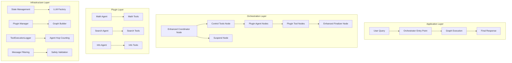
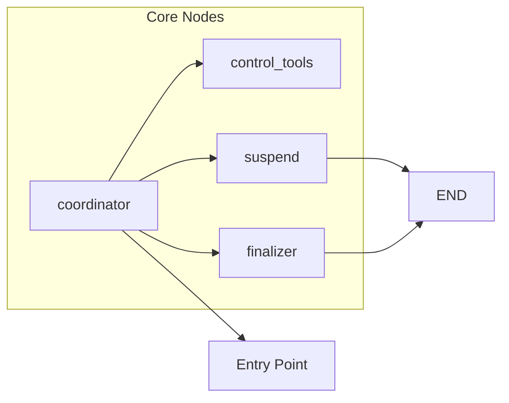
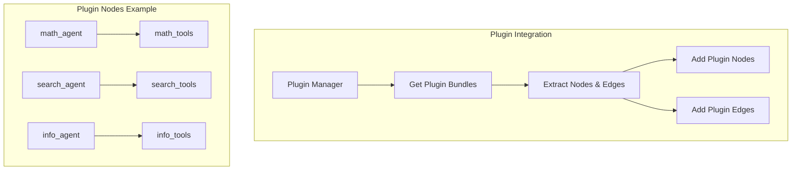
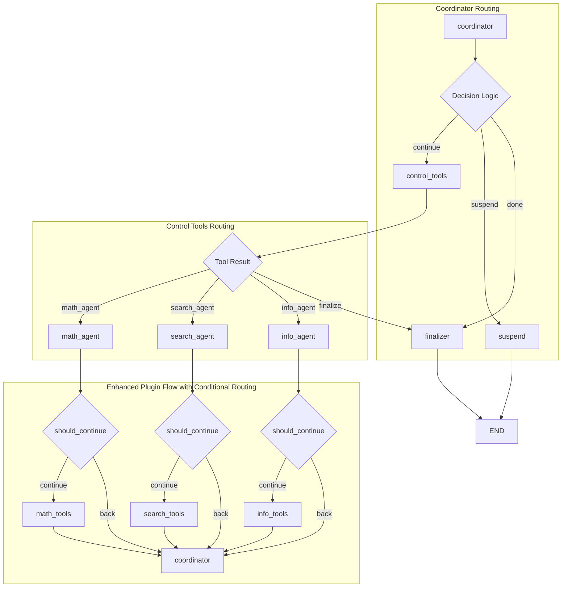
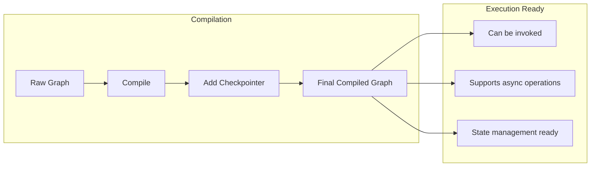
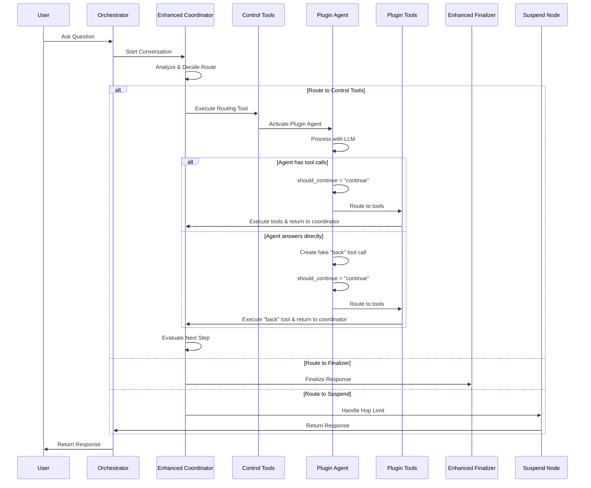
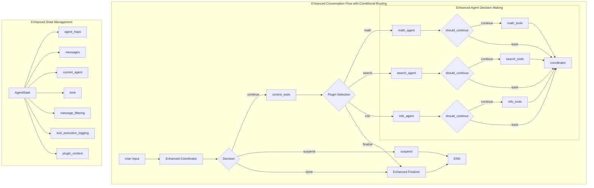
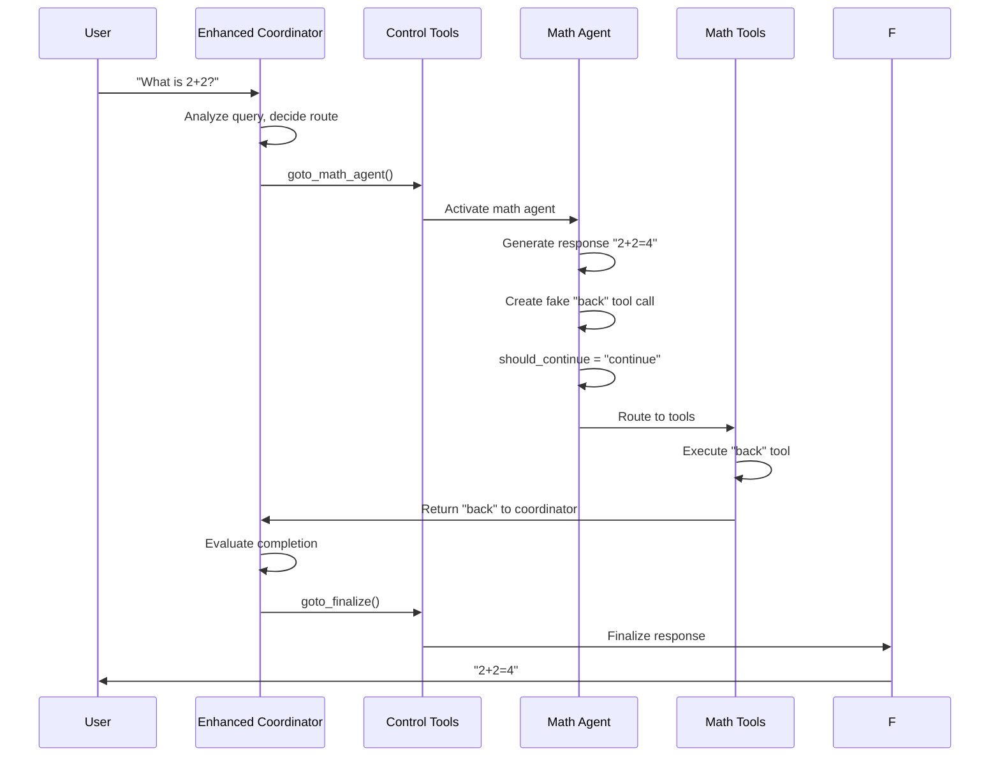
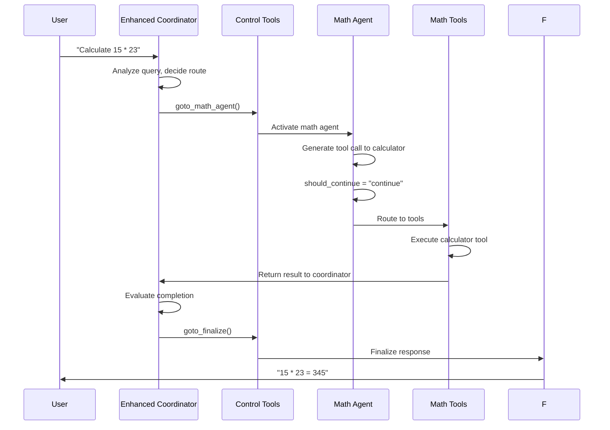

# LangGraph Architecture in Cadence

## Overview

The Cadence system uses LangGraph to orchestrate multi-agent conversations through a sophisticated workflow that
dynamically routes between different plugin agents. This document provides a comprehensive guide to understanding the
architectural design, how the graph is conceptually constructed, and how the conversation flow is designed to be
flexible and extensible.

## Table of Contents

- [Architecture Layers](#architecture-layers)
- [Graph Construction Design](#graph-construction-design)
- [Enhanced Decision Logic and Routing](#enhanced-decision-logic-and-routing)
- [Response Tone Control](#response-tone-control)
- [Tool Execution Logging](#tool-execution-logging)
- [Complete Conversation Flow](#complete-conversation-flow)
- [Practical Examples](#practical-examples)
- [Best Practices](#best-practices)

## Architecture Layers

The LangGraph implementation in Cadence follows a layered architecture approach:

## Graph Construction Design

The graph construction follows a systematic 6-phase design approach that ensures proper setup and integration of all
components.

### Phase 1: Graph Initialization

The process begins with creating a new state graph instance that will manage the conversation flow.

**Design Principles:**

- Creates a new state graph instance with conversation state schema
- Associates it with the agent state schema for type safety
- Prepares the graph for dynamic node and edge additions

### Phase 2: Core Node Registration

The orchestrator starts by adding four essential nodes that form the backbone of the conversation flow:

**Core Node Design:**

- **Coordinator Node**: Main decision-making hub that analyzes user queries and routes to appropriate agents
- **Control Tools Node**: Manages routing tools that direct conversation flow to specific plugin agents
- **Suspend Node**: Handles graceful termination when hop limits are exceeded
- **Finalizer Node**: Synthesizes conversation results into coherent final responses

### Phase 3: Plugin Node Integration

Dynamic plugin nodes are discovered and integrated based on registered plugins in the system:

**Plugin Integration Design:**

- **Dynamic Discovery**: Plugin manager discovers available plugin bundles
- **Node Extraction**: Each plugin bundle provides agent and tool nodes
- **Graph Integration**: Nodes are dynamically added to the conversation graph
- **Edge Configuration**: Plugin bundles define their own routing logic

### Phase 4: Enhanced Routing Edge Establishment

The routing network creates the decision tree that guides conversation flow. **This is where the enhanced conditional
routing
system is implemented:**

**Routing Design Principles:**

- **Conditional Edges**: Agent routing decisions based on `should_continue` method
- **Direct Edges**: Tools always route to coordinator (prevents circular routing)
- **No Circular Routing**: Eliminated the `tools → agent` edge that caused infinite loops
- **Dynamic Edge Creation**: Plugin bundles define their own routing logic

### Phase 5: Entry Point Configuration

The graph needs a starting point for all conversations.

**Design Principles:**

- Every conversation starts at the coordinator node
- The coordinator analyzes the user query and makes routing decisions
- This creates a consistent entry point for all conversations

### Phase 6: Graph Compilation

The final step compiles the graph for execution.

**Compilation Design:**

- **Graph Compilation**: Converts the raw graph into an executable workflow
- **Checkpointer Integration**: Optional state persistence for conversation continuity
- **Debug Information**: Graph structure logging for development and debugging

## Enhanced Decision Logic and Conditional Routing

### Intelligent Agent Decision Making

The enhanced system implements intelligent agent decision-making through a standardized decision method:

**Decision Logic Design:**

- If the agent's response has tool calls → routes to tools for execution
- If the agent's response has NO tool calls → returns control to coordinator
- This ensures consistent routing behavior across all agents

### Fake Tool Call Implementation

To ensure consistent routing flow, agents create fake tool calls when they answer directly.

**Design Principles:**

- **Consistent Flow**: All agent responses follow the same routing path
- **Explicit Intent**: Fake tool calls make routing decisions explicit
- **No Direct Routing**: Agents never route directly to coordinator
- **Tool Node Integration**: All responses go through the tools node for proper state management

### Plugin Bundle Edge Configuration

The plugin bundles define their own routing logic through a standardized interface.

**Edge Configuration Design:**

- **Conditional Edges**: Agent routing decisions based on standardized decision method
- **Direct Edges**: Tools always route to coordinator (prevents circular routing)
- **No More Loops**: Eliminated the `tools → agent` edge that caused infinite loops
- **Standardized Interface**: All plugins follow the same edge configuration pattern

### Back Tool Integration

Each plugin bundle includes a special "back" tool for routing control back to the coordinator.

**Design Principles:**

- **Standardized Tool**: Every plugin bundle includes a back tool
- **Consistent Interface**: All plugins use the same back tool pattern
- **Explicit Control**: Clear mechanism for returning control to coordinator

## Enhanced Suspend Node Implementation

The suspend node provides intelligent handling of hop limits with enhanced context awareness.

**Key Design Enhancements:**

- **Enhanced Hop Detection**: Improved hop limit detection with better state tracking
- **Smart Hop Counting**: Only actual agent calls increment the hop counter, not finalization calls
- **Context Preservation**: Maintains conversation context while explaining the limit situation
- **Tone Adaptation**: Respects user's requested tone preference in the suspension message
- **Safe Message Filtering**: Prevents validation errors by filtering incomplete tool call sequences

**Enhanced Hop Limit Prompt Design:**

The suspend node uses an enhanced prompt that provides better user experience:

- **User-Friendly Language**: Explains limits without technical jargon
- **Accomplishment Acknowledgment**: Explains what was accomplished based on gathered information
- **Best Possible Answer**: Provides the best answer with available data
- **Continuation Suggestions**: Suggests how to continue if the answer is incomplete
- **Tone Adaptation**: Maintains the user's requested conversation tone

**Enhanced Hop Counting Logic:**

The hop counting system ensures that only actual agent calls increment the hop counter:

- **Finalization Exclusion**: `goto_finalize` calls don't increment hop counter
- **Agent Call Tracking**: Only actual agent routing calls increment the counter
- **Accurate Limits**: Prevents premature hop limit triggering

## Complete Conversation Flow

### High-Level Flow with Enhanced Conditional Routing

### Detailed Node Interactions with Enhanced Routing

## Practical Examples

### Example 1: Agent Answers Directly (Enhanced Flow)

**User Query:** "What is 2+2?"

**Execution Flow:**

**Key Design Enhancements:**

1. **Enhanced Agent Decision**: Uses standardized decision method for routing decisions
2. **Fake Tool Call**: Creates fake "back" tool call for consistent flow
3. **Consistent Flow**: Always goes through tools node before coordinator
4. **No Circular Routing**: Tools route directly to coordinator, not back to agent
5. **Enhanced Suspend Node**: Better hop limit handling with user-friendly messages

### Example 2: Agent Uses Tools (Enhanced Flow)

**User Query:** "Calculate 15 * 23"

**Execution Flow:**

## Benefits of the Enhanced Routing System

### 1. **Eliminated Circular Routing**

- **Before**: `agent → tools → agent → tools → ...` (infinite loop)
- **After**: `agent → tools → coordinator` (clean, predictable flow)

### 2. **Enhanced State Management**

- All agent responses go through the same routing path
- State updates happen consistently through the tools node
- Better debugging and monitoring capabilities
- Plugin context tracking for routing history

### 3. **Clear Intent Communication**

- Fake tool calls make agent routing decisions explicit
- Easier to understand and debug conversation flow
- More predictable system behavior
- Enhanced logging for routing decisions

### 4. **Improved Error Handling**

- Clear separation between agent decisions and tool execution
- Better error isolation and recovery
- Consistent error handling patterns
- Graceful degradation when agents fail

### 5. **Enhanced Plugin Integration**

- Plugin bundles define their own routing logic
- Consistent interface for all plugins
- Better separation of concerns
- Easier plugin development and testing

### 6. **Enhanced Suspend Node**

- Better hop limit detection and counting
- User-friendly limit explanations
- Tone-aware suspension messages
- Safe message filtering to prevent errors
- Improved context preservation

## Best Practices

### 1. **Enhanced Agent Implementation**

- Always implement the standardized decision method properly
- Use fake tool calls for direct answers
- Clear system prompts that guide tool usage
- Proper error handling and logging

### 2. **Enhanced Tool Design**

- Tools should return meaningful results
- Handle errors gracefully
- Provide clear documentation
- Include proper validation

### 3. **Enhanced Plugin Structure**

- Follow the established plugin structure
- Register plugins properly in the initialization
- Include proper metadata and capabilities
- Implement proper edge configuration

### 4. **Enhanced Testing**

- Test both tool usage and direct answer scenarios
- Verify routing behavior with different agent responses
- Test error conditions and edge cases
- Validate state management consistency

### 5. **Enhanced Monitoring**

- Monitor routing decisions and edge creation
- Track plugin context and routing history
- Monitor tool execution performance
- Validate state consistency

## Conclusion

The enhanced conditional routing system in Cadence provides a robust, predictable foundation for multi-agent
conversations.
By implementing intelligent agent decision-making, fake tool calls, proper edge routing, and enhanced suspend node
handling, we've eliminated circular routing issues while maintaining the
flexibility and power of the multi-agent architecture.

The system now ensures that:

- All agent responses follow a consistent routing path
- Circular routing is prevented through proper edge configuration
- State management is predictable and debuggable
- The conversation flow is clear and maintainable
- Plugin integration is seamless and consistent
- Error handling is robust and graceful

This enhanced implementation makes Cadence more reliable, easier to debug, and more maintainable while preserving all
the advanced features of the
multi-agent orchestration system.
