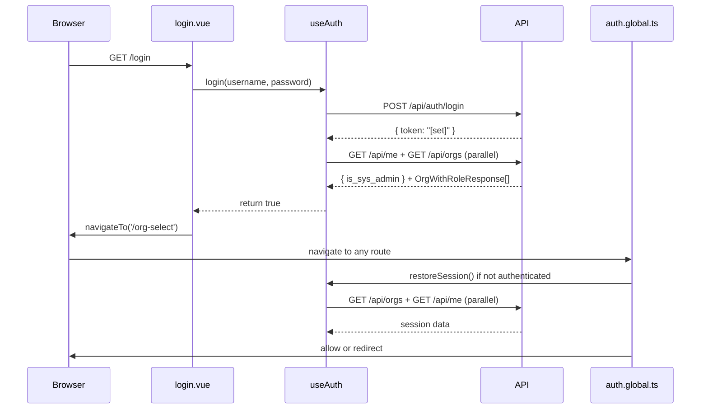

# Auth Flow

Authentication is handled by a single composable (`useAuth`), a global route middleware (`auth.global.ts`), and three
pages (`login`, `org-select`, and every protected page that calls `restoreSession` indirectly through the middleware).

## Flow Diagram



## Step-by-Step Walkthrough

### 1. Login Form — `ui/app/pages/login.vue`

The page uses the `auth` layout (`login.vue:6`). A Zod schema validates the form before submission:

```ts
// login.vue:12-15
const schema = z.object({
    username: z.string().min(1, 'Username is required'),
    password: z.string().min(1, 'Password is required')
})
```

`UForm` from Nuxt UI wires the schema directly to the form element. On submit, `onSubmit` calls `auth.login()` (
`login.vue:27`).

After a successful login the redirect logic branches:

- Sys admin with no orgs yet → `/admin/orgs` (`login.vue:31`)
- All other authenticated users → `/org-select` (`login.vue:33`)

### 2. `useAuth.login()` — `ui/app/composables/useAuth.ts`

`login()` makes a `POST /api/auth/login`. When the API responds with `{ token: "[set]" }` the JWT has been placed in an
HttpOnly cookie by the server-side proxy; the frontend only sees the sentinel string.

After confirming the sentinel, `login()` calls `loadUserContext(username)` which loads user profile and org list in
parallel to populate `authUser`, `isSysAdmin`, and `orgList` state.

```ts
async function login(username: string, password: string): Promise<boolean> {
    const response = await $fetch<{ token: string }>('/api/auth/login', {
        method: 'POST',
        body: {username, password}
    })
    if (response.token === '[set]') {
        await loadUserContext(username)
        return true
    }
    return false
}
```

### 3. Cookie Set

`currentOrgId` is a `useCookie<string | null>` ref named `cadence-org-id` (`useAuth.ts:15`). Writing to it updates the
browser cookie synchronously. The cookie is read on every SSR request, giving the server the active org context without
an extra API call.

### 4. Global Route Middleware — `ui/app/middleware/auth.global.ts`

This middleware runs on every navigation. Its logic:

1. If the target is a **public route** (`/login`) and the user is already authenticated, redirect to the appropriate
   destination — via `handleAuthenticatedRedirect(auth)` (`auth.global.ts:21-26`).
2. If the user is **not authenticated**, call `auth.restoreSession()` to attempt cookie-based session recovery (
   `auth.global.ts:46`).
3. If still unauthenticated after restore, redirect to `/login` (`auth.global.ts:47`).
4. Allow `/org-select` through unconditionally once authenticated (`auth.global.ts:49`).
5. Redirect non-admins away from any `/admin/*` route to `/dashboard` — via `handleAdminRoute(auth)` (
   `auth.global.ts:28-30`).
6. If `currentOrgId` is not set, redirect to `/org-select` (with a special bypass for sys admins who have orgs) — via
   `handleOrgRequiredRoute(auth)` (`auth.global.ts:32-39`).

```ts
export default defineNuxtRouteMiddleware(async (to) => {
    const auth = useAuth()

    if (isPublicRoute(to.path)) return handleAuthenticatedRedirect(auth)

    if (!auth.isAuthenticated.value) await auth.restoreSession()
    if (!auth.isAuthenticated.value) return navigateTo(LOGIN_PATH)

    if (isOrgSelectRoute(to.path)) return
    if (isAdminRoute(to.path)) return handleAdminRoute(auth)
    return handleOrgRequiredRoute(auth)
})
```

**Public routes** are defined as a `Set` constant at `auth.global.ts:1`. Currently only `/login` is public. All other
routes are protected.

### 5. Org Selection — `ui/app/pages/org-select.vue`

This page also uses the `auth` layout. On mount it calls `auth.loadOrgs()`. If the user belongs to exactly one org it
immediately calls `auth.selectOrg()` and skips the picker UI (`org-select.vue:13–16`).

`selectOrg(orgId)` writes `currentOrgId.value = orgId` (setting the `cadence-org-id` cookie) and navigates to
`/dashboard` (`useAuth.ts:76-79`).

The org list renders as clickable `UCard` items showing the org name, ID, and the user's role badge (using `roleLabel` /
`roleColor` from utils).

### 6. `restoreSession()` — `ui/app/composables/useAuth.ts`

Called by the middleware when `authUser` is `null` but an HttpOnly auth cookie may still be present. It fires
`GET /api/orgs` and `GET /api/me` in parallel using `useRequestFetch()` (which forwards cookies during SSR). On success
it populates all three state refs. On any failure it resets them, and the middleware then redirects to `/login`.

```ts
// useAuth.ts:79-91
async function restoreSession(): Promise<void> {
    if (authUser.value) return
    try {
        const [orgs, me] = await Promise.all([
            apiFetch<OrgWithRoleResponse[]>('/api/orgs'),
            apiFetch<{ user_id: string; is_sys_admin: boolean }>('/api/me')
        ])
        orgList.value = orgs.map(mapOrgWithRoleToOrgAccess)
        isSysAdmin.value = me.is_sys_admin
        authUser.value = {username: 'user'}
    } catch {
        authUser.value = null
        orgList.value = []
        isSysAdmin.value = false
    }
}
```

`useRequestFetch` is used instead of `$fetch` throughout `useAuth` to ensure cookie forwarding works correctly during
server-side rendering (`useAuth.ts:10`).

## State Shape

| `useState` key              | Composable ref | Description                    |
|-----------------------------|----------------|--------------------------------|
| `auth:user`                 | `authUser`     | `{ username }` or `null`       |
| `auth:orgs`                 | `orgList`      | `OrgAccessResponse[]`          |
| `auth:is_sys_admin`         | `isSysAdmin`   | `boolean`                      |
| *(cookie)* `cadence-org-id` | `currentOrgId` | Active org ID string or `null` |

Derived computed values exposed by `useAuth`:

- `isAuthenticated` — `!!authUser.value`
- `currentOrg` — the `OrgAccessResponse` matching `currentOrgId`
- `isOrgAdmin` — `currentOrg.role === 'org_admin' || isSysAdmin`

## Public vs Protected Routes

| Route            | Access                                                                       |
|------------------|------------------------------------------------------------------------------|
| `/login`         | Public — unauthenticated users only; authenticated users are redirected away |
| `/org-select`    | Authenticated only; no org required                                          |
| `/admin/*`       | Authenticated + `isSysAdmin === true`                                        |
| All other routes | Authenticated + `currentOrgId` set                                           |

## Related Pages

- [Frontend Overview](index.md)
- [Admin Panel](admin.md) — sys admin first destination after login with no orgs
