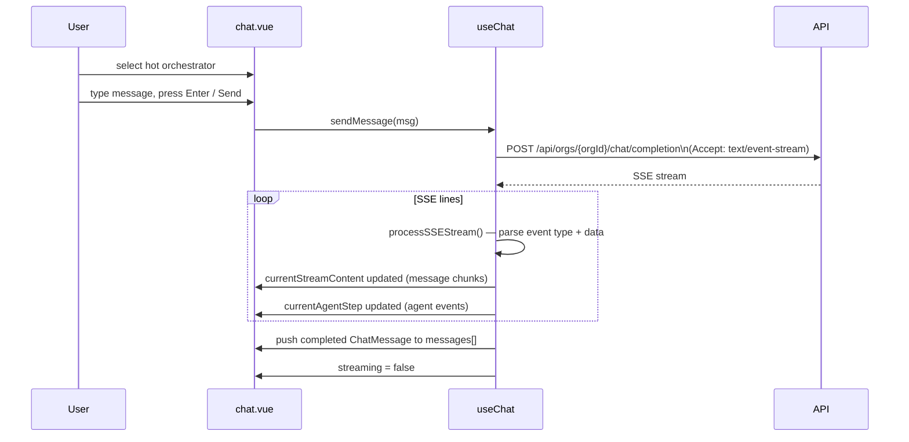

# Chat Interface & SSE

The chat page provides a real-time messaging interface backed by Server-Sent Events (SSE). It is built from
`ui/app/pages/chat.vue` and `ui/app/composables/useChat.ts`.

## Flow Diagram



## Orchestrator Selection

On mount, `chat.vue` calls `chat.loadOrchestrators()` (`chat.vue:7`), which fetches
`GET /api/orgs/{orgId}/orchestrators`.

The sidebar only shows **hot and active** instances:

```ts
// chat.vue:9-11
const hotOrchestrators = computed(() =>
  chat.orchestrators.value.filter((o) => o.tier === 'hot' && o.status === 'active')
)
```

Clicking an orchestrator card sets `chat.selectedInstanceId.value` directly. If no hot orchestrators exist, a prompt
directs the user to the Orchestrators page to load one.

## Sending a Message

`onSend()` trims the input, guards against empty text or an in-progress stream, clears the textarea, then calls
`chat.sendMessage(msg)` (`chat.vue:13–18`). `Enter` without `Shift` triggers `onSend`; `Shift+Enter` inserts a newline (
`chat.vue:21–25`).

The `Send` button is disabled when `inputText` is empty or no orchestrator is selected (`chat.vue:198–199`).

A `UCheckbox` bound to `chat.enableStream` lets the user toggle between streaming and non-streaming responses (
`chat.vue:206`).

## `sendMessage()` — `ui/app/composables/useChat.ts`

1. Pushes a user `ChatMessage` to `messages[]`.
2. Sets `streaming = true`, clears `currentStreamContent`, `currentEvents`, and `currentAgentStep`.
3. POSTs to `/api/orgs/{orgId}/chat/completion` with `Accept: text/event-stream` and a body of
   `{ instance_id, message, conversation_id, stream }`.
4. If `enableStream` is false, awaits `response.json()` and pushes an assistant message directly.
5. If streaming, gets a `ReadableStreamDefaultReader` from `response.body` and passes it to `processSSEStream()`.
6. After the stream closes, pushes the completed assistant message (content + collected events) to `messages[]`.
7. In `finally`: calls `resetStreamState()` to clear all streaming state.

```ts
// useChat.ts:103-162
async function sendMessage(message: string): Promise<void> {
  if (!selectedInstanceId.value || !orgId.value) {
    toast.add({ title: 'Select an orchestrator first', color: 'warning' })
    return
  }

  messages.value.push({ role: 'user', content: message, timestamp: new Date() })
  streaming.value = true
  currentStreamContent.value = ''
  currentEvents.value = []
  currentAgentStep.value = null

  try {
    const response = await fetch(`/api/orgs/${orgId.value}/chat/completion`, {
      method: 'POST',
      headers: { 'Content-Type': 'application/json', Accept: 'text/event-stream' },
      body: JSON.stringify({
        instance_id: selectedInstanceId.value,
        message,
        conversation_id: conversationId.value,
        stream: enableStream.value
      })
    })

    if (!response.ok) throw new Error(`HTTP ${response.status}`)

    if (!enableStream.value) {
      saveNonStreamingResponse((await response.json()) as { session_id: string; response: string })
      return
    }

    const reader = response.body!.getReader()
    await processSSEStream(reader, {
      onContent: (chunk) => { currentStreamContent.value += chunk },
      onEvent: (event) => {
        currentEvents.value.push(event)
        if (event.type === 'agent') currentAgentStep.value = event.data as AgentStep
      },
      onSessionId: (id) => { conversationId.value = id }
    })

    messages.value.push({
      role: 'assistant',
      content: currentStreamContent.value,
      timestamp: new Date(),
      events: [...currentEvents.value]
    })
  } catch (err: unknown) {
    const msg = err instanceof Error ? err.message : 'Stream error'
    toast.add({ title: 'Chat error', description: msg, color: 'error' })
  } finally {
    resetStreamState()
  }
}
```

## SSE Parsing — `processSSEStream()`

```ts
// useChat.ts:35-69
async function processSSEStream(
  reader: ReadableStreamDefaultReader<Uint8Array>,
  callbacks: StreamCallbacks
): Promise<void> {
  const decoder = new TextDecoder()
  let buffer = ''
  let currentEventType: string | null = null

  while (true) {
    const { done, value } = await reader.read()
    if (done) break

    buffer += decoder.decode(value, { stream: true })
    const lines = buffer.split('\n')
    buffer = lines.pop() ?? ''

    for (const line of lines) {
      if (line === '') {
        currentEventType = null
      } else if (line.startsWith(SSE_EVENT_PREFIX)) {
        currentEventType = line.slice(SSE_EVENT_PREFIX.length).trim()
      } else if (line.startsWith(SSE_DATA_PREFIX)) {
        const rawData = line.slice(SSE_DATA_PREFIX.length).trim()
        try {
          const parsed = JSON.parse(rawData) as Record<string, unknown>

          if (isMessageContentEvent(currentEventType, parsed)) {
            callbacks.onContent((parsed.content as string) ?? '')
          } else if (currentEventType && currentEventType !== MESSAGE_EVENT_TYPE) {
            callbacks.onEvent({ type: currentEventType, data: parsed })
          }
          if (parsed.session_id) {
            callbacks.onSessionId(parsed.session_id as string)
          }
        } catch {
        }
      }
    }
  }
}
```

The parser maintains a `buffer` string and a `currentEventType` tracker. On each chunk from the reader:

- Bytes are decoded with `TextDecoder` in streaming mode.
- The buffer is split on `\n`; the trailing incomplete line is kept in the buffer.
- For each complete line:
    - Blank line → reset `currentEventType` (SSE event boundary).
    - Line starting with `event: ` → set `currentEventType`.
    - Line starting with `data: ` → parse JSON and dispatch:
        - If `currentEventType === 'message'` or the payload has a `content` field and no event type → call
          `callbacks.onContent(parsed.content)`.
        - Otherwise → call `callbacks.onEvent({ type: currentEventType, data: parsed })`.
        - If the payload has a `session_id` field → call `callbacks.onSessionId(parsed.session_id)`.

The three callbacks wire back into composable state (`useChat.ts:136-148`):

| Callback      | Effect                                                                             |
|---------------|------------------------------------------------------------------------------------|
| `onContent`   | Appends chunk to `currentStreamContent`                                            |
| `onEvent`     | Pushes to `currentEvents`; if `event.type === 'agent'`, updates `currentAgentStep` |
| `onSessionId` | Sets `conversationId`                                                              |

## State Shape

All state lives inside `useChat()` as plain `ref` values — there is no `useState` (chat state is not shared across SSR):

| Ref                    | Type                     | Description                                 |
|------------------------|--------------------------|---------------------------------------------|
| `orchestrators`        | `OrchestratorResponse[]` | Full list fetched on mount                  |
| `selectedInstanceId`   | `string \| null`         | ID of the selected hot instance             |
| `messages`             | `ChatMessage[]`          | Completed conversation history              |
| `conversationId`       | `string \| null`         | Session ID returned by the backend          |
| `enableStream`         | `boolean`                | SSE toggle (default `true`)                 |
| `streaming`            | `boolean`                | True while a stream is open                 |
| `currentStreamContent` | `string`                 | Accumulated text for the live bubble        |
| `currentEvents`        | `ChatEvent[]`            | Events collected during current stream      |
| `currentAgentStep`     | `AgentStep \| null`      | Most recent agent step for the progress bar |

### `ChatMessage` structure

```ts
interface ChatMessage {
  role: 'user' | 'assistant'
  content: string
  timestamp: Date
  events?: ChatEvent[]       // attached after stream completes
}
```

### `AgentStep` structure

```ts
export interface AgentStep {
  key: string      // e.g. 'msg.orchestrator.planner'
  progress: number // 0–100
  fallback: string // human-readable label
}
```

## Message Rendering — `chat.vue`

**Completed messages** (`chat.vue:90–128`): user messages render as plain text in a primary-coloured bubble; assistant
messages render via `<MDC>` for Markdown. An expandable `<details>` section lists agent steps, filtered with
`agentStepsOf()` which removes the terminal `msg.orchestrator.end` key (`chat.vue:27–32`).

**Live streaming bubble** (`chat.vue:131–173`): shown while `streaming` is true. Displays `currentStreamContent` via
`<MDC>` as it accumulates. If `currentAgentStep` is set, shows a spinning icon, the step's `fallback` label, its
`progress` percentage, and an animated progress bar. Before any agent step arrives, three bouncing dots provide visual
feedback.

**Session ID** (`chat.vue:81–84`): displayed in the sidebar footer once `conversationId` is populated, so users can
reference the session for debugging.

`clearMessages()` resets `messages[]` and `conversationId` to their initial values (`useChat.ts:164-167`).

## Related Pages

- [Frontend Overview](index.md)
- [Orchestrator Management](orchestrators.md) — loading orchestrators into the hot tier
