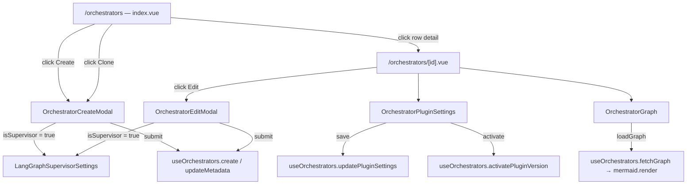

# Orchestrator Management

Orchestrators are the central resource in Cadence. The UI provides a list page, a detail page, a create/edit modal,
plugin settings, LangGraph supervisor configuration, and an in-browser graph visualisation.

## Flow Diagram



## Composable — `useOrchestrators` (`ui/app/composables/useOrchestrators.ts`)

All API calls go through this composable. It reads `auth.currentOrgId` to build URLs and provides:

| Method                                            | HTTP   | Endpoint                                                        |
|---------------------------------------------------|--------|-----------------------------------------------------------------|
| `fetchAll()`                                      | GET    | `/api/orgs/{orgId}/orchestrators`                               |
| `create(data)`                                    | POST   | `/api/orgs/{orgId}/orchestrators`                               |
| `remove(instanceId)`                              | DELETE | `/api/orgs/{orgId}/orchestrators/{id}`                          |
| `load(instanceId, tier?)`                         | POST   | `/api/orgs/{orgId}/orchestrators/{id}/load`                     |
| `unload(instanceId)`                              | POST   | `/api/orgs/{orgId}/orchestrators/{id}/unload`                   |
| `updateStatus(instanceId, status)`                | PATCH  | `/api/orgs/{orgId}/orchestrators/{id}/status`                   |
| `updateMetadata(instanceId, payload)`             | PATCH  | `/api/orgs/{orgId}/orchestrators/{id}`                          |
| `updateConfig(instanceId, config)`                | PATCH  | `/api/orgs/{orgId}/orchestrators/{id}/config`                   |
| `updatePluginSettings(instanceId, settings)`      | PATCH  | `/api/orgs/{orgId}/orchestrators/{id}/plugin-settings`          |
| `activatePluginVersion(instanceId, pid, version)` | POST   | `/api/orgs/{orgId}/orchestrators/{id}/plugin-settings/activate` |
| `fetchGraph(instanceId)`                          | GET    | `/api/orgs/{orgId}/orchestrators/{id}/graph`                    |

State exposed: `orchestrators` (`OrchestratorResponse[]`), `loading` (`boolean`).

A private helper `updateOrchestratorInList` (`useOrchestrators.ts:11`) performs an in-place update on the local array
after any PATCH, avoiding a full `fetchAll()` for status and metadata changes.

## List Page — `ui/app/pages/orchestrators/index.vue`

Fetches all orchestrators on mount (`orchestrators/index.vue:20`). The `UTable` has columns: Name, Framework, Mode,
Tier, Status, Actions. Tier and Status cells render coloured `UBadge` components via `tierColor` / `statusColor` utility
functions.

Actions available to org admins per row:

- **Detail** — navigates to `/orchestrators/{instance_id}`
- **Clone** — opens `OrchestratorCreateModal` with `cloneSource` set to the row
- **Load** — calls `orchestrators.load(instance_id)` (defaults tier to `'hot'`)
- **Unload** — calls `orchestrators.unload(instance_id)`
- **Delete** — calls `orchestrators.remove(instance_id)` after a `confirm()` prompt

The create modal is a `UModal` that triggers `orchestrators.fetchAll()` directly via `@after:leave` so the list
refreshes after the modal closes (`orchestrators/index.vue:122`).

## Detail Page — `ui/app/pages/orchestrators/[id].vue`

Uses `useFetch` for the initial orchestrator load with a computed URL, so it re-fetches if `orgId` changes (
`[id].vue:12–14`). The instance ID is read from `route.params.id`.

Sections on the page:

1. **Details card** — instance ID, framework, mode, tier badge, status badge, config hash.
2. **Graph card** — renders `<OrchestratorGraph>` (`[id].vue:177`).
3. **Plugin Settings card** — renders `<OrchestratorPluginSettings>` with a ref for imperative access (
   `[id].vue:41–43`).

Header actions (org admin only):

- **Edit** — opens `OrchestratorEditModal` via `showEdit` flag.
- **Suspend / Activate** — calls `orchestrators.updateStatus()` then refreshes (`[id].vue:67–75`).
- **Load / Unload** — calls the matching composable method.

A `watch` on `orchestrator.value?.framework_type` calls `loadSupportedProviders()` to fetch which LLM providers the
framework supports; this is passed to the edit modal so the provider selector can be filtered (`[id].vue:31–37`).

**Saving plugin settings** uses an exposed method from the child component ref:

```ts
// [id].vue:45-56
async function savePluginSettings() {
  if (!pluginSettingsRef.value) return
  savingPluginSettings.value = true
  try {
    await orchestrators.updatePluginSettings(instanceId, pluginSettingsRef.value.getValue())
    await refresh()
  } ...
}
```

## Create Modal — `ui/app/components/orchestrators/OrchestratorCreateModal.vue`

Accepts an optional `cloneSource` prop. When provided, the form pre-fills name (`Copy of {name}`), framework, and mode
from the source orchestrator (`OrchestratorCreateModal.vue:36–40`).

Zod schema (`OrchestratorCreateModal.vue:25–31`):

```ts
z.object({
  name: z.string().min(10).max(200),
  framework_type: z.enum(['langgraph', 'openai_agents', 'google_adk']),
  mode: z.enum(['supervisor', 'coordinator', 'handoff']),
  tier: z.enum(['hot', 'warm', 'cold']),
  active_plugin_ids: z.array(z.string()).min(1)
})
```

Available frameworks: LangGraph, Google ADK, OpenAI Agents (marked as not supported yet). Available modes: Supervisor,
Coordinator and Handoff (both marked as not supported yet). Initial tier defaults to `'cold'`.

When `mode === 'supervisor'` and `framework_type` is `langgraph` or `google_adk`, the `isSupervisor` computed flag is
true (`OrchestratorCreateModal.vue:50–53`) and `<LangGraphSupervisorSettings>` is rendered in a second panel. Before
submitting, the form validates that the supervisor settings component reports `isValid()` (
`OrchestratorCreateModal.vue:102–104`).

Plugins are loaded from `GET /api/orgs/{orgId}/plugins` and rendered as a multi-select (
`OrchestratorCreateModal.vue:21–23`).

## Plugin Settings — `ui/app/components/orchestrators/OrchestratorPluginSettings.vue`

Receives `initialValue` (a `Record<string, PluginSettingsEntry>` keyed by `{pid}@{version}` spec strings) and an
optional `disabled` flag.

The component groups entries by plugin ID into `pluginGroups` (`OrchestratorPluginSettings.vue:75–88`). Each group
renders as an accordion. When a plugin has multiple versions, tab buttons appear so the user can switch between them
without losing edits. The active version is highlighted with a success badge.

Per-setting field rendering is driven by `inferType(value)` (`OrchestratorPluginSettings.vue:103–108`):

| Inferred type   | Rendered as                                                  |
|-----------------|--------------------------------------------------------------|
| `boolean`       | `UCheckbox`                                                  |
| `number`        | `UInput type="number"`                                       |
| `json` (object) | `UTextarea` (monospace, parsed on blur)                      |
| `text`          | `UInput type="text"` or `type="password"` for sensitive keys |

Sensitive field detection uses `SENSITIVE_FIELD_PATTERN = /key|secret|password|token/i` (
`OrchestratorPluginSettings.vue:4`).

The component exposes `getValue()` via `defineExpose`, which returns a deep clone of the local state. The parent calls
this on save.

## LangGraph Supervisor Settings — `ui/app/components/orchestrators/LangGraphSupervisorSettings.vue`

Handles supervisor-mode configuration: default LLM config, default model, instance-level temperature and max tokens, and
scalar mode settings.

**Scalar settings**:

| Field                         | Default | Description                          |
|-------------------------------|---------|--------------------------------------|
| `max_agent_hops`              | 5       | Max planner iterations               |
| `node_execution_timeout`      | 60 s    | LLM/tool call timeout per node       |
| `message_context_window`      | 5       | Last N messages sent to orchestrator |
| `max_context_window`          | 16000   | Max token context window             |
| `enabled_parallel_tool_calls` | `true`  | Parallel tool execution              |
| `enabled_llm_validation`      | `false` | LLM-based output validation          |
| `enabled_auto_compact`        | `false` | Auto-compact message history         |

**Per-node overrides**: Seven nodes can each have independent `llm_config_id`,
`model_name`, `prompt`, `temperature`, and `max_tokens`:

- `classifier_node` (Router)
- `planner_node`
- `synthesizer_node`
- `validation_node`
- `clarifier_node`
- `responder_node`
- `error_handler_node`

Each node section is an accordion. A node is auto-expanded if it already has any override set, detected by
`hasNodeOverride()`.

Model selection fetches available models from `GET /api/providers/{provider}/models`. If no models are returned for a
provider, the UI automatically switches to a free-text input. A toggle button lets users switch manually at any time.

The component fetches default prompts from `GET /api/engine/supervisor/prompts` on mount and makes them viewable
per-node via a "View default prompt" toggle.

`defineExpose` provides `isValid()` (requires `defaultLlmConfigId` and `defaultModelName`) and `getValue()` which
serialises the full config structure.

## Graph Rendering — `ui/app/components/orchestrators/OrchestratorGraph.vue`

On mount, `loadGraph()` calls `orchestrators.fetchGraph(instanceId)` which hits
`GET /api/orgs/{orgId}/orchestrators/{id}/graph` returning a `GraphDefinitionResponse`.

If `graphData.is_ready` is true and `graphData.mermaid` is a non-empty string, `renderMermaid()` is called (
`OrchestratorGraph.vue:15–27`):

1. Dynamically imports the `mermaid` package.
2. Calls `mermaid.initialize({ startOnLoad: false, theme: 'neutral' })`.
3. Generates an element ID by stripping hyphens from `instanceId` and prepending `'mg'` (to satisfy Mermaid's ID
   constraints).
4. Calls `mermaid.render(id, definition)` to get an SVG string.
5. Sets `graphContainer.value.innerHTML = svg`.

The `loading` flag is set to `false` before `renderMermaid` is called, so the container `<div>` is in the DOM when
Mermaid tries to write into it (`OrchestratorGraph.vue:38–40`).

If the orchestrator is not loaded (`is_ready === false`), a message is shown with a prompt to use the **Load** button
and a **Refresh** button to retry.

## Related Pages

- [Frontend Overview](index.md)
- [Chat Interface & SSE](chat.md) — uses hot orchestrators
- [Admin Panel](admin.md) — pool stats showing hot/warm/cold tier counts
