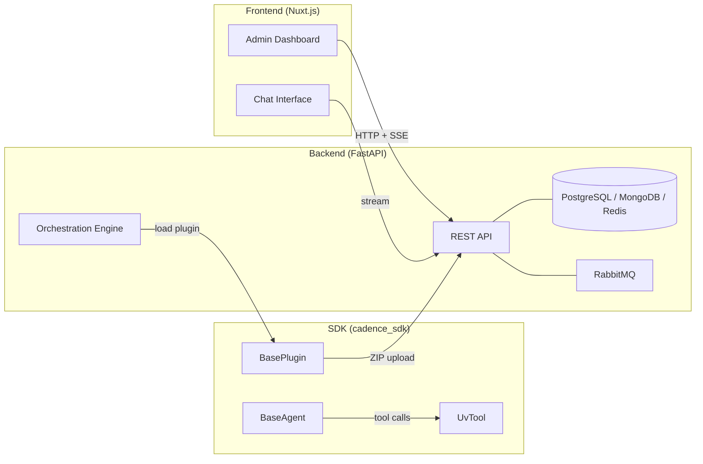

# Cadence Multi-agents AI Framework

Cadence is a multi-tenant AI agent orchestration platform. It lets you deploy, manage, and run AI agent plugins across
multiple organizations from a single backend — without changing your plugin code when switching between LLM frameworks.

## Architecture

Cadence has three components that work together:

| Component    | Purpose                                                   | Tech                                          |
|--------------|-----------------------------------------------------------|-----------------------------------------------|
| **Backend**  | API server, orchestration engine, multi-tenant management | FastAPI, PostgreSQL, MongoDB, Redis, RabbitMQ |
| **Frontend** | Admin dashboard and chat UI                               | Nuxt 4, Vue 3, Nuxt UI, Tailwind CSS 4        |
| **SDK**      | Library for writing agent plugins                         | Python 3.13+, framework-agnostic              |

## Key Concepts

- **Plugin** — a ZIP archive containing a `BasePlugin` subclass plus one or more `BaseAgent` subclasses with `UvTool`
  -decorated functions
- **Orchestrator Instance** — a deployed, configured instance of a plugin running inside the engine; can be Hot (
  in-memory), Warm (standby), or Cold (stored only)
- **Multi-tenancy** — each organization has its own plugins, orchestrators, LLM configs, and settings; a system admin
  manages all orgs
- **3-tier configuration cascade** — settings resolve from Global → Organization → Instance, so defaults propagate down
  but can be overridden at any level

## Sections

### For Business Analysts & Testers

- [User Guide](guide/features.md) — feature overview, glossary, roles, and step-by-step workflows
- [Testing](guide/testing/scenarios.md) — test scenarios, error reference, and validation checklists

### Technical Reference

- [Backend](backend/index.md) — how the API server, engine, auth, and event bus work
- [Frontend](frontend/index.md) — how the Nuxt dashboard handles auth, chat, and admin flows
- [SDK](sdk/index.md) — how to write plugins, tools, and settings for your agents
