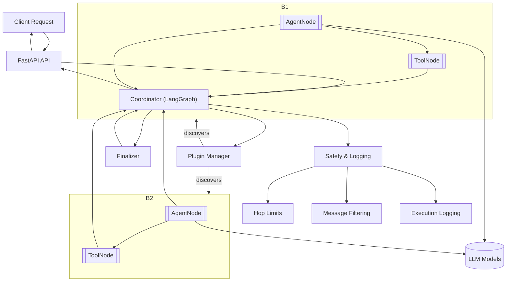

# Cadence 🤖 Multi-agents AI Framework

Welcome to Cadence — a powerful, open-source multi-agent orchestration system designed to simplify the development and
deployment of AI agent workflows with enterprise-grade reliability and extensibility.

- **Quick Start**: [Get up and running](getting-started/quick-start.md)
- **Core Concepts**:
    - [Understand the architecture](concepts/architecture.md)
    - [LangGraph Architecture](concepts/langgraph-architecture.md)
    - [Project Structure](concepts/project-structure.md)
- **Plugin Development**: [Build custom agents](plugins/overview.md)
- **Plugin Management**: [Upload and manage plugins](plugins/upload-feature.md)
- **Deployment**: [Configure environments](deployment/environment.md)

---

## What is Cadence?

Cadence is a multi-agent orchestration framework built with modern Python technologies like LangChain and LangGraph. It
provides a robust foundation for creating intelligent, collaborative AI systems, and a clean plugin system that keeps
your core code decoupled from custom functionality.

## Quick Installation

**For end users:**

```bash
pip install cadence-py
python -m cadence start api
```

**For developers:**

```bash
git clone https://github.com/jonaskahn/cadence.git
cd cadence
poetry install
poetry run python -m cadence start api
```

## Philosophy

Cadence is built on three core principles:

### 1. Simplicity First

- Clean, intuitive APIs that get out of your way
- Minimal boilerplate code for maximum productivity
- Clear separation of concerns between core system and plugins

### 2. Plugin-Driven Architecture

- Everything is a plugin — from agents to tools
- Hot-reloadable plugins for rapid development
- True decoupling between core system and custom functionality

### 3. Production Ready

- Built for scale with enterprise-grade reliability
- Comprehensive monitoring and observability
- Docker support and cloud-native deployment

## Architecture Overview



## Key Features

### 🤖 **Multi-Agent Orchestration**

- Coordinate multiple AI agents in complex workflows with intelligent routing
- LangGraph-based workflow orchestration with advanced decision logic
- Automatic agent switching based on query content and context
- Consecutive agent routing limits and hop count protection
- Structured response handling with model-based and prompt-based modes
- Intelligent message compaction for efficient conversation synthesis
- Response tone control (natural, explanatory, formal, concise, learning)
- Timeout handling with fallback responses
- Plugin-aware response context building

### 🔌 **Plugin System**

- Extend functionality without touching core code with dynamic plugin discovery
- Hot reloading: Update plugins without restarting the system
- Plugin upload and management via UI and API
- SDK-based plugin development with validation and health checks
- Response schema support with `@object_schema` and `@list_schema` decorators
- Plugin response suggestions for enhanced context
- Structured response integration with plugin metadata

### 🧠 **LLM Provider Support**

- Support for OpenAI, Anthropic, Google AI, and Azure OpenAI
- Separate model configurations for coordinator, suspend, and synthesizer roles
- Intelligent caching for LLM providers with fallback handling
- Temperature and token control per plugin
- Model factory with specialized configurations for different orchestration roles
- Timeout handling and fallback response generation

### 🛠️ **Infrastructure**

- Multi-backend storage: PostgreSQL, Redis, and in-memory support
- Service container with dependency injection
- Repository pattern for backend-agnostic data access
- Production-ready configuration management

### 🎨 **User Interface**

- Streamlit UI with real-time plugin management
- Plugin upload, deletion, and monitoring capabilities
- Conversation history and metrics visualization
- Response tone control and customization

### 📊 **Observability & Safety**

- Comprehensive logging with tool execution tracking
- Safety mechanisms: hop limits, message filtering, error handling
- Health monitoring for plugins and system components
- Conversation analytics and token usage tracking

### 🚀 **Developer Experience**

- REST API with OpenAPI documentation
- CLI tools for development and deployment
- Hot reloading for rapid development cycles
- SDK with examples and templates

## Quick Example

```python
from cadence_sdk import BasePlugin, PluginMetadata, BaseAgent, tool


@tool
def my_custom_tool(input_text: str) -> str:
    """Process the input text and return a result."""
    return f"Processed: {input_text}"


class MyPlugin(BasePlugin):
    @staticmethod
    def get_metadata() -> PluginMetadata:
        return PluginMetadata(
            name="my_agent",
            version="0.1.0",
            description="My custom AI agent",
            capabilities=["custom_task"],
            llm_requirements={
                "provider": "openai",
                "model": "gpt-4.1",
                "temperature": 0.1,
                "max_tokens": 1024,
            },
        )

    @staticmethod
    def create_agent() -> BaseAgent:
        return MyAgent(MyPlugin.get_metadata())


class MyAgent(BaseAgent):
    def get_tools(self):
        return [my_custom_tool]

    def get_system_prompt(self):
        return "You are a helpful AI assistant."
```

## What's Next?

- [Quick Start Guide](getting-started/quick-start.md) — Get Cadence running in 5 minutes
- [Plugin Development](plugins/overview.md) — Learn to build custom agents
- [Architecture](concepts/architecture.md) — Understand the system design
- [Environment](deployment/environment.md) — Configure your setup

## Contributing

Cadence is open source and welcomes contributions! Check out the [contributing guide](contributing/development.md) to
get
started.

## License

Cadence is licensed under the MIT License — see the [LICENSE](../LICENSE) file for details.

---

Made with Material for MkDocs
