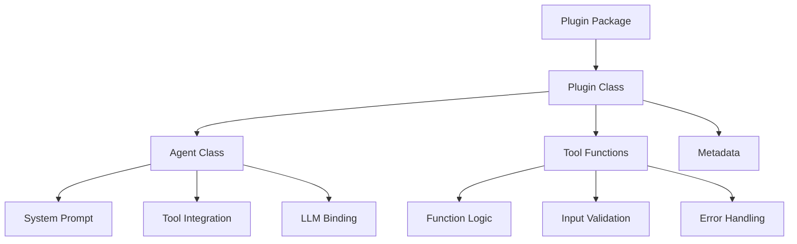
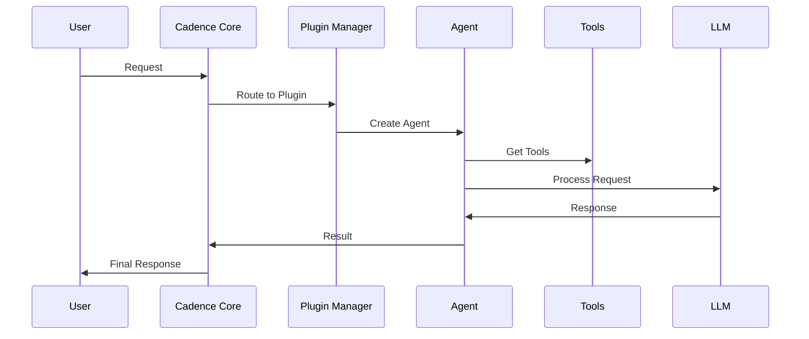

# Plugin Development Overview

Cadence's plugin system is the heart of its extensibility. This guide explains how plugins work, their architecture, and
how to create your own.

## What is a Plugin?

A **plugin** in Cadence is a self-contained module that provides:

- **AI Agents**: Specialized AI assistants with specific capabilities
- **Tools**: Functions that agents can use to perform tasks
- **Metadata**: Information about the plugin's purpose and requirements
- **Configuration**: Settings and parameters for customization

## Plugin Architecture



## Plugin Structure

Every Cadence plugin follows this structure:

```
my_plugin/
├── __init__.py          # Plugin registration
├── plugin.py            # Main plugin class
├── agent.py             # Agent implementation
├── tools.py             # Tool functions
├── pyproject.toml       # Package configuration
└── README.md            # Documentation
```

## Core Components

### 1. Plugin Class

The main entry point that defines:

- Plugin metadata (name, version, description)
- Agent creation factory method
- Dependency validation
- Configuration schema

### 2. Agent Class

Implements the AI agent behavior:

- System prompt for LLM interaction
- Tool integration and management
- State management and decision making
- LLM model binding with parallel tool calls support
- Must inherit from `BaseAgent` and implement required methods

#### Parallel Tool Calls Support

Cadence agents support parallel tool execution, allowing multiple tools to be called simultaneously for improved
performance and efficiency:

```python
class MyAgent(BaseAgent):
    def __init__(self, metadata: PluginMetadata):
        # Enable parallel tool calls (default: True)
        super().__init__(metadata, parallel_tool_calls=True)

    # Or disable for sequential execution
    # super().__init__(metadata, parallel_tool_calls=False)
```

**Benefits of Parallel Tool Calls:**

- **Improved Performance**: Multiple tools execute concurrently instead of sequentially
- **Better User Experience**: Faster response times for multi-step operations
- **Resource Optimization**: Efficient use of computational resources
- **Scalability**: Better handling of complex, multi-tool workflows

**When to Use Parallel Tool Calls:**

- ✅ **Enable** when tools are independent and can run concurrently
- ✅ **Enable** for performance-critical operations
- ✅ **Disable** when tools have dependencies or shared resources
- ✅ **Disable** for debugging and troubleshooting

### 3. Tools

Functions that agents can call:

- Input validation and processing
- External API integration
- Data transformation
- Error handling and logging
- Must be decorated with `@tool` decorator from `cadence_sdk`

## Plugin Lifecycle



## Plugin Requirements

### Correct Import Patterns

```python
# Main imports - recommended approach
from cadence_sdk import BasePlugin, PluginMetadata, BaseAgent, tool

# Alternative specific imports if needed
from cadence_sdk.base.plugin import BasePlugin
from cadence_sdk.base.metadata import PluginMetadata
from cadence_sdk.base.agent import BaseAgent
from cadence_sdk.tools.decorators import tool
```

**Important**: Always use the main `cadence_sdk` import for the core classes and `tool` decorator. The specific
submodule imports are available but not recommended for most use cases.

### Required Methods

Every plugin must implement:

- `get_metadata()` - Return plugin information
- `create_agent()` - Create agent instance

### Required Agent Methods

Every agent must implement:

- `get_tools()` - Return available tools
- `get_system_prompt()` - Define agent behavior
- `bind_model()` - Connect to LLM
- `initialize()` - Setup resources
- `create_agent_node()` - LangGraph integration
- `should_continue()` - Workflow control

## Plugin Types

### 1. **Specialized Agents**

- Focus on specific domains (math, search, analysis)
- Limited but powerful tool sets
- Optimized for particular tasks

### 2. **General Agents**

- Broad capabilities across multiple domains
- Extensive tool collections
- Flexible but potentially less focused

### 3. **Utility Agents**

- Support and coordination functions
- System management and monitoring
- Workflow orchestration

## Plugin Discovery

Cadence automatically discovers plugins through multiple sources:

1. **Pip-installed Packages**: Discovers plugins from installed packages that depend on `cadence_sdk`
2. **Directory Scanning**: Looks in configured plugin directories (via `CADENCE_PLUGINS_DIR`)
3. **Uploaded Plugins**: Manages plugins uploaded via UI/API to the store directory
4. **Auto-registration**: Registers discovered plugins through the SDK registry
5. **Validation**: Comprehensive structure, dependency, and health validation
6. **Hot Reloading**: Dynamic plugin reload without system restart

## Plugin Metadata

Essential information for each plugin:

```python
PluginMetadata(
    name="my_agent",
    version="1.0.0",
    description="Description of what this agent does",
    capabilities=["capability1", "capability2"],
    llm_requirements={
        "provider": "openai",
        "model": "gpt-4",
        "temperature": 0.1,
        "max_tokens": 1024
    },
    agent_type="specialized",
    dependencies=["cadence_sdk>=1.0.2,<2.0.0"],
)
```

## Complete Plugin Example

Here's a complete example of a math plugin implementation:

### `__init__.py`

```python
from cadence_sdk import register_plugin
from .plugin import MathPlugin

register_plugin(MathPlugin)
```

### `plugin.py`

```python
from cadence_sdk import BasePlugin, PluginMetadata


class MathPlugin(BasePlugin):
    @staticmethod
    def get_metadata() -> PluginMetadata:
        return PluginMetadata(
            name="mathematics",
            version="1.0.10",
            description="Mathematical calculations and arithmetic operations agent",
            agent_type="specialized",
            capabilities=["addition", "subtraction", "multiplication", "division"],
            dependencies=["cadence_sdk>=1.0.2,<2.0.0"],
        )

    @staticmethod
    def create_agent():
        from .agent import MathAgent
        return MathAgent(MathPlugin.get_metadata())
```

### `agent.py`

```python
from cadence_sdk import BaseAgent
from cadence_sdk.base.metadata import PluginMetadata


class MathAgent(BaseAgent):
    def __init__(self, metadata: PluginMetadata):
        # Enable parallel tool calls for better performance
        super().__init__(metadata, parallel_tool_calls=True)

    def get_tools(self):
        from .tools import math_tools
        return math_tools

    def get_system_prompt(self) -> str:
        return "You are a math agent specialized in mathematical operations."
```

### `tools.py`

```python
from cadence_sdk import tool


@tool
def add(a: int, b: int) -> int:
    """Add two numbers together."""
    return a + b


@tool
def multiply(a: int, b: int) -> int:
    """Multiply two numbers together."""
    return a * b


math_tools = [add, multiply]
```

## Development Workflow

### 1. **Design Phase**

- Define agent purpose and capabilities
- Plan required tools and integrations
- Design system prompt and behavior

### 2. **Implementation Phase**

- Create plugin structure
- Implement agent logic
- Develop tool functions with `@tool` decorator
- Add error handling

### 3. **Testing Phase**

- Unit test individual components
- Integration test with Cadence core
- Validate plugin behavior
- Performance testing

### 4. **Deployment Phase**

- Package plugin for distribution
- Deploy to plugin directory
- Monitor plugin health
- Gather user feedback

## Security Considerations

- **Input Validation**: Always validate user inputs
- **API Key Management**: Secure external service credentials
- **Rate Limiting**: Prevent abuse of external APIs
- **Error Handling**: Don't expose sensitive information
- **Dependency Scanning**: Regular security updates

## Best Practices

### Code Quality

- Follow Python best practices (PEP 8)
- Comprehensive error handling
- Clear documentation and comments
- Type hints for better IDE support

### Performance

- Efficient tool implementations
- Proper resource management
- Caching where appropriate
- Async operations for I/O-bound tasks

### Maintainability

- Modular design
- Clear separation of concerns
- Comprehensive testing
- Version management

## Plugin Management

### Upload and Management

- **UI-based Upload**: Drag-and-drop plugin ZIP files through the Streamlit interface
- **API-based Upload**: Programmatic plugin upload via REST API endpoints
- **Plugin Store**: Centralized storage and versioning of uploaded plugins
- **Health Monitoring**: Real-time plugin health checks and status monitoring
- **Dependency Management**: Automatic installation of plugin dependencies

### Plugin Lifecycle

1. **Discovery**: Automatic detection from multiple sources
2. **Validation**: Structure, dependency, and compatibility checks
3. **Loading**: Dynamic plugin instantiation and model binding
4. **Health Checks**: Continuous monitoring and failure isolation
5. **Hot Reload**: Runtime plugin updates without system restart

## Next Steps

Ready to build your first plugin? Continue with:

- **[Creating Your First Plugin](first-plugin.md)** - Step-by-step tutorial
- **[Plugin Upload Feature](upload-feature.md)** - Upload, manage, and reload plugins via UI/API
- Explore the code of existing plugins for deeper patterns

## Examples

Examples in this repository:

- Math plugin: `plugins/src/cadence_example_plugins/math_agent/`
- Search plugin: `plugins/src/cadence_example_plugins/search_agent/`

## Getting Help

- Review plugin validation in `sdk/src/cadence_sdk/utils/validation.py`
- Explore SDK base classes in `sdk/src/cadence_sdk/base/`
- Join our community discussions
