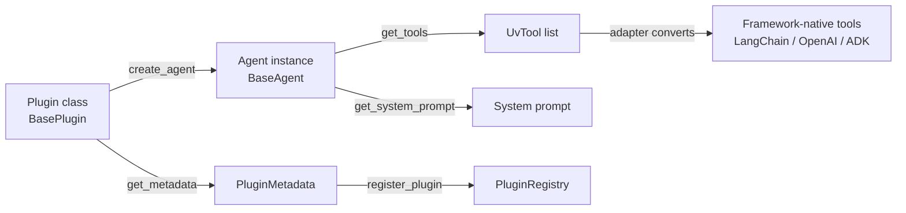

# Cadence SDK Overview

The Cadence SDK (`cadence_sdk`) is a Python library for writing plugins that run without modification across multiple
orchestration frameworks — LangGraph, OpenAI Agents, and Google ADK. You write your tools and agent logic once; the
framework adapter layer handles the translation.

Package: `cadence_sdk`
Current version: `2.0.5`
Minimum Python: 3.13

---

## Core pattern

```
BasePlugin (stateless factory)
    └── create_agent() → BaseAgent (stateful instance)
                             └── get_tools() → [UvTool, ...]
```

A **plugin** is a stateless class that describes capabilities and manufactures agent instances. An **agent** holds
runtime state (API keys, connections, etc.) and exposes callable tools. A **tool** is a `UvTool` — a thin wrapper around
a plain function or coroutine that carries name, description, and optional cache configuration.



---

## Key exports

All public names are available directly from `cadence_sdk`:

| Name                                | Kind           | Purpose                                               |
|-------------------------------------|----------------|-------------------------------------------------------|
| `BasePlugin`                        | Abstract class | Stateless plugin factory                              |
| `BaseAgent`                         | Abstract class | Stateful agent instance                               |
| `PluginMetadata`                    | Dataclass      | Plugin identity and capabilities                      |
| `UvTool`                            | Class          | Framework-agnostic tool wrapper                       |
| `uvtool`                            | Decorator      | Convert a function to a `UvTool`                      |
| `CacheConfig`                       | Dataclass      | Semantic cache configuration for a tool               |
| `UvState`                           | TypedDict      | Minimal shared conversation state                     |
| `UvMessage`                         | Pydantic base  | Base message type                                     |
| `UvHumanMessage`                    | Pydantic model | Human turn message                                    |
| `UvAIMessage`                       | Pydantic model | AI turn message (with optional tool calls)            |
| `UvSystemMessage`                   | Pydantic model | System instruction message                            |
| `UvToolMessage`                     | Pydantic model | Tool result message                                   |
| `ToolCall`                          | Pydantic model | Single tool invocation request                        |
| `PluginContract`                    | Class          | Lazy metadata-cache wrapper over a plugin class       |
| `PluginRegistry`                    | Singleton      | Global registry keyed by `pid`                        |
| `register_plugin`                   | Function       | Register a plugin with the global registry            |
| `plugin_settings`                   | Decorator      | Declare plugin configuration schema                   |
| `DirectoryPluginDiscovery`          | Class          | Scan directories for `plugin.py` files                |
| `discover_plugins`                  | Function       | Convenience wrapper around `DirectoryPluginDiscovery` |
| `validate_plugin_structure`         | Function       | Deep structural validation                            |
| `validate_plugin_structure_shallow` | Function       | Fast structural validation (no instantiation)         |
| `install_dependencies`              | Function       | Install pip packages at runtime                       |
| `check_dependency_installed`        | Function       | Check whether a package is importable                 |

Source: `sdk/src/cadence_sdk/__init__.py`

---

## Message types

`UvState` carries a list of `AnyMessage` — a union of the four concrete message types. All four are Pydantic models that
support `to_dict()` / `from_dict()` round-trips and carry an auto-generated `message_id`.

```python
from cadence_sdk import UvHumanMessage, UvAIMessage, ToolCall, UvToolMessage

human = UvHumanMessage(content="What is the weather in Berlin?")
ai    = UvAIMessage(content="", tool_calls=[ToolCall(name="search", args={"query": "Berlin weather"})])
```

Source: `sdk/src/cadence_sdk/types/sdk_messages.py`

---

## Sub-pages

- [Plugin Development](plugin-development.md) — implement `BasePlugin` and `BaseAgent`
- [Creating Tools](tools.md) — `@uvtool`, `UvTool`, `CacheConfig`
- [Plugin Settings](settings.md) — `@plugin_settings` decorator and schema format
- [Plugin Discovery & Bundling](discovery.md) — directory scanning, validation, `SDKPluginBundle`
