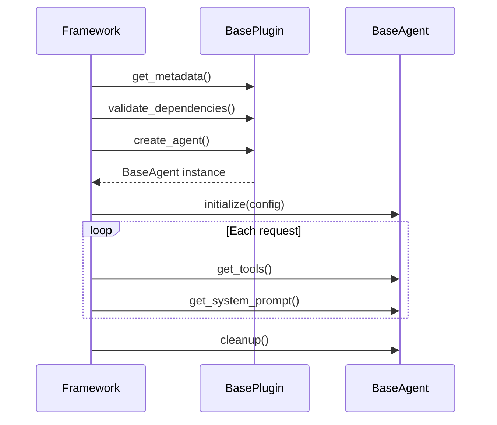

# Building a Plugin

A Cadence plugin is two classes: a stateless **factory** (`BasePlugin`) and a stateful **instance** (`BaseAgent`). The
factory manufactures agents on demand; every piece of runtime state lives in the agent.

---

## Lifecycle overview



---

## BaseAgent — the stateful instance

`sdk/src/cadence_sdk/base/agent.py`

```python
class BaseAgent(ABC):
    @abstractmethod
    def get_tools(self) -> List[UvTool]: ...

    @abstractmethod
    def get_system_prompt(self) -> str: ...

    def initialize(self, config: Dict[str, Any]) -> None: ...   # optional

    async def cleanup(self) -> None: ...                        # optional

    def get_settings_schema(self) -> List[Dict[str, Any]]: ...  # optional
```

### `get_tools()` (required)

Return the list of `UvTool` instances this agent exposes. The framework calls this once per bundle creation and passes
the tools to the orchestrator adapter.

### `get_system_prompt()` (required)

Return a plain string. The framework prepends state context and may append routing guidance. The prompt can be
overridden per orchestrator instance via `node_settings.plugins.<pid>.system_prompt`.

### `initialize(config)` (optional)

Called once, immediately after `create_agent()`, with a flat `{key: value}` dict resolved from the orchestrator
instance's `plugin_settings`. Use this method to store API keys, connection handles, and any other runtime state the
tools will need.

### `cleanup()` (optional, async)

Called when the agent is being torn down. Close HTTP connections, release file handles, etc.

### `get_settings_schema()` (optional)

An in-class alternative to `@plugin_settings`. Returns the same list-of-dicts format. If both are present the
decorator's entries are prepended to the method's entries.

---

## BasePlugin — the stateless factory

`sdk/src/cadence_sdk/base/plugin.py`

```python
class BasePlugin(ABC):
    @staticmethod
    @abstractmethod
    def get_metadata() -> PluginMetadata: ...

    @staticmethod
    @abstractmethod
    def create_agent() -> BaseAgent: ...

    @staticmethod
    def validate_dependencies() -> List[str]: ...   # optional, default []

    @staticmethod
    def health_check() -> Dict[str, Any]: ...       # optional, default {"status": "unknown"}
```

All methods are `@staticmethod`. The class carries no instance state — each call to `create_agent()` must return a fresh
`BaseAgent`.

### `validate_dependencies()` (optional)

Return a list of human-readable error strings. An empty list means all dependencies are satisfied. The framework calls
this during bundle validation and raises `ValueError` if the list is non-empty.

### `health_check()` (optional)

Return a dict with at least a `"status"` key. Used by monitoring endpoints; not called on the hot path.

---

## PluginMetadata

`sdk/src/cadence_sdk/base/metadata.py`

```python
@dataclass
class PluginMetadata:
    pid: str           # reverse-domain, e.g. "com.example.product_search"
    name: str          # human-readable display name
    version: str       # semver: "MAJOR.MINOR" or "MAJOR.MINOR.PATCH"
    description: str   # one-paragraph description of capabilities
    capabilities: List[str] = field(default_factory=list)
    dependencies: List[str] = field(default_factory=list)   # pip specs
    agent_type: str = "specialized"
    sdk_version: str = ">=2.0.0,<3.0.0"
    stateless: bool = True
```

Key constraints enforced by `__post_init__`:

- `pid`, `name`, `version`, `description` must be non-empty.
- `version` must have 2 or 3 dot-separated parts (`MAJOR.MINOR` or `MAJOR.MINOR.PATCH`).
- `pid` uses reverse-domain convention to guarantee global uniqueness across all tenants and system plugins. System
  plugins use `io.cadence.system.*`; third-party plugins use their own domain.

`to_dict()` / `from_dict()` are provided for JSON serialization.

---

## PluginContract

`sdk/src/cadence_sdk/registry/contracts.py`

`PluginContract` wraps a plugin class and caches its metadata on first access. The framework always interacts with
plugins through contracts, not plugin class objects directly.

```python
contract = PluginContract(MyPlugin)
contract.pid          # "com.example.my_plugin"
contract.version      # "1.0.0"
contract.capabilities # ["search"]
contract.is_stateless # True
agent = contract.create_agent()
```

The `metadata` property is lazy: `get_metadata()` is called once and the result is stored in `self._metadata`.

---

## PluginRegistry and register_plugin

`sdk/src/cadence_sdk/registry/plugin_registry.py`

`PluginRegistry` is a thread-safe process-level singleton. Plugins are keyed by `pid`.

```python
from cadence_sdk import register_plugin, PluginRegistry

# Register
contract = register_plugin(MyPlugin)

# Lookup
contract = PluginRegistry.instance().get_plugin("com.example.my_plugin")

# Query by capability
contracts = PluginRegistry.instance().list_plugins_by_capability("search")
```

When the same `pid` is registered twice (e.g., from two directory scans), the registry keeps the higher semantic
version. Pass `override=True` to force replacement regardless of version.

---

## Complete minimal example

This is adapted from the `web_search_agent` example at `sdk/examples/web_search_agent/plugin.py`.

```python
from cadence_sdk import (
    BaseAgent, BasePlugin, PluginMetadata,
    UvTool, plugin_settings, register_plugin, uvtool,
)
from typing import Any, Dict, List


class GreeterAgent(BaseAgent):
    def __init__(self):
        self._greeting = "Hello"
        self._tool = self._build_tool()

    def initialize(self, config: Dict[str, Any]) -> None:
        self._greeting = config.get("greeting", "Hello")

    def _build_tool(self) -> UvTool:
        agent = self  # capture self so the tool can read agent state

        @uvtool
        def greet(name: str) -> str:
            """Greet a person by name."""
            return f"{agent._greeting}, {name}!"

        return greet

    def get_tools(self) -> List[UvTool]:
        return [self._tool]

    def get_system_prompt(self) -> str:
        return "You are a greeting agent. Use the greet tool to say hello to people."


@plugin_settings([
    {
        "key": "greeting",
        "name": "Greeting Word",
        "type": "str",
        "default": "Hello",
        "description": "The word used to greet people",
    }
])
class GreeterPlugin(BasePlugin):
    @staticmethod
    def get_metadata() -> PluginMetadata:
        return PluginMetadata(
            pid="com.example.greeter",
            name="Greeter",
            version="1.0.0",
            description="Greets people by name.",
            capabilities=["greeting"],
        )

    @staticmethod
    def create_agent() -> BaseAgent:
        return GreeterAgent()


register_plugin(GreeterPlugin)
```

---

See also:

- [Creating Tools](tools.md) — `@uvtool`, `CacheConfig`
- [Plugin Settings](settings.md) — full `@plugin_settings` reference
- [Plugin Discovery & Bundling](discovery.md) — how the framework loads this file
