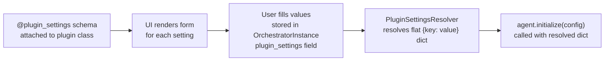

# Plugin Settings

Plugins declare their configuration requirements with the `@plugin_settings` decorator. The framework uses this schema
to render a settings UI, validate user input, and resolve values before calling `agent.initialize(config)`.

Source: `sdk/src/cadence_sdk/decorators/settings_decorators.py`

---

## How settings flow



The `OrchestratorInstance.plugin_settings` field stores one entry per plugin:

```json
{
  "com.example.greeter": {
    "id": "com.example.greeter",
    "name": "Greeter",
    "settings": [
      {"key": "api_key",     "name": "API Key",     "value": "sk-..."},
      {"key": "max_results", "name": "Max Results",  "value": 10}
    ]
  }
}
```

The resolver flattens this to `{"api_key": "sk-...", "max_results": 10}` and passes it to `agent.initialize()`.

---

## The `@plugin_settings` decorator

`sdk/src/cadence_sdk/decorators/settings_decorators.py`

Apply the decorator to the plugin class (not the agent class):

```python
@plugin_settings([...settings list...])
class MyPlugin(BasePlugin):
    ...
```

The decorator:

1. Validates the schema list (see validation rules below).
2. Normalises each entry: if `name` is absent it defaults to `key`.
3. Stores the schema in `cls._cadence_settings_schema`.
4. Attaches or replaces `cls.get_settings_schema()` as a `staticmethod` that returns the schema. If a
   `get_settings_schema` method already exists on the class, the decorator prepends its entries to the existing method's
   entries.

---

## Schema format

Each entry in the settings list is a dict:

| Field         | Type   | Required | Description                                                                     |
|---------------|--------|----------|---------------------------------------------------------------------------------|
| `key`         | `str`  | Yes      | Machine-readable identifier; used as the key in `config` dict                   |
| `type`        | `str`  | Yes      | One of `str`, `int`, `float`, `bool`, `list`, `dict`                            |
| `description` | `str`  | Yes      | Shown in UI and error messages                                                  |
| `name`        | `str`  | No       | Display label in UI; defaults to `key`                                          |
| `required`    | `bool` | No       | Default `False`; framework ensures a value exists before calling `initialize()` |
| `sensitive`   | `bool` | No       | Default `False`; encrypted at rest, masked in logs and UI                       |
| `default`     | any    | No       | Used when the user does not supply a value                                      |

---

## Validation rules

`sdk/src/cadence_sdk/decorators/settings_decorators.py`

The decorator validates the schema at class-definition time (import time). Violations raise `ValueError` immediately:

1. `settings_list` must be a `list`.
2. Each entry must be a `dict`.
3. Each entry must have `key`, `type`, and `description`.
4. `type` must be one of the six valid strings: `str`, `int`, `float`, `bool`, `list`, `dict`.
5. All `key` values within the list must be unique.
6. If `required` is present it must be `bool`.
7. If `sensitive` is present it must be `bool`.
8. If `default` is present, `type(default)` must match the declared `type` (e.g., a setting with `"type": "int"` may not
   have `"default": "ten"`).

---

## `get_plugin_settings_schema()` helper

`sdk/src/cadence_sdk/decorators/settings_decorators.py`

```python
from cadence_sdk.decorators.settings_decorators import get_plugin_settings_schema

schema = get_plugin_settings_schema(MyPlugin)
for s in schema:
    print(f"{s['name']} ({s['key']}): {s['description']}")
```

The helper checks for `_cadence_settings_schema` first (set by the decorator), then falls back to calling
`get_settings_schema()` if that method exists, and finally returns `[]`.

---

## Complete example

Taken from `sdk/examples/web_search_agent/plugin.py`, with an added optional setting:

```python
from cadence_sdk import BaseAgent, BasePlugin, PluginMetadata, plugin_settings
from typing import Any, Dict, List


class WebSearchAgent(BaseAgent):
    def initialize(self, config: Dict[str, Any]) -> None:
        api_key = config.get("serper_api_key")
        if not api_key:
            raise ValueError("serper_api_key is required but not configured")
        self._serper_api_key = api_key
        self._max_results = config.get("max_results", 10)

    def get_tools(self): ...
    def get_system_prompt(self): ...


@plugin_settings([
    {
        "key": "serper_api_key",
        "name": "Serper API Key",
        "type": "str",
        "required": True,
        "sensitive": True,
        "description": "Serper.dev API key for Google Search",
    },
    {
        "key": "max_results",
        "name": "Max Search Results",
        "type": "int",
        "default": 10,
        "required": False,
        "description": "Maximum number of search results per query (1-20)",
    },
    {
        "key": "enable_caching",
        "name": "Enable Caching",
        "type": "bool",
        "default": True,
        "description": "Cache repeated identical queries to reduce API usage",
    },
])
class WebSearchPlugin(BasePlugin):
    @staticmethod
    def get_metadata() -> PluginMetadata:
        return PluginMetadata(
            pid="com.cadence.plugins.web_search_agent",
            name="Web Search Agent",
            version="1.0.0",
            description="Searches the web using Google Search via Serper.dev.",
            capabilities=["web_search", "image_search"],
        )

    @staticmethod
    def create_agent() -> BaseAgent:
        return WebSearchAgent()
```

At runtime the framework resolves the settings and calls:

```python
agent.initialize({
    "serper_api_key": "<redacted>",
    "max_results": 10,          # from default if user did not override
    "enable_caching": True,     # from default
})
```

---

## Notes on sensitive settings

Settings marked `"sensitive": True` are:

- Encrypted at rest in the database.
- Masked (replaced with `"***"`) in all log output.
- Hidden in the UI after initial entry.

They are decrypted and passed in plain text to `agent.initialize(config)` only within the trusted server process. Never
log `config` directly inside `initialize()`.

---

See also:

- [Plugin Development](plugin-development.md) — `initialize(config)` and `get_settings_schema()`
- [Plugin Discovery & Bundling](discovery.md) — `PluginSettingsResolver` and how settings are resolved from
  `OrchestratorInstance`
